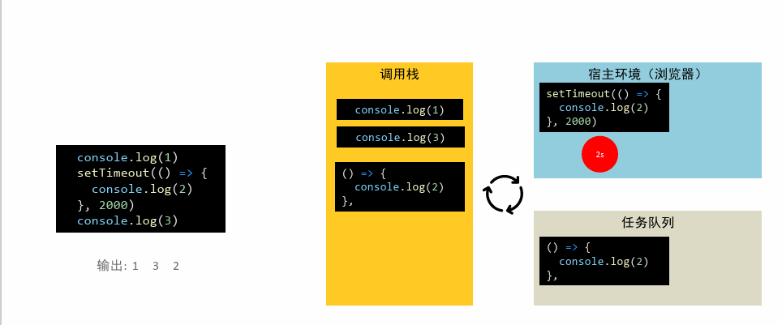
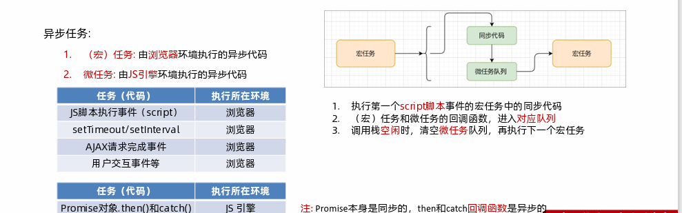
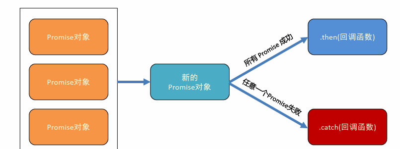

### 同步代码和异步代码

```
同步代码
逐行执行，需原地等待结果后，才会继续往下执行
```

```
异步代码
调用后耗时，不阻塞代码执行，在将来完成后触发回调函数
```

### 回调函数地狱

```
定义：在回调函数中调用回调函数，形成的代码结构称之为回调函数地狱
缺点：可读性差，异常捕获困难
```

```
代码：
axios({ url: '地址1' }).then(result => {
	// 第一次请求完成
	// 其他代码略
	axios({ url: '地址2' }).then(result => {
		// 第二次请求完成
		// 其他代码略
		axios({ url: '地址3' }).then(result => {
			// 第三次请求完成
			// 其他代码略。。。
		})
 	})
})
```

### Promise-链式调用

```
定义：每一个then方法还会返回一个新生成的promise对象，这个对象可被用作链式调用
then方法的返回值：then方法中的回调函数的返回值，会影响新生成的promise对象最终状态和结果
```

### Promise-链式调用-解决回调地狱

```
需求:展示数据到下拉框中（使用Promise-链式编程完成）
核心步骤: then的回调函数中返回Promise对象
```


### async函数和await

```
定义：async 函数是使用async关键字声明的函数。async 函数是AsyncFunction构造函数的实例，并且其中允许使用await关键字。async和await关键字让我们可以用一种更简洁的方式写出基于Promise的异步行为，而无需刻意地链式调用promise。
```

```
语法: 在async函数内，使用await关键字取代then函数，等待获取Promise对象成功状态的结果值
```


### async函数和await-错误捕获

```
定义: 使用async/await 关键字就可以在异步代码中使用普通的try/catch代码块。
```


### 事件循环-eventloop

```
定义: JavaScript 有一个基于事件循环的并发模型，事件循环负责执行代码、收集和处理事件以及执行队列中的子任务。这个模型与其它语言中的模型截然不同，比如C 和Java。
JavaScript是单线程（代码逐行执行）的，为了不让耗时代码阻塞其他代码运行，就设计了事件循环
```

**事件循环-执行过程**



## （宏）任务和微任务

```
定义:每个代理都是由事件循环驱动的，事件循环负责收集用事件（包括用户事件以及其他非用户事件等）、对任务进行排队以便在合适的时候执行回调。然后它执行所有处于等待中的JavaScript 任务（宏任务），然后是微任务，然后在开始下一次循环之前执行一些必要的渲染和绘制操作。
```



### Promise.all 静态方法

```
说明: 此方法在集合多个promise的返回结果时很有用
作用: 将多个Promise对象包装成一个新的Promise对象，获取所有的成功结果，或某一个的失败原因
```



```
语法：
const p = Promise.all([Promise对象1, Promise对象2...])
 p.then(results => {
 // results: 结果数组[Promise对象1的结果,Promise对象2的结果]
 }).catch(err => {
 // err: 第一个失败的Promise抛出的异常
})
```

