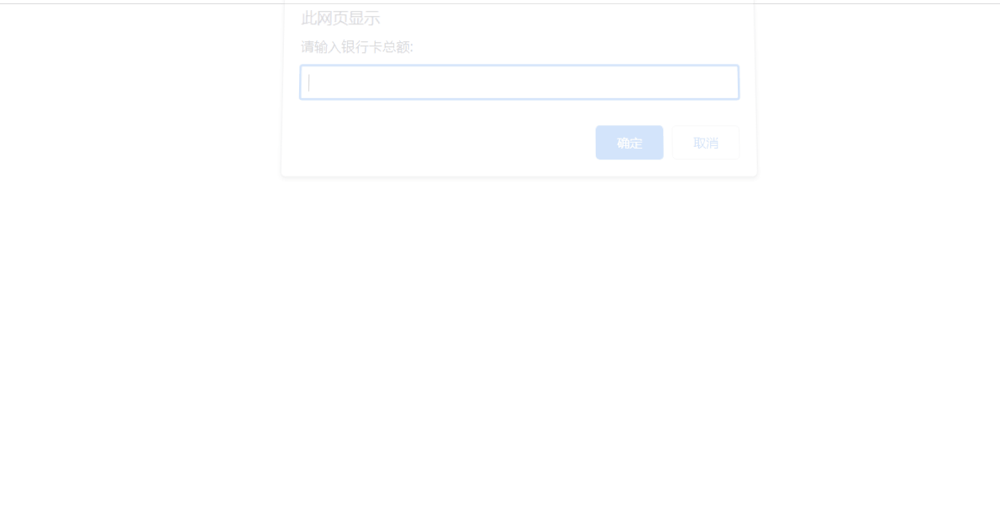
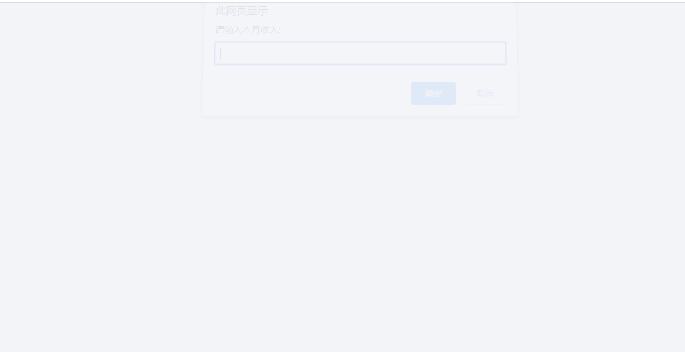
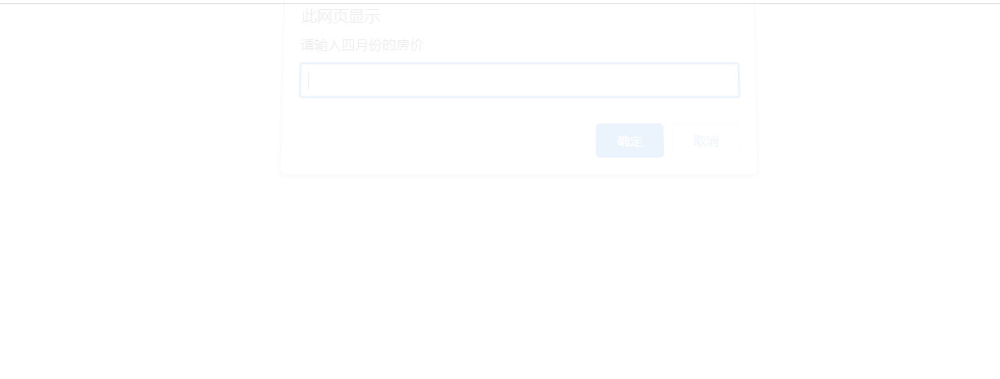
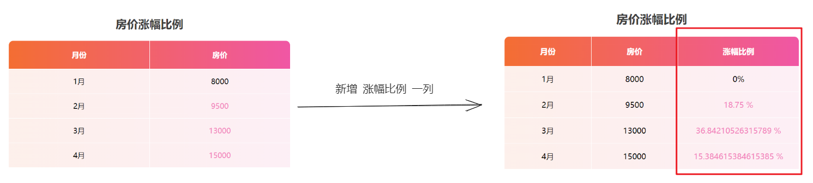
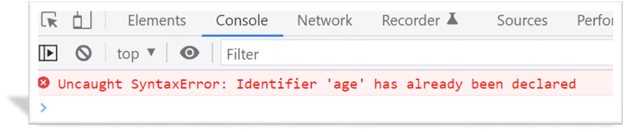
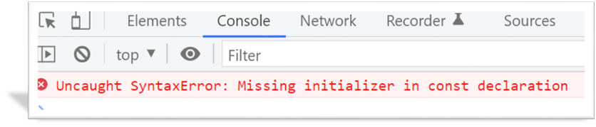
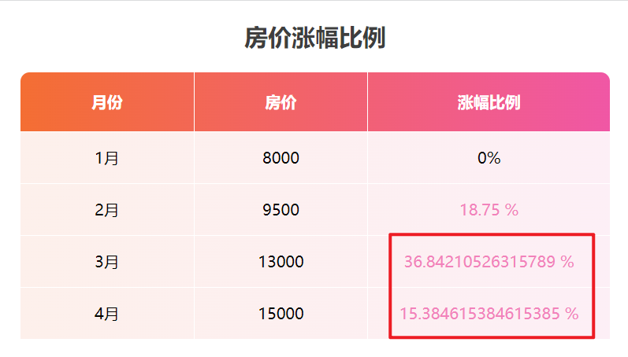
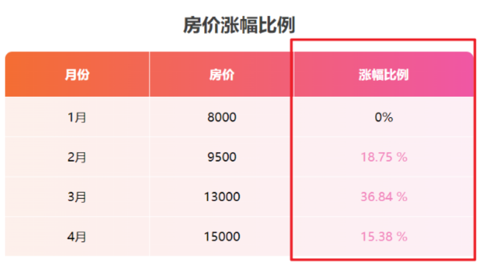

# 今日能力目标

掌握用户交互思维，能够对用户**输入**的数据进行**处理**，并且将结果**输出**显示到页面中


# 必要知识:

1. 能够利用**prompt** 允许用户输入数据，并且利用**变量**来保存数据
2. 能够利用**算术运算符**对数据进行计算
3. 能够使用**querySelector**选择某个标签并目利用**innerHTML** 将内容填充到标签内部
4. 能够使用**模板字符串**将变量拼接到字符串内部


# 一、编程题

## 计算银行卡余额-综合题

**难度等级：** ★★★

**作业目标：**利用 js 实现网页版的计算余额小程序

**考察能力：**

1. 能够利用**promp**t 允许用户输入数据，并且存储到变量中
2. 能够利用**算术运算符**对用户输入的数据进行计算并保存结果
3. 能够利用**innerHTML**将用户输入的数据以及计算的结果渲染到页面

### 作业需求

效果图需求如下：



**需求如下：**

1. 页面打开有 4 次弹框，分别录入：银行卡总额、水费、电费、网费
2. 根据用户录入的数据来计算：`银行卡余额`还剩下多少钱
3. 将用户输入的银行卡总额、支出钱数以及 **银行卡余额** 的计算结果，结合提供好的 html 结构一起渲染到页面中

### 相关素材

见附件

### 思路分析

本题是一个典型的用户交互的效果。用户交互可以分为： 输入、处理、输出。所以本题我们也可以按照这个思路来完成

1. **用户输入：**
   - 用户输入 4 个数据（银行卡总额、水费、电费、网费），同时声明 4 个变量依次**存储**
2. **数据处理：**
   - **计算 银行卡余额** 的结果，并存储到一个新的变量里面
3. **输出结果：**
   - 把相关的数据利用**模板字符串**填充到对应结构中，然后**渲染**到页面中

### 参考答案

```js

```

### 总结反馈

- [ ] 我看效果图就可以分析出实现步骤并独立完成
- [ ] 我看效果图没有思路，需要看本题思路分析才能完成
- [ ] 我需要看参考答案才能梳理思路和完成代码
- [ ] 我没有思路，也看不懂答案，无法完成本题


## 黑马记账本-变形题

**难度等级：** ★★★★

**作业目标： **利用 js 实现网页版的记账的小程序

**考察能力：**

1. 能够利用**promp**t 允许用户输入数据，并且存储到变量中
2. 能够利用**算术运算符**对用户输入的数据进行计算并保存结果
3. 能够利用**innerHTML**将用户输入的数据以及计算的结果渲染到页面

### 作业需求

效果图需求如下：



**需求如下：**

1. 页面打开有 4 次弹框 ，分别输入：**本月收入**、**本月饮食支出**、**本月打车支出**、**本月话费支出**对应的钱数
2. 根据用户输入的收入和支出钱数来计算：**结余** 还剩下多少钱
3. 将用户输入的收入、支出钱数以及 **结余** 的计算结果，结合提供好的 html 结构一起渲染到页面中

### 相关素材

见附件

### 思路分析

本题是一个典型的用户交互的效果。用户交互可以分为： 输入、处理、输出。所以本题我们也可以按照这个思路来完成

1. **用户输入：**
   - 用户输入 4 个数据（本月收入、本月饮食支出、本月打车支出、本月话费支出），同时声明 4 个变量依次**存储**
2. **数据处理：**
   - **计算 结余** 的结果，并存储到一个新的变量里面
3. **输出结果：**
   - 把相关的数据利用**模板字符串**填充到对应结构中，然后**渲染**到页面中

### 参考答案

```js

```

### 总结反馈

- [ ] 我看效果图就可以分析出实现步骤并独立完成
- [ ] 我看效果图没有思路，需要看本题思路分析才能完成
- [ ] 我需要看参考答案才能梳理思路和完成代码
- [ ] 我没有思路，也看不懂答案，无法完成本题


## 计算房价涨幅比例-二次开发题

**难度等级：** ★★★★★

**作业目标： **利用 js实现网页版的计算房价涨幅的小程序

**考察能力：**

1. 能够看懂已经提前准备好代码，并且能说出代码执行过程
2. 能够基于已有的功能新增**涨幅比例**业务

### 作业需求

开发中，我们经常遇到在**已有**的业务基础上**新增**一些需求，所以各位同学先梳理已有提供好的业务，然后在根据需求分析新业务如何实现

**1. 已有业务：**

正在开发一个xx城市的租房网站，需要展示最近四个月的房价，目前功能已经开发如下效果了：



其中前面3个月的数据是固定的如下： 

- 1月房价 `8000` 
- 2月房价 `9500  `
- 3月房价 `13000`

而4月房价，让用户自己来输入的：页面打开有**弹框** 让用户输入：**四月份的房价**，用户输入完毕后，页面中展示表格，以及每个月的房价。

现有业务素材见附件

**2. 新增需求**

1. 为了更清楚看到每个月房价的涨幅比例，所以要求在以上已有的功能基础上，**新增 涨幅比例一栏**，并计算出**每个月份房价的涨幅比例**渲染到表格中

   效果对比图如下：
   
   

   - 一月价格是参照，所以涨幅比例 直接是 `0%`
   - **2,3,4月**的涨幅比例需要计算得出
   - 环比公式： `(当前月份的房价 - 上个月的房价）/ 上个月的房价 * 100`   得到百分比。 例如 ：**18.75%**

**完整效果图如下：**


### 相关素材

见附件

### 思路分析

本题是一个典型的二次开发题型。本题我们需要 **补充HTML结构** 和 **JS业务逻辑** 来实现新功能

1. **补充HTML结构：**
   - 在 **thead标签**中 在tr行里面新增一个**th表头单元格**，内容文字为 `涨幅比例` 
2. **JS业务逻辑：**
   - 计算2月，3月，4月的涨幅比例
     - 每月房价涨幅比例的计算公式：`（当前月份的房价 - 上个月的房价）/ 上个月的房价 * 100`
     - 比如计算2月的涨幅比例：`(2月的房价 - 1月的房价) / 1月的房价 * 100`  得到百分比
   - 在 **tbody标签**的每一行tr里面都新增 td单元格，**存放 该月份的 涨幅比例 数据**

### 参考答案

**HTML 结构**

```html
<thead>
  <tr>
    <th>月份</th>
    <th>房价</th>
    <th>涨幅比例</th>
  </tr>
</thead>
```

**JS业务逻辑**

```js

```

### 总结反馈

- [ ] 我看效果图就可以分析出实现步骤并独立完成
- [ ] 我看效果图没有思路，需要看本题思路分析才能完成
- [ ] 我需要看参考答案才能梳理思路和完成代码
- [ ] 我没有思路，也看不懂答案，无法完成本题


# 二、问答题

## 变量的作用是什么？

**难度等级：**★★

**考察能力**：

1. 能够掌握变量的基本使用
2. 能够理解变量的作用

### 问答要点

1. 什么是变量？
2. 变量的作用是什么？

### 参考答案

```markdown
变量是计算机中用来存储数据的“容器”
记录计算机中数据的不同状态
```


## 基本数据类型有哪5种？

**难度等级：**★★★

**考察能力**

1. 理解JavaScript中的基本数据类型
2. 能够识别和区分不同的基本数据类型

### 问答要点

1. 列出JavaScript的五种基本数据类型
2. 对每种基本数据类型进行简要的描述

### 参考答案

```markdown
基本数据类型
number 数字型
可以用于运算操作,比如对数字的加减乘除等操作
string 字符串型
通过单引号（ ‘’） 、双引号（ “”）或反引号( `` ) 包裹的数据都属于字符串
单引号和双引号没有本质上的区别
boolean 布尔型
表示肯定的数据用 true（真），表示否定的数据用 false（假）
undefined 未定义型
只声明变量，不赋值的情况下，变量的值为 undefined
null 空类型
null 是一个代表“无”、“空”或“值未知”的特殊值
```

## 什么是模板字符串？有什么好处？

**难度等级：**★★★

**考察能力**

1. 理解模板字符串的用法
2. 模板字符串的好处

### 问答要点

1. 模板字符串插入变量的写法？
2. 模板字符串的好处

### 参考答案

```markdown
`内容拼接变量时，用 ${ } 包住变量`
可以让我们拼接字符串更简便
模板字符串里面的字符可以换行的
```


## 如果出现这个报错提示，会是什么原因引起的？ 

 

**难度等级：**★★★

**考察能力**

1. 变量的使用注意事项
2. 锻炼解决bug能力

### 问答要点

1. 报错的原因
2. 如何解决报错

### 参考答案

```markdown
age 重复定义
更换变量名，不要重复
```


 


## 如果出现这个报错提示，会是什么原因引起的？ 



**难度等级：**★★★

**考察能力**

1. 变量的使用注意事项
2. 锻炼解决bug能力

### 问答要点

1. 报错的原因
2. 如何解决报错

### 参考答案

```markdown
常量没赋值
赋值
```


# 三. 自主学习题

## toFixed方法

**难度等级：**`★★`

在**计算房价涨幅比例-二次开发题案例**中，出现的瑕疵：计算结果小数点后面的小数个数过多，如图所示



### 题目要求

查阅MDN官方文档，学习`toFixed`方法, 实现将该案例的计算结果小数位保留在2位，达到如下图所示效果



### 参考教程

[菜鸟教程-toFixed 方法](https://www.runoob.com/jsref/jsref-tofixed.html)

或者

[MDN文档-toFixed 方法](https://developer.mozilla.org/zh-CN/docs/Web/JavaScript/Reference/Global_Objects/Number/toFixed)

### 相关素材

在**计算房价涨幅比例-二次开发题案例**中实现

### 参考答案

```js
let priceNum = prompt('请输入四月份的房价')

// 2.1 计算每月的房价涨幅比例
let num2 = (9500 - 8000) / 8000 * 100
let num3 = (13000 - 9500) / 9500 * 100
let num4 = (priceNum - 13000) / 13000 * 100

// 2.2 在tbody 的每一行新增 td单元格
document.querySelector('.table tbody').innerHTML = `
  <tr>
    <td>1月</td>
    <td>8000</td>
    <td>0%</td>
  </tr>
  <tr>
    <td>2月</td>
    <td>9500</td>
    <td>${num2.toFixed(2)} %</td>
  </tr>
  <tr>
    <td>3月</td>
    <td>13000</td>
    <td>${num3.toFixed(2)} %</td>
  </tr>
  <tr>
    <td>4月</td>
    <td>${priceNum}</td>
    <td>${num4.toFixed(2)} %</td>
  </tr>
`
```

### 总结提炼

- `toFixed(2)` 方法可以保留2位小数
- 括号中的数字表示保留几位小数


# 四、客观题

1. 下列定义的变量名中，不合法的是 ()A

   A： 2age

   B： newClass

   C： userName

   D： _age

   

2. 下列有关字符串变量定义正确的是（） 可以多选~~~  C

   A： let strMsg = "我爱北京天安门"

   B： let  strMsg2 = '我爱吃猪蹄'

   C： let  strMsg3 = 我爱大肘子

   D： let  strMsg4 = '我是'高帅富'程序猿'


4. 下面不属于JavaScript数据类型的是？ ( )D

   A、number
   B、string
   C、boolean
   D、int
   E、undefined

   

5. 在js代码中，'123'+ 4 的运行结果是B

   A:127

   B:'1234'  字符串型

   C:1234 数字型

   D:'123'4

   

6. 请问模板字符串的语法是以下哪种？（）C

   A: 单引号  '' 

   B: 双引号 ""

   C: 反引号  ``

   D: 都是可以的

   

7. 下列有关javascript变量命名说法错误的是

   A:变量名不能是关键字比如 let 、var、if 等

   B: 变量名是区分大小写的

   C:变量名可以由数字、字母、下划线、$组成，可以以数字开头C

   D:变量名建议使用驼峰命名法

   

8. 在算术运算符中，如果计算错误返回的结果是？（）C

   A:    1

   B： 报错

   C： NaN

   D： undefined

   

   

   
