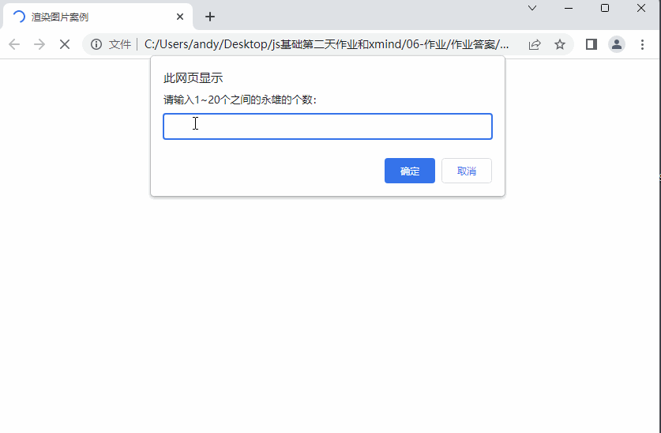
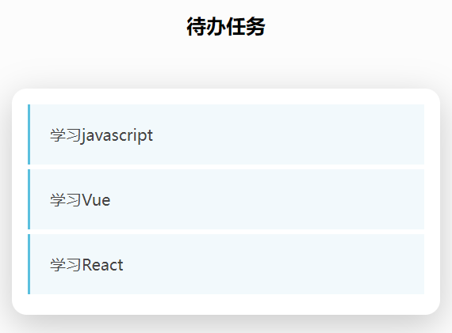
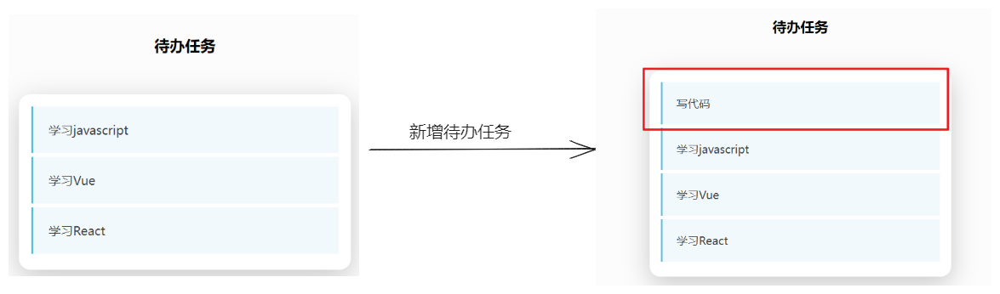

# 今日能力目标

能够对数组进行增删改查，并且可以利用循环将数组中的数据渲染到页面上

# 必要知识:

1. 能够使用**数组**来存储数据
2. 能够从**数组**中根据下标取值
3. 能够使用 **push**/**pop**/**unshift**/**shift**/**splice**方法对数组进行增加、删除元素
4. 能够利用**嵌套for循环**渲染HTML结构到页面中


# 一、编程题

1. [10,11,22,24,8,6,7,25] 求数组中所有偶数的和
2. [1,5,8,11,20,15,13,17,6] 求数组中所有奇数的和
3. [12,80,60,7,8,5,3,14,16,4]  求数组中被2整除的数,放到新数组中
4. [7,11,15,10,30,15,100,9] 求数组中最小的值
5. [2,50,4,112,5,8,13,19,7,6] 求数组中小于10的数, 放到新数组中
6. ['小米','小华','小果','小锤'] 删除数组中的 '小果', 打印删除后的数组
7. 一直弹框让用户输入姓名, 把姓名放到数组中, 当数组的长度大于等于5时, 关闭弹出,控制台打印数组

## 数组版-渲染王者荣耀头像-综合题

**难度等级：** ★★

**作业目标：**利用js展示**数组版本**-王者荣耀英雄头像案例

**考察能力：**

1. 能够利用数组来存储数据
2. 能够从数组中根据下标取值

### 作业需求

效果图需求如下：



**需求如下：**

1. 页面打开，出现一个弹框 ，让用户录入：`1-20`之间的数字，用于渲染英雄头像的数量
2. **要求：**把所有需要展示的**英雄头像文件名**放到数组中
3. 根据用户输入的数字来生成对应个数的王者荣耀英雄，头像从数组中获取

### 相关素材

见附件

### 思路分析

本题是一个典型的用户交互的效果。用户交互可以分为： 用户输入、处理数据、输出结果。所以本题我们也可以按照这个思路来完成

1. **用户输入：**
   - 用户输入 1 个数据（`1-20`之间的数字），声明一个变量，并存储该数据
2. **处理数据：**
   - 2.1 创建一个数组：把所有需要展示的**英雄头像文件名**放入数组中
   - 2.2 声明变量来存储生成得到的头像结构
   - 2.3 将用户输入的数字作为循环的次数
3. **输出结果：**
   - 3.1 在循环中，来拼接得到的头像结构，头像地址从数组中获取
   - 3.2 将得到的头像结构写入到`ul`中

### 参考答案

```js

```

> **温馨提示**
>
> 以上代码中，数组中仅仅只有头像文件名，所以在给`img`标签设置`src`属性的时候，一定要带上 `./images `目录，这样才能找到正确的头像文件

### 总结反馈

- [ ] 我看效果图就可以分析出实现步骤并独立完成
- [ ] 我看效果图没有思路，需要看本题思路分析才能完成
- [ ] 我需要看参考答案才能梳理思路和完成代码
- [ ] 我没有思路，也看不懂答案，无法完成本题


## 九九乘法表-综合题

**难度等级：** ★★★

**作业目标：**利用js实现九九乘法表案例

**考察能力：**

1. 能够利用双层for循环完成渲染

### 作业需求

效果图需求如下：


**需求如下：**

1. 需要通过 **双层for循环**来完成 该功能

### 相关素材

见附件

### 思路分析

本题是一个典型的双层for循环案例功能。需要考虑到**外层for循环**、**内层for循环**、**输出结果**。所以本题我们也可以按照这个思路来完成

1. 声明变量`str`来存储九九乘法表的结构
2. **外层for循环：**
   - 外层循环**控制行数**, 需要9行，所以外层循环9次
3. **内层for循环：**
   - 3.1 内层循环控制列数，并且需要让**列个数等于行数**（因为行数和列数是对应的）
   - 3.2 内层循环来 拼接 需要的 结构
4. **输出结果：**
   - 4.1 由于每一行之后，需要与下一行换行展示，所以在内层for循环结束之后，给变量`str`**拼接 br 换行标签**
   - 4.2 在外层`for`循环之后，拼接得到完整的结构，就可以将拼接完整的结构渲染到页面中
### 参考答案

```js

```

### 总结反馈

- [ ] 我看效果图就可以分析出实现步骤并独立完成
- [ ] 我看效果图没有思路，需要看本题思路分析才能完成
- [ ] 我需要看参考答案才能梳理思路和完成代码
- [ ] 我没有思路，也看不懂答案，无法完成本题


## 待办任务-二次开发题

**难度等级：** ★★★★

**作业目标： **利用js展示待办任务案例

**考察能力：**

1. 能够看懂已经提前准备好代码，并且能说出代码执行过程
2. 能够基于已有功能进行**新增业务**
3. 能够知道`js`的执行逻辑（明确js代码的位置应该放哪）

### 作业需求

开发中，我们经常遇到在**已有**的业务基础上**新增**一些需求，所以各位同学先梳理已有提供好的业务，然后在根据需求分析新业务如何实现

**1. 已有业务：**

正在开发一个待办任务功能，需要展示今日待办的任务有哪些

目前已有的功能（已经实现）

​	①：在数组`arr`中准备好了需要渲染的数据

​	②：并且已经渲染展示到页面中

​	③：效果图如下




**2. 新增需求：**

1. 为了让用户可以新增待办任务，在以上已有功能基础上实现**新增功能**：

    ①：页面打开出现一个弹框 ，让用户录入：**你的待办任务**

    ②：用户输入完成之后，将用户录入的待办任务渲染到页面中

2. 要求：**用户录入的待办任务排在第一位**

3. 效果对比图如下：

    

**完整效果图如下：**


### 相关素材

见附件

### 思路分析

本题是一个典型的用户交互的效果。用户交互可以分为： **用户输入**、**处理数据**、**输出结果**。所以本题我们也可以按照这个思路来完成

**注意都是先处理数据在渲染**

1. **用户输入：**
   - 声明一个变量来存储用户输入的待办任务
2. **处理数据：**
   - 将用户输入的待办任务添加作为数组的第一项
3. **输出结果**：
   - 代码已提供

### 参考答案

```js

```


### 总结反馈

- [ ] 我看效果图就可以分析出实现步骤并独立完成
- [ ] 我看效果图没有思路，需要看本题思路分析才能完成
- [ ] 我需要看参考答案才能梳理思路和完成代码
- [ ] 我没有思路，也看不懂答案，无法完成本题


# 二、问答题

## 数组的作用，如何声明数组，添加、删除元素，遍历数组

**难度等级：** ★★★

**考察能力**

1. 掌握数组的基本使用

### 问答要点

1. 什么是JavaScript数组？
3. 如何向数组添加元素？
4. 如何获取数组的长度？
5. 如何访问数组中的元素？
6. 如何遍历数组？
7. 如何在数组中删除元素？

### 参考答案

```markdown
1.数组是一个可以存储一系列数据的变量
2.数组名.push
将一个或多个元素添加到数组的末尾
数组名.unshift
将一个或多个元素添加到数组的开头
3.数组名.length
4.数组[下标、索引]
5.let arr = [数据1,数据2,数据3,数据4,数据5]
for (let i =0; i < arr.length; i++) {
	conlose.log(arr[i])
}
6.数组.pop()
从数组中删除最后一个元素
数组.shift()
从数组中删除第一个元素
```


## 数组的sort方法有和作用，如何升序或降序排序数组

**难度等级：**★★★

**考察能力**

1. 掌握数组的sort方法

### 问答要点

1.  什么是JavaScript数组的`sort`方法？ 
2.  如何使用`sort`方法按升序或降序排序数组？ 

### 参考答案

```markdown
sort() 方法用于对数组的元素进行排序
这种方法会改变原始数组
升序
数组.sort(function (a, b) {
      return a - b
    })
降序
数组.sort(function (a, b) {
      return b - a
    })
```


# 三. 自主学习题

## 数组的slice 方法

**难度等级：**★★★

考察数组的基本功这块，有个面试问答题，**如何快速复制得到新数组**，小伙伴，你能想到有什么做法吗？

注意题目要求是**快速**哦，而且是**得到新的数组**（不是简单的赋值操作哦），也就是要求简便轻松的实现。

那么这个问题，其实就可以通过 `slice` 方法轻松搞定

### 题目要求

实现对 数组 `arr` 进行快速复制得到新数组

```js
let arr = [10, 20, 30]
```

### 参考教程

[阮一峰-JS教程](https://wangdoc.com/javascript/stdlib/array#slice)

或者

[MDN文档](https://developer.mozilla.org/zh-CN/docs/Web/JavaScript/Reference/Global_Objects/Array/slice)

### 相关素材

见附件

### 参考答案

```js

```


## for...of 循环

**难度等级：** ★★★

遍历数组除了可以使用`for`循环之外，还可以使用 `for...of` 循环语句

### 题目要求

1. 使用`for...of` 语句来遍历数组，进行求和

### 参考教程

[mdn文档-for...of](https://developer.mozilla.org/zh-CN/docs/Web/JavaScript/Reference/Statements/for...of)

### 相关素材

见附件

### 参考答案

```js

```


# 四、客观题

1. 关于数组的常用方法，下列描述正确的是（）A

   A： 数组能在本长度内任意位置删除元素

   B： 数组只能在头部追加或删除元素

   C： 数组只能在头部或尾部追加或删除元素

   D： 上述描述都是错误的

   

2. 关于javascript中数组的说法中,不正确的是( ) A

   A： 数组的长度必须是创建时给定, 之后便不能改变

   B： 数组里面可以存放多个数据

   C： 数组中元素的类型可以不同

   D： 数组可以在声明的同时进行初始化

   

3. let  arr = []  声明数组未给值，请问里面的值是什么？( ) D

   A: true

   B: false

   C: null

   D: undefined

   

4. 下面关于for循环说法正确的是(  ) D

   A： for(;;)  这种写法会出现语法错误

   B： 在for循环中,不能用break语句跳出循环体

   C： for循环是先执行循环体语句,后判断表达式

   D： for循环的循环体语句中,可以包含多条语句,但必须用花括号括起来

   

5. 以下代码,依次输出的结果为 ( ) C

   ~~~javascript
   let i
   for (i = 0; i < 5; i++) {
       console.log(i)
   }
   console.log(i)
   ~~~

    A： 0 1 2 3 4 4

    B： 5 5 5 5 5 5

    C： 0 1 2 3 4 5

    D： 0 1 2 3 4 

   

6. 下列语句中 helloworld打印的次数是 () D

   ~~~javascript
   for(let i = 0; i <= 3; i++){
     for (j = 1; j <= 3; j++){
       console.log("helloworld")
     }
   }
   ~~~

    A:    3次

    B： 4次

    C： 9次

    D： 12次

   

7. 关于数组的说法错误的是() D

   A： 可以按照索引号查找数组元素

   B： 能存储多个数据

   C： 按照索引遍历数组方便

   D： 数组只能存储一种类型的数据

   

8. 关于数组的描述错误的是 （ ）C

   A：  数组的创建方式是 let arr = [1, 2, 3, 4, 5]

   B：  数组的长度可以使用 arr.length 来得到

   C： 数组的每一项值都有索引， 索引默认从1开始

   D： 数组里面的元素可以增加和删除等操作

   

9. 求以下代码的结果  （）C

   ~~~javascript
   let sum = 0
   let arr = [10, 20, 30, 40]
   for (let i = 0; i < arr.length; i++) {
     if (i == 2) {
         continue
     }
     sum += arr[i]
   }
   console.log(sum)
   ~~~

    A： 0

    B： 60

    C： 70

    D： 100

   

10. 下面代码输出的结果是（）A
      ~~~javascript
      let sum = 0
      let arr = [11,22,33]
      for(let i = 0; i <= arr.length; i++){
        sum += arr[i]
      }
      console.log(sum)
      ~~~
       A： 66

       B： 0112233

       C： NaN

       D： undefined

    

    

