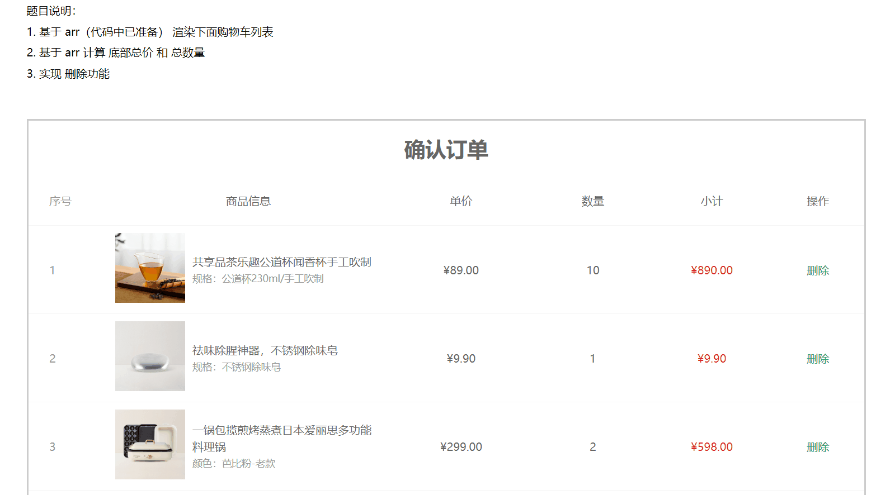
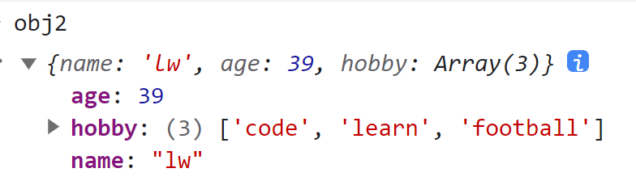
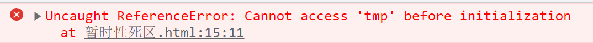

# 今日能力目标

掌握**数组常用方法**来便捷完成功能，掌握**箭头函数**、**解构赋值**、**展开运算符**语法来简化代码

# 必要知识:

1. 能够利用**map + join**渲染数据到页面上
2. 能够利用**reduce** 来对数组元素进行求和
3. 能够利用**箭头函数**、**解构赋值**、**展开运算符**语法来简化代码


# 一、编程题

## 确认订单页面-综合题

**难度等级：** ★★★

**作业目标： **利用 js 展示确认订单页面

**考察能力：**

1. 能够利用**map + join**渲染数据到页面上
2. 能够利用**reduce** 来求和
3. 能够利用**splice**来删除数据

### 作业需求

效果图需求如下：



**需求如下：**

1. 页面打开需要渲染所有订单信息
2. 实现删除功能
3. 实现计算总件数和总价功能
4. 需要尽可能多的使用新语法简化代码（如：`map`、`reduce`、`splice`、箭头函数，解构赋值等语法）

### 相关素材

见附件

### 思路分析

1. **渲染功能：**
   - `map`映射得到新数组，里面包含需要的**tr结构**
   - 配合`join()`将新数组拼接得到字符串结构
   - 渲染到**`tbody`结构**中
2. **计算 总数量 和 总价**
   - 使用`reduce`方法 来计算
   - 需要注意：由于 `arr`是对象数组，**所以`reduce`的起始值必须设置**
3. **删除功能**
   - 删除的`a`链接已经提供了执行`del`函数，需要在`del`函数内实现删除功能
   - 可以借助`splice`方法实现删除功能，所以在`del`函数中需要传递开始删除的位置下标
   - 删除之后，需要重新渲染列表数据，以及重新计算总件数和总价，所以需要将渲染和求和功能进行使用函数封装，以便复用

### 参考答案

```js
// 渲染功能（利用 map + join 实现）
function render() {
  const strArr = arr.map((ele, index) => {
    // 从遍历的每一项中解构出需要的数据
    const { picture, name, attrsText, price, count } = ele
    
    return `
      <tr>
        <td>${index + 1}</td>
        <td>
          <div class="goods">
            <a href="#/"
              ></a>
            <div>
              <p class="name ellipsis">
                ${name}
              </p>
              <p class="attr">${attrsText}</p>
            </div>
          </div>
        </td>
        <td class="tc">
          <p>&yen;${price}</p>
        </td>
        <td class="tc">${count}</td>
        <td class="tc"><p class="f16 red">&yen;${(count * price).toFixed(2)}</p></td>
        <td class="tc">
          <p><a class="green" href="javascript:void(0);" onclick="del(${index})">删除</a></p>
        </td>
      </tr>`
  }).join('')
  
  tbody.innerHTML = strArr
}
render()

// 计算 总数量 和 总价（使用reduce方法 来计算）
function renderPrice() {
  const totalCount = arr.reduce((sum, item) => sum + item.count, 0)
  const totalPrice = arr.reduce((sum, item) => sum + item.count * item.price, 0)
  action.innerHTML = `
      <div class="batch"></div>
      <div class="total">
        共 ${totalCount} 件商品，商品合计：
        <span class="red">¥${totalPrice.toFixed(2)}</span>
      </div>
    `
}
renderPrice()

// 删除功能
function del(index) {
  // splice 实现删除功能
  arr.splice(index, 1)
  // 渲染列表
  render()
  // 计算总件数和总价
  renderPrice()
}
```

### 总结反馈

- [ ] 我看效果图就可以分析出实现步骤并独立完成
- [ ] 我看效果图没有思路，需要看本题思路分析才能完成
- [ ] 我需要看参考答案才能梳理思路和完成代码
- [ ] 我没有思路，也看不懂答案，无法完成本题


## 删除水果列表-二次开发题

**难度等级：** ★★★★

**作业目标： **利用 js 实现水果列表

**考察能力：**

1. 能够看懂已经提前准备好代码，并且能说出代码执行过程
2. 能够基于已有的代码使用新语法进行简化代码

### 作业需求

开发中，我们经常遇到在**已有**的业务基础上**新增**一些需求，所以各位同学先梳理已有提供好的业务，然后在根据需求分析新业务如何实现

**1. 已有业务：**

正在开发一个xx商城的购物车功能，需要展示用户购物车的数据列表，目前功能已经开发如下效果了：


1. 购物车的数据都已经渲染展示到页面中
2. 删除购物车的数据

**2. 新增需求**

​	①：渲染购物车列表数据，必须要使用 `map` + `join` 配合实现

​	②：求和功能必须使用 `reduce`实现

​	③：代码中必须要有**箭头函数** ， **解构赋值**等语法的参与（不限于其他技术的使用）

**完整效果图如下：**


### 相关素材

见附件

### 思路分析

本题是一个典型的二次开发题型，按照需求：在功能实现中运用新语法，从而来简化代码

1. **渲染功能：**
   - `map`映射得到新数组，里面包含需要的**类名为tr的div结构**，表示购物车中的每一行
   - 配合`join()`将新数组拼接得到字符串结构
   - 渲染到**类名为tbody的div结构**中
   
2. **求和功能**
   - 使用`reduce`方法 来计算总件数和总价
   - 需要注意：由于 `fruit`是对象数组，**所以`reduce`的起始值必须设置**

### 参考答案

```js
// 1. 渲染功能（展示购物车列表，map + join() 实现渲染）
function render() {
  // 解构赋值+ 箭头函数，简化代码
  const str = fruit.map(({ icon, price, num }, index) => {
    return `
      <div class="tr">
        <div class="td"><input type="checkbox" checked=""></div>
        <div class="td"></div>
        <div class="td">${price}</div>
        <div class="td">
          <div class="my-input-number">
            <button class="decrease"> - </button>
            <span class="my-input__inner">${num}</span>
            <button class="increase"> + </button>
          </div>
        </div>
        <div class="td">${price * num}</div>
        <div class="td"><a href="javascript:void(0);" onclick="del(${index})">删除</a></div>
      </div>
    `
  }).join('')

  // 设置内容
  document.querySelector('.tbody').innerHTML = str

  // 2. 求和功能（设置总价 + 总件数，reduce实现）
  const totalPrice = fruit.reduce((total, item) => total + item.num * item.price, 0)
  document.querySelector('.price').innerHTML = totalPrice

  const totalNum = fruit.reduce((total, item) => total + item.num, 0)
  document.querySelector('.pay').innerHTML = `结算( ${totalNum} )`
}
render()


// 删除功能
function del(index) {
  fruit.splice(index, 1)
  render()
}
```

### 总结反馈

- [ ] 我看效果图就可以分析出实现步骤并独立完成
- [ ] 我看效果图没有思路，需要看本题思路分析才能完成
- [ ] 我需要看参考答案才能梳理思路和完成代码
- [ ] 我没有思路，也看不懂答案，无法完成本题


# 二、问答题

## 使用箭头函数的好处，和注意事项

**难度等级：**★★

**考察能力**

1. 掌握箭头函数的基本使用

### 问答要点

1. 使用箭头函数的好处
2. 使用注意事项

### 参考答案

```markdown
1. 好处：箭头函数通常比传统的函数表达式更简洁。
		// 传统函数表达式
        const add = function(a, b) {
        	return a + b;
        };
        
        // 箭头函数
   		const add = (a, b) => a + b;

2. 使用注意事项
	- 箭头函数内没有arguments, 可以使用剩余参数来替代
	- 当箭头函数返回对象字面量的时候，并且是简化写法的时候，需要给 对象加小括号包裹

     const fn3 = () => ({ name: 'lw', age: 39 })
```


## 如何区分展开运算符和剩余参数

**难度等级：**★★★

**考察能力**

1. 掌握展开运算符的基本使用
2. 掌握剩余参数的基本使用

### 问答要点

1. 区分展开运算符 和 剩余参数

### 参考答案

```markdown
展开运算符 和 剩余参数在语法上看起来一样，但它们的作用和用法是不同的

展开运算符通常用于将数组、对象、字符串展开成单独的值，通常位于函数调用或数组字面量内的元素位置。
	let numbers = [1, 2, 3];
	let newNumbers = [...numbers, 4, 5]; // 展开数组
	
	// 展开对象
	let obj = {
        name: 'lw',
        age: 39
    }

    let obj2 = {
        // 把obj对象给展开，将其属性展开给obj2对象，obj2对象就拥有了obj对象的属性
        ...obj,
        hobby: ['code', 'learn', 'football']
    }
    
剩余参数用于在函数声明中接收多个参数并将它们合并为一个数组，通常位于函数参数列表的最后。
	function sum(...numbers) { // 使用剩余参数
        return numbers.reduce((total, num) => total + num, 0);
    }
    
简言之，展开运算符在拆散数组或对象，而剩余参数在凝聚为数组。
```




## 使用对象和数组解构，有哪些注意事项

**难度等级：**★★★

**考察能力**

1. 掌握解构赋值的基本使用

### 问答要点

1. 对象解构的注意事项
2. 数组解构的注意事项

### 参考答案

```markdown
对象解构的注意事项	
	对象解构需要确保**属性名匹配**，否则会导致变量为undefined
        const { name, age } = { name: "Alice", age: 30 };
        // 正确的解构，属性名匹配
        console.log(name); // "Alice"
        console.log(age);  // 30

        const { name, age } = { firstName: "Alice", years: 30 };
        // 错误的解构，属性名不匹配，name 和 age 为 undefined
        console.log(name); // undefined
        console.log(age);  // undefined

	可以嵌套解构，但需要确保每个嵌套层次的属性都存在
        const { info: { name, age } } = { info: { name: "Alice", age: 30 } };
        console.log(name); // "Alice"
        console.log(age);  // 30

数组解构的注意事项 ： 
	解构的变量与数组元素顺序是一一对应的
        const [first, second, three] = [1, 2, 3];
        console.log(first);  // 1
        console.log(second); // 2
        console.log(three); // 3

	可以使用剩余元素来捕获数组中的剩余元素。 
        const [first, ...rest] = [1, 2, 3, 4, 5];
        console.log(first); // 1
        console.log(rest);  // [2, 3, 4, 5]
```


# 三. 自主学习题

## 暂时性死区

**难度等级：** ★★★

小伙伴们，在听到这个名字的时候，是不是就被唬住了，学个代码太恐怖啦~~~

在面试的时候，也许会遇到该问题哦

- 面试题：请说说你的暂时性死区的理解

- 笔试题：请说出以下代码的结果

  ```js
  let tmp = 123;
  
  if (true) {
      tmp = 'abc';
      console.log(tmp)
      let tmp;
  }
  ```

### 题目要求

1. 能够简明扼要的说出对暂时性死区的理解
2. 能够回答上来以上代码的结果，并解释原因

### 参考教程
[阮一峰教程](https://es6.ruanyifeng.com/#docs/let#%E6%9A%82%E6%97%B6%E6%80%A7%E6%AD%BB%E5%8C%BA)

### 相关素材

无

### 参考答案
以上代码题的结果是会报错



  ```js
let tmp = 123;

if (true) {
    // 由于在该块级作用域中已经let 声明了 tmp变量，所以该区块对let声明的tmp变量，从一开始就形成了封闭作用域
    // 也就意味着：凡是在声明之前就使用这些变量，就会报错。
    tmp = 'abc';
    console.log(tmp)
    let tmp;
}
  ```

### 总结提炼

1. 暂时性死区的理解
	
	明确规定，如果区块中存在`let`和`const`命令，这个区块对这些命令声明的变量，从一开始就形成了封闭作用域。**凡是在声明之前就使用这些变量，就会报错。**
	
	总之，在代码块内，使用`let`命令声明变量之前，该变量都是不可用的。这在语法上，称为“**暂时性死区**”（temporal dead zone，简称 TDZ）。


# 四、客观题

1. 下列关于作用域说法错误的是？()

    A：  JavaScript作用可以分为全局作用域和局部作用域

    B： 全局作用域声明的变量可以给局部作用域使用

    C： 局部作用域可以分为函数作用域和块级作用域

    D： 局部作用域声明的变量可以给其他局部作用域使用

   **答案：**D

   **解析：**  局部作用域的变量通常只能在其声明的局部作用域内访问，不能被其他局部作用域访问。故选项D错误

2. 下列关于作用域链说法错误的是？()

    A： 作用域链本质上是底层的变量查找机制

    B： 在函数被执行时，会优先查找当前函数作用域中查找变量

    C： 如果当前作用域查找不到则会优先从全局作用域查找，按照从外到内的顺序查找

    D： 子作用域能够访问父作用域，父级作用域无法访问子级作用域

   **答案：**C

   **解析：**  作用域链是按照从内到外的顺序查找变量的，而不是从外到内的 , 故选项C错误

3. 下列关于剩余参数说法错误的是？()

    A： 剩余参数允许我们将一个不定数量的参数表示为一个数组

    B： 剩余参数是个真数组，具备pop、push等方法

    C： 剩余参数和arguments动态参数是一样的，但是写法更简单

    D： 开发中提倡使用剩余参数想必也是极好的

   **答案：**C

   **解析：** 剩余参数是个真数组，具备pop、push等方法。而arguments动态参数是伪数组，不具备pop,push 等方法，所以两者不一样，故选项C错误

4. 下列关于箭头函数写法正确的是?()

    A： const fn = x =>  x + x    只有一个参数可以省略小括号

    B： const fn = x =>  x + x    只有一行代码，可以省略大括号，而且还可以省略return

    C： const fn = x =>  ({uname})    箭头函数还可以返回对象，但是必须用小括号包含

    D： const fn = x，y =>   x + y    平时省略小括号更简单

   **答案：**ABC

   **解析：**  在箭头函数中，如果有多个参数，需要用小括号包含参数列表。 选项D没有使用小括号包裹多个参数，所以选项D错误，正确答案ABC

5. 下列关于数组解构说法错误的是?()

    A： 数组解构是将数组的单元值快速批量赋值给一系列变量的简洁语法

    B： [a,b] = [1,2,3]  这样写返回的结果是  a = 2    b =  3  

    C： [a,b] = [[1,2], 3]   返回的结果是:  a = [1,2]   b  = 3

    D： 还是建议尽量数组单元值和变量匹配

   **答案：**B

   **解析：** 选项B的结果是 a = 1, b = 2， 故选项B错误

6. 有如下代码，下列关于对象解构说法正确的是?()
   ```js
   const obj = [{uname: '佩奇'， age: 18}]
   ```

    A： {uname, age}  可以得到    佩奇 和  18

    B：[{uname}] 可以得到  佩奇

    C： {age}  可以得到 18

    D： [uname, age ] 可以得到    佩奇   和  18

   **答案：**B

   **解析：** obj是对象数组，所以不能直接对象解构，故选项AC错误，选项D中不能直接从数组中解构，缺少对象解构，所以错误，故选项B正确

7. 下面关于数组方法说法错误的是? ()

    A：forEach 方法可以遍历数组，并且返回一个新的数组，不修改原数组

    B：map 方法可以迭代数组，主要用于数据处理，并且返回一个新的数组，不修改原数组

    C：filter方法可以筛选数组，主要用于筛选符合条件数据，并且返回一个新的数组，不修改原数组

    D:   push、shift、splice 都会修改原数组

   **答案：**A

   **解析：** forEach 不返回新的数组，也不修改原数组。 所以选项A错误


