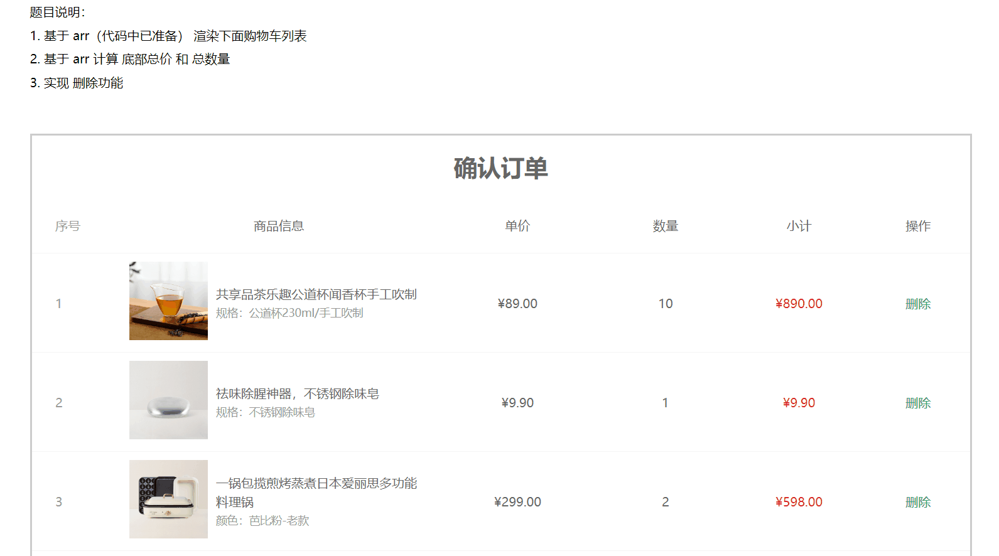
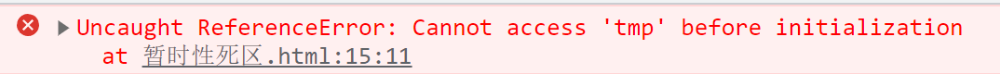

# 今日能力目标

掌握**数组常用方法**来便捷完成功能，掌握**箭头函数**、**解构赋值**、**展开运算符**语法来简化代码

# 必要知识:

1. 能够利用**map + join**渲染数据到页面上
2. 能够利用**reduce** 来对数组元素进行求和
3. 能够利用**箭头函数**、**解构赋值**、**展开运算符**语法来简化代码


# 一、编程题

## 确认订单页面-综合题

**难度等级：** ★★★

**作业目标： **利用 js 展示确认订单页面

**考察能力：**

1. 能够利用**map + join**渲染数据到页面上
2. 能够利用**reduce** 来求和
3. 能够利用**splice**来删除数据

### 作业需求

效果图需求如下：



**需求如下：**

1. 页面打开需要渲染所有订单信息
2. 实现删除功能
3. 实现计算总件数和总价功能
4. 需要尽可能多的使用新语法简化代码（如：`map`、`reduce`、`splice`、箭头函数，解构赋值等语法）

### 相关素材

见附件

### 思路分析

1. **渲染功能：**
   - `map`映射得到新数组，里面包含需要的**tr结构**
   - 配合`join()`将新数组拼接得到字符串结构
   - 渲染到**`tbody`结构**中
2. **计算 总数量 和 总价**
   - 使用`reduce`方法 来计算
   - 需要注意：由于 `arr`是对象数组，**所以`reduce`的起始值必须设置**
3. **删除功能**
   - 删除的`a`链接已经提供了执行`del`函数，需要在`del`函数内实现删除功能
   - 可以借助`splice`方法实现删除功能，所以在`del`函数中需要传递开始删除的位置下标
   - 删除之后，需要重新渲染列表数据，以及重新计算总件数和总价，所以需要将渲染和求和功能进行使用函数封装，以便复用

### 参考答案


### 总结反馈

- [ ] 我看效果图就可以分析出实现步骤并独立完成
- [ ] 我看效果图没有思路，需要看本题思路分析才能完成
- [ ] 我需要看参考答案才能梳理思路和完成代码
- [ ] 我没有思路，也看不懂答案，无法完成本题


## 删除水果列表-二次开发题

**难度等级：** ★★★★

**作业目标： **利用 js 实现水果列表

**考察能力：**

1. 能够看懂已经提前准备好代码，并且能说出代码执行过程
2. 能够基于已有的代码使用新语法进行简化代码

### 作业需求

开发中，我们经常遇到在**已有**的业务基础上**新增**一些需求，所以各位同学先梳理已有提供好的业务，然后在根据需求分析新业务如何实现

**1. 已有业务：**

正在开发一个xx商城的购物车功能，需要展示用户购物车的数据列表，目前功能已经开发如下效果了：


1. 购物车的数据都已经渲染展示到页面中
2. 删除购物车的数据

**2. 新增需求**

​	①：渲染购物车列表数据，必须要使用 `map` + `join` 配合实现

​	②：求和功能必须使用 `reduce`实现

​	③：代码中必须要有**箭头函数** ， **解构赋值**等语法的参与（不限于其他技术的使用）

**完整效果图如下：**


### 相关素材

见附件

### 思路分析

本题是一个典型的二次开发题型，按照需求：在功能实现中运用新语法，从而来简化代码

1. **渲染功能：**
   - `map`映射得到新数组，里面包含需要的**类名为tr的div结构**，表示购物车中的每一行
   - 配合`join()`将新数组拼接得到字符串结构
   - 渲染到**类名为tbody的div结构**中
   
2. **求和功能**
   - 使用`reduce`方法 来计算总件数和总价
   - 需要注意：由于 `fruit`是对象数组，**所以`reduce`的起始值必须设置**

### 参考答案

```js

```

### 总结反馈

- [ ] 我看效果图就可以分析出实现步骤并独立完成
- [ ] 我看效果图没有思路，需要看本题思路分析才能完成
- [ ] 我需要看参考答案才能梳理思路和完成代码
- [ ] 我没有思路，也看不懂答案，无法完成本题


# 二、问答题

## 使用箭头函数的好处，和注意事项

**难度等级：**★★

**考察能力**

1. 掌握箭头函数的基本使用

### 问答要点

1. 使用箭头函数的好处
2. 使用注意事项

### 参考答案

```markdown
替代匿名函数，写法更简洁
只一个形参，可以省略小括号不写
只有一句输出代码，可以省略 { } 和 return
返回对象，需要使用小括号包裹对象
```


## 如何区分展开运算符和剩余参数

**难度等级：**★★★

**考察能力**

1. 掌握展开运算符的基本使用
2. 掌握剩余参数的基本使用

### 问答要点

1. 区分展开运算符 和 剩余参数

### 参考答案

```markdown

```


## 使用对象和数组解构，有哪些注意事项

**难度等级：**★★★

**考察能力**

1. 掌握解构赋值的基本使用

### 问答要点

1. 对象解构的注意事项
2. 数组解构的注意事项

### 参考答案

```markdown

```


# 三. 自主学习题

## 暂时性死区

**难度等级：** ★★★

小伙伴们，在听到这个名字的时候，是不是就被唬住了，学个代码太恐怖啦~~~

在面试的时候，也许会遇到该问题哦

- 面试题：请说说你的暂时性死区的理解

- 笔试题：请说出以下代码的结果

  ```js
  let tmp = 123;
  
  if (true) {
      tmp = 'abc';
      console.log(tmp)
      let tmp;
  }
  ```

### 题目要求

1. 能够简明扼要的说出对暂时性死区的理解
2. 能够回答上来以上代码的结果，并解释原因

### 参考教程
[阮一峰教程](https://es6.ruanyifeng.com/#docs/let#%E6%9A%82%E6%97%B6%E6%80%A7%E6%AD%BB%E5%8C%BA)

### 相关素材

无

### 参考答案
以上代码题的结果是会报错



  ```js
let tmp = 123;

if (true) {
    // 由于在该块级作用域中已经let 声明了 tmp变量，所以该区块对let声明的tmp变量，从一开始就形成了封闭作用域
    // 也就意味着：凡是在声明之前就使用这些变量，就会报错。
    tmp = 'abc';
    console.log(tmp)
    let tmp;
}
  ```

### 总结提炼

1. 暂时性死区的理解
	
	明确规定，如果区块中存在`let`和`const`命令，这个区块对这些命令声明的变量，从一开始就形成了封闭作用域。**凡是在声明之前就使用这些变量，就会报错。**
	
	总之，在代码块内，使用`let`命令声明变量之前，该变量都是不可用的。这在语法上，称为“**暂时性死区**”（temporal dead zone，简称 TDZ）。


# 四、客观题

1. 下列关于作用域说法错误的是？()

    A：  JavaScript作用可以分为全局作用域和局部作用域

    B： 全局作用域声明的变量可以给局部作用域使用

    C： 局部作用域可以分为函数作用域和块级作用域

    D： 局部作用域声明的变量可以给其他局部作用域使用

   

2. 下列关于作用域链说法错误的是？()

    A： 作用域链本质上是底层的变量查找机制

    B： 在函数被执行时，会优先查找当前函数作用域中查找变量

    C： 如果当前作用域查找不到则会优先从全局作用域查找，按照从外到内的顺序查找

    D： 子作用域能够访问父作用域，父级作用域无法访问子级作用域

   

3. 下列关于剩余参数说法错误的是？()

    A： 剩余参数允许我们将一个不定数量的参数表示为一个数组

    B： 剩余参数是个真数组，具备pop、push等方法

    C： 剩余参数和arguments动态参数是一样的，但是写法更简单

    D： 开发中提倡使用剩余参数想必也是极好的

   

4. 下列关于箭头函数写法正确的是?()

    A： const fn = x =>  x + x    只有一个参数可以省略小括号

    B： const fn = x =>  x + x    只有一行代码，可以省略大括号，而且还可以省略return

    C： const fn = x =>  ({uname})    箭头函数还可以返回对象，但是必须用小括号包含

    D： const fn = x，y =>   x + y    平时省略小括号更简单

   

5. 下列关于数组解构说法错误的是?()

    A： 数组解构是将数组的单元值快速批量赋值给一系列变量的简洁语法

    B： [a,b] = [1,2,3]  这样写返回的结果是  a = 2    b =  3  

    C： [a,b] = [[1,2], 3]   返回的结果是:  a = [1,2]   b  = 3

    D： 还是建议尽量数组单元值和变量匹配

   

6. 有如下代码，下列关于对象解构说法正确的是?()
   ```js
   const obj = [{uname: '佩奇'， age: 18}]
   ```

    A： {uname, age}  可以得到    佩奇 和  18

    B：[{uname}] 可以得到  佩奇

    C： {age}  可以得到 18

    D： [uname, age ] 可以得到    佩奇   和  18

   

7. 下面关于数组方法说法错误的是? ()

    A：forEach 方法可以遍历数组，并且返回一个新的数组，不修改原数组

    B：map 方法可以迭代数组，主要用于数据处理，并且返回一个新的数组，不修改原数组

    C：filter方法可以筛选数组，主要用于筛选符合条件数据，并且返回一个新的数组，不修改原数组

    D:   push、shift、splice 都会修改原数组

   


