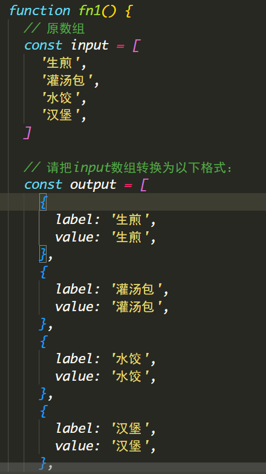

# 今日能力目标

掌握数组、对象、字符串、日期对象等常用方法来方便实现功能

# 必要知识:

1. 能够利用**filter**过滤得到所有符合条件的数据

# 一、编程题

## 语法强化-综合题

**难度等级：** ★★★

**作业目标：**加强数组新语法练习

**考察能力：**

1. 能够利用**map**映射得到新数组
2. 能够利用**filter**过滤得到符合条件的新数组
3. 能够利用**reduce**求和

### 作业需求



**需求如下：**

按照各个函数内的需求来完成

### 相关素材

见附件

### 思路分析

本题主打数组常用方法的强化练习

### 参考答案-第一题

```js
// 第一题：
fn1()
function fn1() {
  // 原数组
  const input = [
    '生煎',
    '灌汤包',
    '水饺',
    '汉堡',
  ]

  // 请把数组转换为以下格式：
  const output = [
    {
      label: '生煎',
      value: '生煎',
    },
    {
      label: '灌汤包',
      value: '灌汤包',
    },
    {
      label: '水饺',
      value: '水饺',
    },
    {
      label: '汉堡',
      value: '汉堡',
    },
  ]


  const res = input.map(item => ({
    label: item,
    value: item,
  }))

  // item: '生煎' 转换成 ({ label: '生煎', value: '生煎' })
  console.log(res)
}
```

### 参考答案-第二题

```js
fn2()
function fn2() {
  //  已知有以下数据：
  const data = [
    {
      sku: '1001',
      name: 'iPhone 7 Plus 128G 玫瑰金色 移动联通电信4G手机',
      is5G: false,
      price: 6188,
      count: 100, // 库存
      suggestions: [
        '1002',
        '1003',
        '1004',
      ], // 相关推荐
    },
    {
      sku: '1002',
      name: 'iPhone 14 Pro 256G 深空灰色 移动联通电信5G手机',
      is5G: true,
      price: 9999,
      count: 100,
      suggestions: [
        '1001',
        '1003',
      ],
    },
    {
      sku: '1003',
      name: 'iPhone 14 Pro Max 256G 深空灰色 移动联通电信5G手机',
      is5G: true,
      price: 10999,
      count: 0,
      suggestions: [
        '1001',
        '1002',
      ],
    },
    {
      sku: '1004',
      name: 'iPhone 14 Pro Max 256G 白色 移动联通电信5G手机',
      is5G: true,
      price: 10999,
      count: 9,
      suggestions: [
        '1001',
      ],
    },
  ]

  // 请完成以下需求：
  // 1. 找出所有5G手机
  // 2. 找出所有有货的手机
  // 3. 找出所有有货的5G手机
  // 4. 找出所有有货的5G手机的总价格（数量 * 单价）

  // 1. 找出所有5G手机
  console.log(data.filter(d => d.is5G))

  // 2. 找出所有有货的手机
  console.log(data.filter(d => d.count))

  // 3. 找出所有有货的5G手机
  console.log(data.filter(d => d.count && d.is5G))

  // 4. 找出所有有货的5G手机的总价格（数量 * 单价）
  console.log(data.filter(d => d.count && d.is5G).reduce((total, item) => total + item.count * item.price, 0))
}
```

### 参考答案-第三题

```js
fn3()
function fn3() {
  // 有如下数据
  const data = [
    {
      id: '1faa0e81', // 快递单号
      from: { // 发件人信息
        name: '张三',
        id: '1412908431238',
        phone: '13800138000',
        address: '北京市朝阳区望京soho',
      },
      to: { // 收件人信息
        name: '李四',
        id: '1412908431239',
        phone: '13800138001',
        address: '北京市海淀区西二旗',
      },
      timestamp: 1610000000000, // 时间戳
      status: 'pending', // 状态 pending在途中 resolved已签收 rejected拒签
      goodsType: 'food', // 类型 food食品 electronic电子
      price: 18,  // 价格
      type: '次日达', // 快递类型
    },
    {
      id: '1faa0e82',
      from: {
        name: '张武',
        id: '1412908431240',
        phone: '13800138002',
        address: '重庆市渝中区渝中路',
      },
      to: {
        name: '李六',
        id: '1412908431241',
        phone: '13800138003',
        address: '重庆市渝北区渝北路',
      },
      timestamp: 1610000123123,
      status: 'resolved',
      goodsType: 'electronics',
      price: 188,
      type: '次日达',
    },
    {
      id: '1faa0e83',
      from: {
        name: '赵信',
        id: '1412908431242',
        phone: '13800138004',
        address: '上海市浦东新区张江高科',
      },
      to: {
        name: '王9',
        id: '1412908431243',
        phone: '13800138005',
        address: '深圳市南山区科技园',
      },
      timestamp: 1610000123124,
      status: 'pending',
      goodsType: 'food',
      price: 18,
      type: '次日达',
    },
    {
      id: '1faa0e84',
      from: {
        name: '蛮王',
        id: '1412908431244',
        phone: '13800138006',
        address: '重庆市渝中区千与千寻小区',
      },
      to: {
        name: '艾希',
        id: '1412908431245',
        phone: '13800138007',
        address: '重庆市渝北区中央公园',
      },
      timestamp: 1610000123125,
      status: 'rejected',
      goodsType: 'flowers',
      price: 99,
      type: '隔日达',
    },
  ]

  // 请完成以下需求
  // 1. 找出所有food类型的订单
  // 2. 找出所有次日达的订单
  // 3. 找出所有次日达的food类型的订单
  // 4. 统计快递的拒签率(rejected为退回)
  // 5. 找出所有在途中的订单(即pending状态的订单)


  // 1. 找出所有food类型的订单
  console.log(data.filter(d => d.goodsType === 'food'))

  // 2. 找出所有次日达的订单
  console.log(data.filter(d => d.type === '次日达'))

  // 3. 找出所有次日达的food类型的订单
  console.log(data.filter(d => d.type === '次日达' && d.goodsType === 'food'))

  // 4. 统计快递的拒签率(rejected为退回)
  console.log(data.filter(d => d.status === 'rejected').length / data.length)

  // 5. 找出所有在途中的订单(即pending状态的订单)
  console.log(data.filter(d => d.status === 'pending'))
}
```

### 参考答案-第四题

```js
// --------------------------------------------------------------
// 封装函数，求得数组中的最大值
function getMax(arr) {
  // 填入代码
  return Math.max(...arr)
}
let arr = [1, 6, 2, 8, 11, 5]
let max = getMax(arr)
console.log(`求得数组中的最大值: ${max}`)


// --------------------------------------------------------------
// 封装函数，求得传入数组元素的和
function getSum(arr) {
  // 填入代码
  return arr.reduce((total, item) => total + item)
}
let arr2 = [3, 9, 9, 2, 7, 5]
let sum2 = getSum(arr2)
console.log(`数组元素的和: ${sum2}`)


// --------------------------------------------------------------
// 封装函数，求得传入数组⾥⼤于 5 的和
function getLargeSum(arr) {
  // 填入代码
  return arr.filter(item => item > 5).reduce((total, item) => total + item)
}

let arr3 = [4, 9, 6, 90, 3, 11]
let sum3 = getLargeSum(arr3)
console.log(`数组⾥⼤于 5 的和: ${sum3}`)


// --------------------------------------------------------------
// 封装函数，对数组，按照价格进行升序排序
function sortByAsc(arr) {
  // 填入代码
  return arr.sort((a, b) => a.price - b.price)
}
const arr4 = [
  { id: 1, name: '茶杯', price: 18 },
  { id: 2, name: '电视机', price: 2000 },
  { id: 3, name: '牙刷', price: 8 },
  { id: 4, name: '电脑', price: 5000 },
]
const res4 = sortByAsc(arr4)
console.log(res4)


// ---------------------------------------------------------------
// 封装函数，将学生数组中的所有姓名，存入成一个新数组，并过滤掉小强 => 得到 ['小明', '小丽', '小美']
function getNames(arr) {
  // 填入代码
  return arr.map(item => item.name).filter(name => name !== '小强')
}
const arr5 = [
  { id: 1, name: '小强', score: 18 },
  { id: 2, name: '小明', score: 2000 },
  { id: 3, name: '小丽', score: 8 },
  { id: 4, name: '小美', score: 5000 },
]
const res5 = getNames(arr5)
console.log(res5)
```

### 总结反馈

- [ ] 我看效果图就可以分析出实现步骤并独立完成
- [ ] 我看效果图没有思路，需要看本题思路分析才能完成
- [ ] 我需要看参考答案才能梳理思路和完成代码
- [ ] 我没有思路，也看不懂答案，无法完成本题


##  员工系统 -综合题

**难度等级：** ★★★★★

**作业目标： **利用 js 实现员工系统的增删改查

**考察能力：**

1. 能够利用**map + join**渲染数据到页面上
2. 能够利用**filter** 来查询所有符合条件的数据
3. 能够利用**filter** 来删除指定的数据

### 作业需求

效果图需求如下：


**需求如下：**

1. 页面打开需要渲染所有员工信息
2. 实现删除员工信息
3. 实现添加员工信息
4. 实现查询员工
5. 实现点击重置按钮，重新渲染员工信息
6. 需要尽可能多的使用新语法简化代码（如：箭头函数，解构赋值等语法）

### 相关素材

见附件

### 思路分析

本题是一个典型的管理系统界面效果，核心处理数据的增删改查

1. **渲染所有数据：**

   - 借助 `map 、join` 方法实现数据渲染到页面上

2. **删除功能**

   - 点击`x`，需要删除指定的数据

   - 借助于 `filter` 来删除数据，而不是 `splice`

     注意：`splice`删除是根据下标来删除的，`filter` 过滤需要根据员工`id`来删除

   - 删除之后，需要重新渲染到页面上

3. **增加功能**

   - 点击`+`，需要弹框，让用户输入新进职工的名字
   - 需要从 `1- 15` 张图片随机一张图片作为员工的头像
   - 需要从 `jobs` 数组中随机一个工种
   - 将以上数据信息添加到数组中（最新的在最前面），并渲染到页面上

4. **查找功能**

   - 点击 `放大镜`， 需要弹框，让用户输入需要查找的员工姓名
   - 支持模糊匹配，即不用输入完整用户名就可以查找到员工信息
   - 并渲染展示到页面上
   - 当查找员工之后，可以点击重置按钮，重新渲染所有员工数据

### 参考答案

```js
// 1. 渲染所有数据到页面中
render()
function render(data = jsonData) {
  // 2. map + join() 实现渲染功能
  document.querySelector('.items').innerHTML = data
    .map(({ id, avatar, name, job }) => {
      return `
          <div class="item">
              <div class="profile">
                
              </div>
              <h1 class="name">${name}</h1>
              <p class="job">${job}</p>

              <a href="javascript:void(0);" onclick="del(${id})"><i class="iconfont icon-guanbi"></i></a>
          </div>
      `
    })
    .join('')
}

// 2. 删除功能
function del(id) {
  // console.log(id)
  // 借助 filter 实现删除功能
  jsonData = jsonData.filter(item => item.id !== id)
  // 删除之后，重新渲染
  render()
}

// 3. 增加功能
function add() {
  // 弹框
  const uname = prompt('请填写入职员工名称')

  if (uname) {
    // 随机jobs数组下标
    const jobIndex = Math.floor(Math.random() * jobs.length)
    
    // 随机 1 - 15 的头像
    const avatar = Math.floor(Math.random() * 15) + 1
	
    // 将员工信息添加到数组的最前面
    jsonData.unshift({
      id: +new Date(),
      name: uname,
      avatar: `./images/${avatar}.jpg`,
      job: jobs[jobIndex],
    })
    // 渲染到页面上
    render()
  } else {
    alert('未填写员工信息')
  }
}

// 4. 查找功能
function search() {
  // 弹框
  const findName = prompt('请输入需要查找的员工名称')

  if (findName) {
    // 如果有输入值，就来查找
    const res = jsonData.filter(item => item.name.includes(findName))

    // 如果有查找结果，就渲染
    if (res.length) render(res)

    // 没有查找到结果，就提示无结果
    else alert('未查找到该员工信息')
  } else {
    // 没有查找到结果，就渲染所有数据
    render()
  }
}
```

### 总结反馈

- [ ] 我看效果图就可以分析出实现步骤并独立完成
- [ ] 我看效果图没有思路，需要看本题思路分析才能完成
- [ ] 我需要看参考答案才能梳理思路和完成代码
- [ ] 我没有思路，也看不懂答案，无法完成本题


# 二、问答题

## Object 有哪些常用方法，有何作用

**难度等级：**★★

**考察能力**

1. 掌握`Object`的常用方法

### 问答要点

1. `Object.keys()` 方法
2. `Object.values()` 方法
3. `Object.assign()` 方法

### 参考答案

```markdown
Object.keys() 作用：返回一个包含对象自身的所有属性名称的数组。

Object.values() 作用：返回一个包含对象自身的所有属性值的数组。 

Object.assign() 作用：将一个或多个源对象的属性复制到目标对象，并返回目标对象。用于对象合并和克隆。
```


## 字符串有哪些常用方法，有何作用

**难度等级：**★★★

**考察能力**

1. 掌握字符串的常用方法

### 问答要点

1. 需要回答 `split` 、 `startsWith`  、`includes`  、`substring`

### 参考答案

```markdown
length：返回字符串的长度（字符数）

trim()：移除字符串两端的空格字符。

toUpperCase()：将字符串转换为大写
toLowerCase()：将字符串转换为小写

split()：将字符串拆分为字符数组

startsWith()：检查字符串是否以指定的子字符串开头。
endsWith()：检查字符串是否以指定的子字符串结尾。
includes()：检查字符串是否包含指定的子字符串。

indexOf()：在字符串中查找指定的子字符串并返回第一次出现的索引位置，如果未找到则返回 -1。
substring()：提取字符串的子字符串，包括起始索引但不包括结束索引。
slice()：提取字符串的子字符串，包括起始索引但不包括结束索引。
```


## 数组常用方法有哪些

**难度等级：**★★★★

**考察能力**

1. 掌握数组的常用方法和作用

### 问答要点

1. 数组常用的增删改查方法
2. 数组常用的遍历方法
3. 其他常用方法

### 参考答案

```js
数组常用的增删改查方法 push 、pop、 shift 、unshift、splice
	let arr = [10, 20, 30]
    
    arr.push(40) // 在数组的末尾添加40
    arr.pop() // 删除数组的最后一项
    arr.shift() // 删除数组的第一项
    arr.unshift(50) // 在数组的开头添加50
    arr.splice(1,1) // 在下标1的位置删除1个元素（即删除下标1的元素）

数组常用的遍历方法 forEach 、map、filter、reduce、some、every、find、findIndex
	let arr = [10, 20, 30]

    // forEach 只遍历，没有返回值
    arr.forEach(item => console.log(item)) // 10 20 30

	// map 会映射得到新数组
    arr.map(item => item * 2) // [20 40 60]

    // filter 会过滤得到新数组
    arr.filter(item => item > 15) // [20, 30]

    // reduce 可以用于求和
    arr.reduce((prev, item) => prev + item) // 60

    // some 判断数组中是否有符合条件的，有就返回true，都没有返回false
    arr.some(item => item > 15) // true

    // every 判断数组中是否都符合条件的，只要有一个不符合条件就返回false，都符合返回true
    arr.every(item => item > 15) // false

    // find 用于查看数组中符合条件的第一项
    arr.find(item => item > 15) // 20

    // findIndex 用于查看数组中符合条件的第一项的下标
    arr.findIndex(item => item > 15) // 1

    let arr = [10, 20, 30]

其他常用方法
    // join 会使用指定的分隔符拼接数组的每一项得到字符串
    arr.join('-') // '10-20-30'

    // sort 用于数组排序
    arr.sort((a, b) => b - a) // 降序排序数组
```


## 如何处理JS中的异常

**难度等级：**★★★

**考察能力**

1. 能够知晓异常处理的作用
2. 能够掌握`throw`关键字的使用。
3. 能够掌握`try-catch`语句的使用。

### 问答要点

1. 什么是`JavaScript`中的异常处理？ 
2.  `throw`关键字的作用是什么？ 
3.  `try-catch`语句的作用是什么？ 

### 参考答案

```markdown
js中的异常处理是一种机制，用于处理运行时发生的错误或异常。
	异常处理允许程序员在代码中检测和响应错误，以确保程序不会因错误而崩溃。 
	
throw关键字用于抛出自定义异常。它可以用于在代码中主动引发错误，以便在后续的代码中进行捕获和处理。 比如：
	throw new Error("This is a custom error.");
	
try-catch语句用于捕获和处理异常。它包含两个块：
	try块用于包装可能引发异常的代码，而catch块用于处理异常情况。
	如果在try块中发生异常，控制流将跳转到匹配的`catch`块，从而避免程序终止。 
	比如：
	try {
        // 可能引发异常的代码
    } catch (error) {
        // 处理异常的代码
        console.error(error.name, error.message);
    }
```


# 三. 自主学习题

## Array.isArray()方法

**难度等级：** ★★

在面试中，经常会被问到如何准确的判断一个数据是否为数组

小伙伴们，你们能够想到有什么方案可以准确的判断吗？

那么这题可以回答上 `Array.isArray`方法哦

### 题目要求
1. 通过该方法来判断数据是否为数组

### 参考教程
[阮一峰-JS教程](https://wangdoc.com/javascript/stdlib/array#arrayisarray)
或者
[MDN文档](https://developer.mozilla.org/zh-CN/docs/Web/JavaScript/Reference/Global_Objects/Array/isArray)

### 相关素材
见附件

### 参考答案
```js
const arr = []

const likeArray = {0: 'apple', 1: 'banner', length: 2}

Array.isArray(arr) // true
Array.isArray(likeArray) // false
```

### 总结提炼

`Array.isArray()` 方法用于确定传递的值是否是一个 数组


## 数组的flat方法

**难度等级：**★★★

在面试的时候，会遇到类似问题，如何把一个多维数组进行扁平化得到一维数组

例如，有数组`[[1, 2], [3, [4, 5]], 6]`，处理得到新数组 `[1, 2, 3, 4, 5, 6]`。 

小伙伴们，你们能够想到有什么方案可以实现这个需求吗？

类似多维数组扁平化处理，就可以使用数组的`flat`方法来实现

### 题目要求

通过`flat`方法实现`[[1, 2], [3, [4, 5]], 6]`，处理得到新数组 `[1, 2, 3, 4, 5, 6]`


### 参考教程

[阮一峰教程](https://es6.ruanyifeng.com/#docs/array#%E5%AE%9E%E4%BE%8B%E6%96%B9%E6%B3%95%EF%BC%9Aflat%EF%BC%8CflatMap)

或者

[MDN文档](https://developer.mozilla.org/zh-CN/docs/Web/JavaScript/Reference/Global_Objects/Array/flat)

### 相关素材

见附件

### 参考答案

```js
const arr = [[1, 2], [3, [4, 5]], 6]

const newArr = arr.flat(3)
console.log(newArr) // [1, 2, 3, 4, 5, 6]
```

### 总结提炼

1.  **`flat()`** 方法创建一个新的数组，并根据指定深度递归地将所有子数组元素拼接到新的数组中。 
2. 参数用来指定要提取嵌套数组的结构深度，默认值为 1。 该案例，数组深度为3，所以可以将参数设置为3


# 四、客观题

1. 下面关于数组常见方法说法错误的是? ()

    A： map  迭代数组 经常用于处理数据，返回一个新的数组

    B： reduce 累计器， 经常用于数组求和之类的类计操作

    C： every   检查是否有元素符合指定查找条件，有元素就返回 true

    D： find  查找元素， 返回符合条件的第一个数组元素， 如果找不到就返回 undefined

   **答案：**C

   **解析：** every 方法检查数组中每一项是否都符合指定查找条件，都符合返回 true，故选项C错误

2. 以下哪个字符串方法用于将字符串分割成子字符串，并将这些子字符串存储在数组中？

   A：`slice()`

   B：`split()`

   C：`splice()`

   D：`substring()`
   
   **答案：**B

   **解析：**  `split()`方法用于将一个字符串分割成多个子字符串，并将这些子字符串存储在一个数组中，分割的依据通常是指定的分隔符。 故选项B正确

3.  以下哪个描述准确地定义了JavaScript中的递归函数？ ()

   A：递归函数是一种调用自身的函数。

   B：递归函数是一种可以同时调用多个函数的函数。

   C：递归函数是一种可以在函数内部使用循环的函数。

   D：递归函数是一种可以在函数内部使用条件语句的函数。

   **答案：**A

   **解析：** 递归函数是指函数内部调用自身的函数，故选项A正确

4. 下列选项中throw抛异常说法错误的是？ ()

   A： throw 后面跟的是错误提示信息

   B：throw 抛出异常信息，但是我们必须加 return 来终止程序的往下执行

   C：Error 对象配合 throw 使用，能够设置更详细的错误信息

   D：Error 对象配合 throw 控制台显示的提示可以为红色警示

   **答案：**B

   **解析：**  一旦 throw 抛出异常，程序将停止执行当前函数的剩余代码，不需要使用 return 来终止程序的执行。故选项B错误

5. 下列选项中 try/catch捕获错误信息 说法错误的是？ ()

   A：将预估可能发生错误的代码写在 catch 代码段中

   B：如果 try 代码段中出现错误后，会执行 catch 代码段，并截获到错误信息

   C：我们需要给catch 添加 return 可以终止程序继续执行

   D：finally  不管是否有错误，都会执行 

   **答案：**A

   **解析：** 将预估可能发生错误的代码写在 try 代码段中，故选项A错误