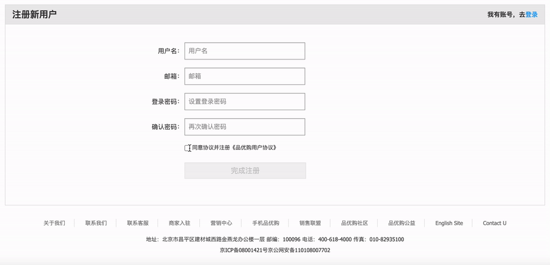
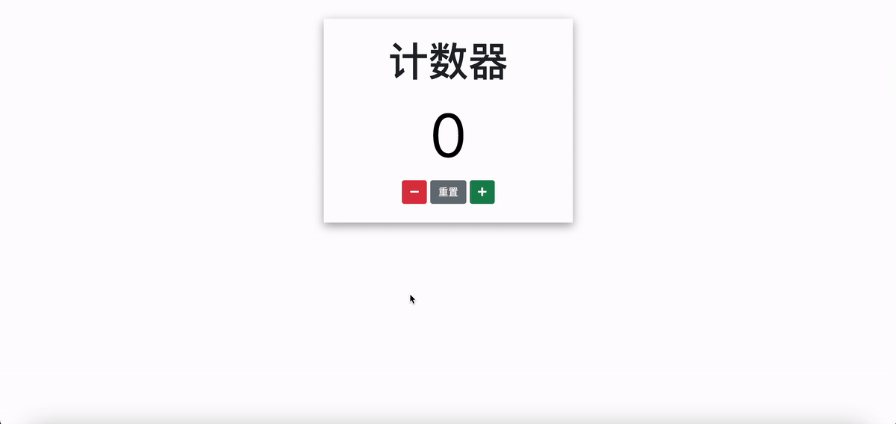
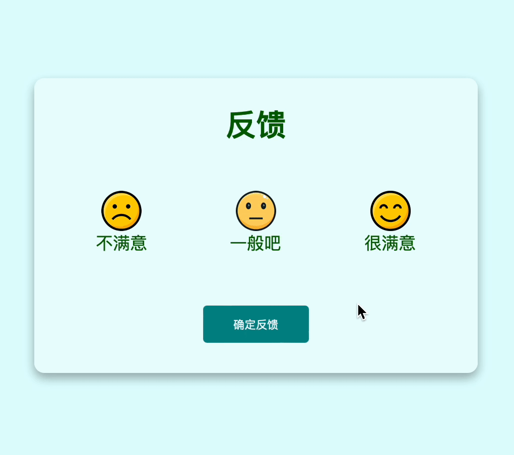

# 今日能力目标

能够通过点击事件，操作DOM元素的属性和样式

# 必要知识

1. 能够使用**`querySelector`**和**`querySelectorAll`**方法获取DOM元素
2. 能够使用**`innerText`**和**`innerHTML`**属性操作元素内容
3. 能够使用**`addEventListener`**给元素绑定事件，监听用户的点击行为
4. 能够通过js**操作元素的属性**，包括常见属性、样式属性、自定义属性

# 一、编程题

## 综合案例：按钮禁用效果

**难度等级：**   ★

**作业目标： ** 利用js实现常见的按钮禁用效果

**考察能力：**

1. 能够获取复选框的**`checked`**属性的值，拿到`checkbox`的勾选状态
2. 能够操作`button`按钮的**`disabled`**属性，来控制按钮的禁用状态

### 作业需求

效果图需求如下：



**需求如下：**

1. 勾选复选框，按钮可以点击，且背景变为红色
1. 不勾选复选框，按钮不可点击，且背景变为灰色


### 相关素材

见附件

### 思路分析

本题是一个典型的使用JS操作DOM属性的效果。这类效果的核心步骤是：获取元素；绑定事件；操作元素

1. **获取元素**
   * 通过`querySelector()`方法获取复选框和按钮元素，并将两个元素用变量存起来
2. **绑定事件**
   * 给复选框绑定`click`事件
3. **操作元素**
   * 在`click`事件中，将复选框的`checked`属性取反并赋值给按钮的`disabled`属性


### 参考答案

```js

```

### 总结反馈

- [ ] 我看效果图就可以分析出实现步骤并独立完成
- [ ] 我看效果图没有思路，需要看本题思路分析才能完成
- [ ] 我需要看参考答案才能梳理思路和完成代码
- [ ] 我没有思路，也看不懂答案，无法完成本题

## 综合案例：知乎写想法

**难度等级：**   ★

**作业目标： ** 完成知乎写想法效果

**考察能力：**

1. 能够使用**`classList`**操作元素类名，控制元素的显示和隐藏

### 作业需求

效果图需求如下：


**需求如下：**

1. 点击写想法，弹出模态框
2. 点击模态框中的✕，关闭模态框


### 相关素材

见附件

### 思路分析

本题是一个典型的使用JS切换元素显示效果的案例，实际开发中一般通过操作类名来完成元素的显示和隐藏。本题需要在点击事件中去操纵模态框和遮罩层的`hidden`类名。（备注：`hidden`类名用于控制模态框和遮罩层的显示和隐藏）

>  备注：`modal`类名表示模态框；`overlay`类名表示遮罩层；`show-modal`表示显示按钮；`close-modal`表示关闭按钮

1. **获取元素**
   * 通过**querySelector**方法获取元素，分别要获取到类名为`modal`、`overlay`、`show-modal`、`close-modal`的元素
   
2. **绑定事件**
   * 给类名为`show-modal`和`close-modal`的元素绑定`click`事件
3. **操作类名**
   * 3.1 显示模态框的时候类名为`modal`和`overlay`的元素需要**移除hidden**类名
   * 3.2 隐藏模态框的时候类名为`modal`和`overlay`的元素需要**添加hidden**类名


### 参考答案

```js

```

### 总结反馈

- [ ] 我看效果图就可以分析出实现步骤并独立完成
- [ ] 我看效果图没有思路，需要看本题思路分析才能完成
- [ ] 我需要看参考答案才能梳理思路和完成代码
- [ ] 我没有思路，也看不懂答案，无法完成本题


## 综合案例：百度换肤 

**难度等级：**   ★★

**作业目标： ** 完成百度换肤效果

**考察能力：**

1. 能够通过`style`属性修改body的背景图片

### 作业需求

效果图需求如下：


**需求如下：**

1. 点击页面顶部的五张小图片，将整个网页的背景切换成对应的图片


### 相关素材

见附件

### 思路分析

本题是一个典型的使用JS操纵DOM元素的效果。这类效果核心步骤是：**获取元素**，**绑定事件**，**操纵元素**

1. 获取元素
   * 获取所有的img图片
2. 绑定事件
   * 循环遍历所有图片，给每张图片绑定`click`事件
3. 操作元素
   * 3.1 获取到点击的那个图片的`src`属性值
   * 3.2 修改body的背景图片为上一步获取到的`src`


### 参考答案

```js
 
```

### 总结反馈

- [ ] 我看效果图就可以分析出实现步骤并独立完成
- [ ] 我看效果图没有思路，需要看本题思路分析才能完成
- [ ] 我需要看参考答案才能梳理思路和完成代码
- [ ] 我没有思路，也看不懂答案，无法完成本题

## 综合案例：计数器

**难度等级：**   ★★★★

**作业目标： ** 完成计数器案例

**考察能力：**

1. 能够通过**`dataset`**获取元素身上绑定的自定义属性
2. 能够通过**`style`**属性修改元素的样式

### 作业需求

效果图需求如下：



**需求如下：**

1. 点击➖按钮，页面数量减1，如果数量小于0，文字为红色
2. 点击➕按钮，页面数量加1，如果数量大于0，文字为绿色
3. 点击重置按钮，页面数量变为 0，颜色变回黑色


### 相关素材

见附件

### 思路分析

本题是一个典型的使用JS操纵数据并且和页面联动的效果。这类效果的核心步骤是：**保存元素和数量**，**修改数据**，**样式和数据联动**

1. 保存元素和数量
   * 定义变量保存操纵的元素和数量`num`
   
2. 修改数据
   * 2.1 循环按钮绑定`click`事件
   * 2.2 在按钮的事件中根据自定义属性`type`区分数量加、减和重置操作，并给`num`赋值

3. 样式和数据联动
  
   * 根据`num`大小的变化，动态修改展示值的元素的样式


### 参考答案

```js

```

### 总结反馈

- [ ] 我看效果图就可以分析出实现步骤并独立完成
- [ ] 我看效果图没有思路，需要看本题思路分析才能完成
- [ ] 我需要看参考答案才能梳理思路和完成代码
- [ ] 我没有思路，也看不懂答案，无法完成本题

## 综合案例：用户反馈 

**难度等级：**   ★ ★ ★ ★

**作业目标： ** 完成用户反馈

**考察能力：**

1. 能够通过**`classList`**操作类名，修改反馈选项样式
2. 能够通过**`innerText`**、**`innerHTML`**修改容器内容

### 作业需求

效果图需求如下：



**需求如下：**

1. 点击反馈项，反馈项高亮
3. 点击确定按钮则显示评价结果


### 相关素材

见附件

### 思路分析

本题是一个使用JS提交用户反馈的效果。该效果主要核心点有**反馈项高亮**和**确定反馈**两块内容

> 备注：高亮样式通过`active`类名控制

1. 反馈项高亮
   * 1.1 定义变量保存操纵的元素和用户选择的数据
   * 1.2 给所有评价选项绑定`click`事件
   * 1.3 操作高亮样式
   * 1.4 存储选中结果
2. 确定反馈
   * 2.1 给确定按钮绑定`click`事件
   * 2.2 判断选中结果如果为空，则弹出提示
   * 2.3 不为空则将结果渲染到页面

模版如下：

```html
<div class="bold">谢谢您的支持!</div>
<div class="bold">您的反馈为: 不满意</div>
<p>您反馈的建议，将成为我们日后改进工作的重要参考内容。</p>
```


### 参考答案

```js


```

### 总结反馈

- [ ] 我看效果图就可以分析出实现步骤并独立完成
- [ ] 我看效果图没有思路，需要看本题思路分析才能完成
- [ ] 我需要看参考答案才能梳理思路和完成代码
- [ ] 我没有思路，也看不懂答案，无法完成本题


# 二、问答题

## innerText和innerHTML的作用和区别

**难度等级：**   ★

**考察能力：**

1. `innerText`和`innerHTML`的作用
2. `innerText`和`innerHTML`的区别

### 问答要点

1. `innerText`和`innerHTML`作用是什么？
2. 哪种情况下只能用`innerHTML`？

### 参考答案

```markdown

```


## 谈谈你对回调函数的理解

**难度等级：**   ★★★★★

**考察能力：**

1. 对于回调函数的理解

### 问答要点

1. 回调函数是什么？
1. 回调函数的应用场景？

### 参考答案

````markdown

````


## 箭头函数的this和普通函数的this有什么区别

**难度等级：**   ★★★★

**考察能力：**

1. 对于函数中this对象的理解

### 问答要点

1. 箭头函数的this指向谁？
2. 普通函数的this指向谁？

### 参考答案

```markdown

```


## 自定义属性的使用方式

**难度等级：**   ★★

**考察能力：**

1. 自定义属性的使用场景
2. 自定义属性的定义规范
2. 自定义属性的获取方式

### 问答要点

1. 自定义属性有什么用？
1. 自定义属性如何设置？
1. 自定义属性如何通过js获取？

### 参考答案

```markdown

```


## className和classList的适用场景

**难度等级：**   ★

**考察能力：**

1. 掌握`className`的使用
2. 掌握`classList`的使用

### 问答要点

1. `className`和`classList`的适用场景有哪些？

### 参考答案

```markdown

```


# 三、自主学习题

## innerText和textContent的异同

**难度等级：**★★★

除了innerText可以获取节点的文本内容，使用textContent也能够获取节点的文本内容，但是二者存在区别

### 题目要求

请对比以下js代码的打印结果：

```html
<!DOCTYPE html>
<html lang="en">
<head>
  <meta charset="UTF-8">
  <meta name="viewport" content="width=device-width, initial-scale=1.0">
  <title>Document</title>
</head>
<body>
  <style>
    div.hide {
      background-color: red;
      display: none;
    }
  </style>
  <script src="index.js"></script>

  <div class="hide">
    <div>看不见的div</div>

    <span>   看不到的span</span>
  </div>

  <script>
    console.log(document.body.innerText)
    console.log(document.body.textContent);
  </script>
</body>
</html>
```

### 参考教程

[textContent文档](https://developer.mozilla.org/zh-CN/docs/Web/API/Node/textContent)

### 相关素材

无

### 参考答案

```

```


# 四、客观题

1. 下列选项中关于 document对象说法错误的是？

   A. 是 DOM 里提供的一个对象，是DOM顶级对象

   B. document是个对象，所以里面有很多属性和方法，比如 document.write()

   C. document 作为网页内容的入口

   D. document  实际开发中不太常用

   

2. 如果我想获取第一个类名为box的元素，该使用哪一个方法？

   A. document.querySelector('box')

   B. document.querySelectorAll('box')

   C. document.querySelector('.box')

   D. document.querySelectorAll('.box')

   

3. 如果我想获取所有类名为box的元素，该使用哪一个方法？

   A. document.querySelector('box')

   B. document.querySelectorAll('box')

   C. document.querySelector('.box')

   D. document.querySelectorAll('.box')

   

4. 假设页面有两个类名为box的元素，以下哪一个语法会报错？（多选）

   A. document.querySelector('box').style.backgroundColor = 'red'

   B. document.querySelector('.box').style.backgroundColor = 'red'

   C. document.querySelectorAll('.box').style.backgroundColor = 'red'

   D. document.querySelectorAll('.box')[0].style.backgroundColor = 'red'

   

5. 关于innerText与innerHTML的区别，下列说法错误的是？

   A.  innerText 只能获取元素文本，无法获取标签

   B.  innerHTML可以获取文本 + 标签

   C.  innerText 赋值时无法解析标签

   D.  innerText与innerHTML在设置的时候，作用一致。

   

6. 关于元素HTML常用属性操作，下列说法错误的是？

   A.  元素HTML属性指的是HTML标签本身的属性，比如 title ， alt等等

   B.  修改img标签的图片语法是:   元素.src = '图片路径'

   C.  修改a标签的链接语法是:   元素.href = '链接'

   D.  获取元素的类名语法是： 元素.class

   

7. 关于操作元素css属性操作，下列说法错误的是？

   A.  我们可以通过style属性来修改常见样式

   B.  我们可以通过className修改类名时候，其实是追加类名，不影响以前类名

   C.  我们可以使用classList 来增加删除类名， 比如 元素.classList.add()等等

   D.  classList在添加类名时，不会影响原来的类名

   

8. 下列设置元素css样式语法，哪些是错误的？（多选）

   A.  元素.style.backgroundColor = 'red'

   B.  元素.style.backgroundColor = 'rgb(255,0,0)'

   C.  元素.style.background-color = 'red'

   D.  元素.style.width = 100

   E.   元素.style.src = './1.jpg'

   

9. 关于classList语法，下列说法正确的是？（多选）

   A.  classList的作用是操作元素的类名，包含新增、移除、切换类名等操作

   B.  新增类名：  元素.classList.add('类名')

   C.  移除类名：   元素.classList.remove('类名')

   D.  切换类名：  元素.classList.toggle('类名')

   

10. 关于表单属性语法，下列说法错误的是？（多选）

    A.  通过元素.innerText 属性也可以用于设置文本框的值

    B.  想要得到文本框的值是通过  文本框元素.value 获取

    C.  设置按钮禁用状态的语法是：  元素.style.disabled= true

    D.  设置表单选中状态的语法是：  元素.checked = true

    

11. 关于自定义属性说法错误的是？

    A.  在html5中通过专门的 data- 实现自定义属性  

    B. 在标签上一律以data-开头， 比如 <标签 data-id='10'> 内容 </标签>

    C.  想要使用自定义属性的值可以通过  元素.dataset 得到 比如 元素.dataset.id 

    D.  其中dataset返回的是一个函数，可以调用函数得到里面的值
    
    
