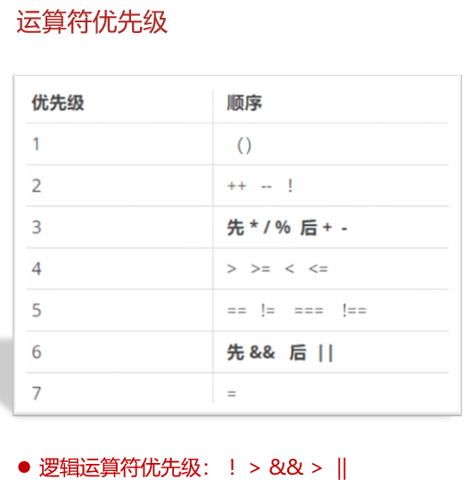

# 今日能力目标

掌握用户交互思维，能够对用户**输入**的数据进行**处理**，并且将结果**输出**显示到页面中

# 必要知识:

1. 能够利用**`while` 循环** 或 **`for`循环** ，重复执行代码
2. 能够使用**`break`**退出循环
3. 能够使用 **`if...else`**做判断，从而执行不同分支的代码
4. 能够使用 **字符串拼接** 将结构展示到页面上


# 一、编程题

## 简易计算器-综合题

**难度等级：** ★★

**作业目标：** 利用js实现网页版的简易加减乘除计算器

**考察能力：**

1. 能够利用**`while` 循环** ，重复执行代码
2. 能够使用**`break`**退出循环

### 作业需求 

效果图需求如下：


**需求如下：**

1. 页面打开出现一个弹框 ，让用户录入：` + - * / ` 或 `q`
   
   ①：提示：该弹框会一直提示，直到用户输入`q`结束程序
2. 如果用户输入的是 `+ - * /` 其中任何一个，比如用户输入是 `+` ，则是计算求和，如果用户输入是 `*`  则是计算乘积
   
   ①：则提示第一个弹框，提示用户：'请您输入第一个数字'
   
   ②：输入完毕则继续提示第二个弹框，提示用户：'请您输入第二个数字'
   
   ③：都输入完毕，则通过**警告框**输出**计算结果**
3. 如果输入是 `q`，则结束程序

### 相关素材

见附件

### 思路分析

本题我们可以按照这个思路来完成： 用户输入、处理数据、输出结果。

1. **用户输入：**
   - 1.1 循环弹框：弹框是会一直出现的，所以需要将其写到 **无限循环** 中
   - 1.2 声明变量来存储用户输入的结果
2. **处理数据：**
   - 2.1 判断变量的结果是否为`q`，如果是，则退出循环
   - 2.2 变量为其他值的话：则**弹框2次**让用户输入数字进行对应运算
3. **输出结果：**
   - 通过**警告框**提示计算结果

### 参考答案

```js
// 1.1 用户输入（弹框是会一直出现的，所以需要将其写到 while 无限循环中）
while (true) {
  // 1.2 用户输入（声明变量来存储用户输入的结果）
  let re = prompt(`
    1. 输入 + - * / 计算两个数字的结果
    2. 如果输入q则是退出
    `)

  // 2.1 处理数据（判断变量的结果是否为q，如果是，则退出while循环）
  if (re === 'q') {
    break
  } else {
    // 2.2 处理数据（变量为其他值的话：则弹框2次让用户输入数字进行 运算）
    let x = +prompt('请您输入第一个数字:')
    let y = +prompt('请您输入第二个数字')
    
    // 3. 输出结果：（通过警告框提示计算结果）
    if (re === '+') {
      alert(`您计算求和结果是：${x + y}`)
    } else if (re === '-') {
      alert(`您计算差值结果是：${x - y}`)
    } else if (re === '*') {
      alert(`您计算求积结果是：${x * y}`)
    } else if (re === '-') {
      alert(`您计算求商结果是：${x / y}`)
    }
  }
}
```

### 总结反馈

- [ ] 我看效果图就可以分析出实现步骤并独立完成
- [ ] 我看效果图没有思路，需要看本题思路分析才能完成
- [ ] 我需要看参考答案才能梳理思路和完成代码
- [ ] 我没有思路，也看不懂答案，无法完成本题


## 渲染王者荣耀头像-综合题

**难度等级：** ★★★

**作业目标： **利用js展示王者荣耀的英雄头像列表

**考察能力：**

1. 能够使用 `for`循环指定次数
2. 能够使用**模板字符串**来拼接`HTML`字符串
3. 能够使用 `if...else` 做判断

### 作业需求

效果图需求如下：


**需求如下：**

1. 页面打开出现一个弹框 ，让用户输入：**1-20之间的数字**，作为渲染英雄头像的个数
2. 根据用户输入的数字来循环生成对应个数的英雄头像
3. 如果用户输入的**非1-20之间的数字**，给予提示： **请输入1~20的数字：**

### 相关素材

见附件

### 思路分析

本题我们可以按照这个思路来完成： 用户输入、处理数据、输出结果。

1. **用户输入：**
   
   - 1.1 声明一个变量来存储用户输入的个数
   
2. **处理数据：**
   
   - 2.1 判断变量是否符合1-20的数字，如果符合，则循环生成头像展示到页面上
   
   - 2.2 声明变量来存储生成得到的头像结构
   - 2.3 将用户输入的个数作为循环的次数
   - 2.4 如果不符合1-20的数字，则提示用户 **请输入1~20的数字：**
   
3. **输出结果**：

   - 3.1 在循环中，来拼接得到头像结构

   - 3.2 在循环之后将得到的头像结构写入到`ul`中

> 温馨提示：
>
> 1. 图片名称是有序号排列的，比如`1.webp`  `2.webp` 此处可以巧用循环的 `i` 变量
> 2. 拼接字符串可以拼接得到多个结构内容
### 参考答案

```js
// 1.1 用户输入（声明变量来存储用户输入的数字）
let num = +prompt('请输入1~20个之间的英雄的个数：')

// 2.1 处理数据（判断变量是否符合1-20的数字）
if (num >= 1 && num <= 20) {
  // 2.2 处理数据（声明变量来存储生成得到的头像结构）
  let str = ''

  // 2.3 处理数据（将用户输入的个数作为循环的次数）
  for (let i = 1; i <= num; i++) {
    // 3.1 输出结果（在循环中，来拼接得到头像结构）
    str += `<li></li>`
  }

  // 3.2 输出结果（将得到的头像结构写入到`ul`中）
  document.querySelector(`.box`).innerHTML = str
} else {
  // 2.4 如果不符合1-20的数字，则提示用户
  alert('请输入1~20的数字：')
}
```

### 总结反馈

- [ ] 我看效果图就可以分析出实现步骤并独立完成
- [ ] 我看效果图没有思路，需要看本题思路分析才能完成
- [ ] 我需要看参考答案才能梳理思路和完成代码
- [ ] 我没有思路，也看不懂答案，无法完成本题


# 二、问答题

## 说出for的执行过程

**难度等级：**★★

**考察能力**

1. for循环的作用
2. for循环的语法

### 问答要点

2.   for的执行过程

### 参考答案

```markdown
for (let i = 0; i < 5; i++) {
  // 循环体
}

1. let i = 0 初始化表达式会执行一次
2. 在每次循环之前，会检查 i < 5 循环条件是否成立，
	如果成立，则继续执行循环体，
	如果不成立，则退出循环
3. 在执行完循环体之后，i++表达式会被执行一次。
4. 步骤 2、3 将会不断重复，直到循环条件不再满足，此时循环终止，跳出循环。
```


## 退出循环的实现方式有哪些，区别是啥

**难度等级：**★★

**考察能力**

1. 掌握如何退出循环
2. 掌握退出循环的区别

### 问答要点

1. `break` 和 `continue` 的作用和区别

### 参考答案

```markdown
退出循环可以使用 break 和 continue 

两者的区别：
1. break语句用于退出当前循环
	for (let i = 0; i < 5; i++) {
        if (i === 3) {
            break; // 退出循环
        }
        console.log(i);
    }
    
2. continue语句用于跳过当前循环迭代中的剩余代码，并继续下一次迭代。
	for (let i = 0; i < 5; i++) {
        if (i === 2) {
            continue; // 跳过当前迭代，继续下一次迭代
        }
        console.log(i);
    }
```


# 三. 自主学习题

## 双非运算符（!!）

**难度等级：**★★

除了 `Boolean()`函数可以将数据转换为布尔值之外，还可以通过 `!!` 更快速方便的实现效果

### 题目要求

请写出以下代码的结果

```js
!!0  			// 结果是 ?
!!''   			// 结果是 ?
!!'false'   	// 结果是 ?
```

### 参考教程

[阮一峰-JS教程](https://wangdoc.com/javascript/features/conversion#%E8%87%AA%E5%8A%A8%E8%BD%AC%E6%8D%A2%E4%B8%BA%E5%B8%83%E5%B0%94%E5%80%BC)

或者

[MDN文档](https://developer.mozilla.org/zh-CN/docs/Web/JavaScript/Reference/Operators/Logical_NOT#%E5%8F%8C%E9%9D%9E%E8%BF%90%E7%AE%97%E7%AC%A6%EF%BC%88!!%EF%BC%89)

### 相关素材

无

### 参考答案

```js
!!0 
	// 结果是 false
	// !0 表示把0进行取反，那么0本身布尔值是false，取反结果是true
	// 前面还有个 !, 把true进行取反，结果就是false
	// 所以 !! 可以很快速方便的得知数据的布尔值
!!''   			// 结果是 false
!!'false'   	// 结果是 true
```

### 总结提炼

1. 一个 `!` 是逻辑非，取反的含义
2. 而 `!!`是可以将任何值转换为相应的布尔基本类型


## do...while 循环

**难度等级：**★★★

循环语句除了`while` ，`for`循环之外，还有个 `do...while`循环语句。 所以需要了解知晓 `do...while` 循环从而拓展自己的知识面。

### 题目要求

通过 `do...while` 循环实现 课上案例**你爱我吗 ** 效果

```js
// 需求： 页面会一直弹窗询问你爱我吗？
// (1). 如果用户输入的是 '爱'，则退出弹窗
// (2). 否则一直弹窗询问
```

### 参考教程

[菜鸟教程](https://www.runoob.com/jsref/jsref-dowhile.html)

或者

[MDN文档](https://developer.mozilla.org/zh-CN/docs/Web/JavaScript/Reference/Statements/do...while)

### 相关素材

见附件

### 参考答案

```js
// 需求： 页面会一直弹窗询问你爱我吗？
// (1). 如果用户输入的是 '爱'，则退出弹窗
// (2). 否则一直弹窗询问

do {
    let love = prompt('你爱我吗?')
    if (love === '爱') {
        // 当满足条件，退出循环
        break
    }
} while (true) 
```

### 总结提炼

1. 首先查看文档要得知 `do...while` 循环的语法

   ```js
   do {
       执行代码
   } while (条件)
   ```

   可以看出 `do...while` 循环是 `while` 循环的变体

   不同点：`do` 中的循环体无论条件是否成立，循环体至少会执行一次

2. 平时开发中，更多使用的是 `while` 和 `for` 循环, 所以核心掌握这两个，了解 `do...while` 循环即可。


# 四、客观题
1. 如果有个字符串是'25px'，想要得到数字型的25，以下哪个选项可以完成？()

   A： Number('25px')

   B：parseInt('25px')

   C：String('25px')

   D：+'25px'

   **答案：**B

   **解析：** 

   ​			选项A 和 D结果都是 NaN，因为数据里面包含非数字 ，转换失败结果为 NaN，故A、D都错误

   ​			选项C的String() 是用于 转换为字符串，不符合题意，故选项C错误

   ​			parseInt() 遇到数字开头的字符串，只保留整数数字，所以可以得到25，故选项B正确

2. 下面关于逻辑运算符计算正确的是？（）

   A:   console.log(true && false)   // 结果是 true

   B：console.log(3>5 && 2<1)   // 结果是 false

   C： console.log(3>5  ||  2<1)   // 结果是 true

   D： console.log(!true)   // 结果是 true

   **答案：**B

   **解析：** 选项A的结果为false（一假则假）

   ​			 	选项B的结果为false（一假则假， 3 > 5 不成立），故选项B正确

   ​				选项C的结果为false（一假则假， 2 < 1 不成立）

   ​				选项D的结果为false，true 经过 ! 取反，自然结果为false

3. 下面关于优先级最高的是？（）

   A:   *

   B：&&

   C：！

   D：>=

   **答案：**C

   **解析：** 

4. 我们从表单、prompt 等获得数据默认是哪种数据类型？()

   A： 数字型

   B：布尔型

   C：字符串型

   D：根据用户输入的数据来决定是哪种数据类型

   **答案：**C

   **解析：** 表单、prompt 等获得数据默认是字符串数据类型，选项C正确

5. 以下选项中转换布尔型结果不为false的是？()

   A： Boolean(0)

   B： Boolean('')

   C： Boolean(null)

   D： Boolean('undefined')

   **答案：**D

   **解析：** 在 JavaScript 中，只有以下值在转换为布尔型时会得到 `false`：

   ​				`false`、`0`（数字零）、`NaN`、`null`、`undefined`、`''`（空字符串 ）

   ​				所以选项ABC的结果都是false，选项D 是字符串的`undefined`，所以布尔结果为`true`

6. 以下选项中输出结果错误的是？()

   A： +'25' 得到的结果是 数字型 25

   B： '今日价格' + 18.00   得到的结果是字符串型 '今日价格18.00'

   C： !''  得到的结果是 false

   D： 3 == '3'  得到的结果是 true  

   **答案：**C 

   **解析：** ! 是取反，""空字符的布尔类型是false，取反结果会得到true，所以选项C错误

7. 请问  console.log(typeof  +'136') 输出的结果是？()

   A： 136

   B： number

   C： NaN

   D： string

   **答案：**B

   **解析：** +'136' 会把字符串136转换为数字136，所以通过 typeof来检测的是 数字136，结果为 number，选项B正确

8. 请选出下面正确的答案？（）

   A:  console.log(typeof  '1')  // 返回结果是 number

   B:  console.log(typeof  '1' + 1)  // 返回结果是 string1 

   C:  console.log( '1' - 1)  // 返回结果是  11

   D:  console.log('pink' + 1)  // 返回结果是 string

   **答案：**B

   **解析：** 选项A，typeof 检测的是字符串1，所以结果是  'string'

   ​				选项B，先执行 typeof  '1'， 结果是 'string'， 在执行 + 1,操作，所以得到拼串的结果 'string1'， 故选项B正确

   ​				选项C，减号有隐式转换功能，结果是0，而不是拼串结果11

   ​				选项D，是 字符串pink 和 1 拼接，所以结果是'pink1'

9. 下列不属于程序三大流程控制结构的是？()

   A： 顺序结构，从上往下执行语句

   B： 分支结构，根据条件选择执行

   C： 循环结构，某段代码被重复执行

   D： 左右结构，代码先计算右边再计算左边

   **答案：**D

   **解析：**  三大流程控制结构包括顺序结构（按顺序执行语句）、分支结构（根据条件选择执行）、循环结构（某段代码被重复执行）。故选项D不属于三大流程控制结构

10. if...else语句的if和else两个句子里的代码能同时被执行吗?()

    A： 不可以，因为两个条件不同

     B： 有时候可以，有时候不可以

     C： 2个都不能执行

     D： 可以，因为条件是并列的

    **答案：**A

    **解析：**  如果条件满足（if条件为true），则执行if块中的代码，否则执行else块中的代码。这两个代码块是互斥的，只会执行其中一个，而不会同时执行。 故选项A正确

11. 结束当前次循环,继续进行下一次循环的关键词是()

    A： break

     B： continue

     C： end

     D： return

    **答案：**B

    **解析：** continue会结束当前次循环，继续进行下一次循环 

12. 以下哪些情况可能会出现无限循环()(多选)

    A： while(1){}

    B： while(true){}

    C： for(;;)

    D： for()

    **答案：**ABC

    **解析：** 选项A中，条件为1，1的布尔类型是true，条件满足，等价选项B，也是无限循环

13. 下列哪个运算符需要同时对 值 与 类型 来比较是否相等？()

    A： =

     B： ==

     C： ===

     D： !=

    **答案：**C

    **解析：**  === 运算符用于比较两个值是否具有相同的值和相同的数据类型，所以是同时对值和类型都进行比较的。选项C正确

14. 下列关于if多分支语句和switch分支语句说法错误的是？()

    A： if多分支和switch多分支没有区别

     B：if多分支语句我们开发中使用更多，更提倡使用

     C：switch分支语句一般用于等值判断, if多分支适合于区间判断

     D：大部分情况下，if多分支可以用来替换switch

    **答案：**A

    **解析：**  if多分支语句通常用于区间判断， switch分支语句一般用于等值判断。两者间是有区别的。故选项A错误

