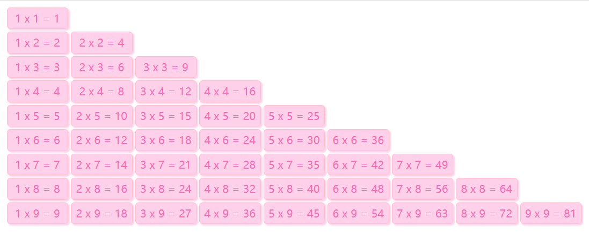
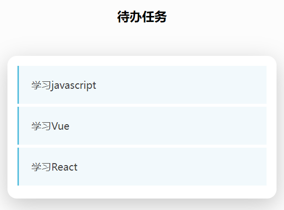
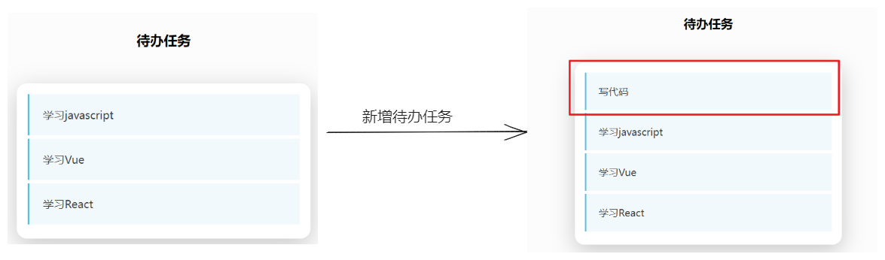

# 今日能力目标

能够对数组进行增删改查，并且可以利用循环将数组中的数据渲染到页面上

# 必要知识:

1. 能够使用**数组**来存储数据
2. 能够从**数组**中根据下标取值
3. 能够使用 **push**/**pop**/**unshift**/**shift**/**splice**方法对数组进行增加、删除元素
4. 能够利用**嵌套for循环**渲染HTML结构到页面中


# 一、编程题

## 数组版-渲染王者荣耀头像-综合题

**难度等级：** ★★

**作业目标：**利用js展示**数组版本**-王者荣耀英雄头像案例

**考察能力：**

1. 能够利用数组来存储数据
2. 能够从数组中根据下标取值

### 作业需求

效果图需求如下：


**需求如下：**

1. 页面打开，出现一个弹框 ，让用户录入：`1-20`之间的数字，用于渲染英雄头像的数量
2. **要求：**把所有需要展示的**英雄头像文件名**放到数组中
3. 根据用户输入的数字来生成对应个数的王者荣耀英雄，头像从数组中获取

### 相关素材

见附件

### 思路分析

本题是一个典型的用户交互的效果。用户交互可以分为： 用户输入、处理数据、输出结果。所以本题我们也可以按照这个思路来完成

1. **用户输入：**
   - 用户输入 1 个数据（`1-20`之间的数字），声明一个变量，并存储该数据
2. **处理数据：**
   - 2.1 创建一个数组：把所有需要展示的**英雄头像文件名**放入数组中
   - 2.2 声明变量来存储生成得到的头像结构
   - 2.3 将用户输入的数字作为循环的次数
3. **输出结果：**
   - 3.1 在循环中，来拼接得到的头像结构，头像地址从数组中获取
   - 3.2 将得到的头像结构写入到`ul`中

### 参考答案

```js
// 1. 用户输入（声明变量来存储用户输入的数字）
let num = +prompt('请输入1~20个之间的英雄的个数：')

// 2.1 处理数据（把所有需要展示的英雄头像文件名放入数组中）
let arr = [
      '1.webp',
      '2.webp',
      '3.webp',
      '4.webp',
      '5.webp',
      '6.webp',
      '7.webp',
      '8.webp',
      '9.webp',
      '10.webp',
      '11.webp',
      '12.webp',
      '13.webp',
      '14.webp',
      '15.webp',
      '16.webp',
      '17.webp',
      '18.webp',
      '19.webp',
      '20.webp',
]

// 2.2 处理数据（声明变量来存储生成得到的头像结构）
let str = ''

// 2.3 处理数据（将用户输入的数字作为循环的次数）
for (let i = 1; i <= num; i++) {
  // 3.1 输出结果（在循环中，来拼接得到的头像结构）
  str += `<li></li>`
}

// 3.2 输出结果（将得到的头像结构写入到`ul`中）
document.querySelector(`.box`).innerHTML = str
```

> **温馨提示**
>
> 以上代码中，数组中仅仅只有头像文件名，所以在给`img`标签设置`src`属性的时候，一定要带上 `./images `目录，这样才能找到正确的头像文件

### 总结反馈

- [ ] 我看效果图就可以分析出实现步骤并独立完成
- [ ] 我看效果图没有思路，需要看本题思路分析才能完成
- [ ] 我需要看参考答案才能梳理思路和完成代码
- [ ] 我没有思路，也看不懂答案，无法完成本题


## 九九乘法表-综合题

**难度等级：** ★★★

**作业目标：**利用js实现九九乘法表案例

**考察能力：**

1. 能够利用双层for循环完成渲染

### 作业需求

效果图需求如下：



**需求如下：**

1. 需要通过 **双层for循环**来完成 该功能

### 相关素材

见附件

### 思路分析

本题是一个典型的双层for循环案例功能。需要考虑到**外层for循环**、**内层for循环**、**输出结果**。所以本题我们也可以按照这个思路来完成

1. 声明变量`str`来存储九九乘法表的结构
2. **外层for循环：**
   - 外层循环**控制行数**, 需要9行，所以外层循环9次
3. **内层for循环：**
   - 3.1 内层循环控制列数，并且需要让**列个数等于行数**（因为行数和列数是对应的）
   - 3.2 内层循环来 拼接 需要的 结构
4. **输出结果：**
   - 4.1 由于每一行之后，需要与下一行换行展示，所以在内层for循环结束之后，给变量`str`**拼接 br 换行标签**
   - 4.2 在外层`for`循环之后，拼接得到完整的结构，就可以将拼接完整的结构渲染到页面中
### 参考答案

```js
// 1. 声明变量来存储九九乘法表的结构
let str = ''

// 2. 外层for循环（外层循环控制行数 ）
for (let i = 1; i <= 9; i++) {
  // 3.1 内层for循环（控制列数，需要让列个数等于行数）
  for (let j = 1; j <= i; j++) {
    // 3.2 内层for循环（来 拼接 需要的结构）
    str += `<span>${j} x ${i} = ${j * i}</span>`
  }
    
  // 4.1 输出结果（拼接换行结果）
  str += '<br>'
}

// 4.2 输出结果（渲染展示到页面上）
document.querySelector('.box').innerHTML = str
```

### 总结反馈

- [ ] 我看效果图就可以分析出实现步骤并独立完成
- [ ] 我看效果图没有思路，需要看本题思路分析才能完成
- [ ] 我需要看参考答案才能梳理思路和完成代码
- [ ] 我没有思路，也看不懂答案，无法完成本题


## 待办任务-二次开发题

**难度等级：** ★★★★

**作业目标： **利用js展示待办任务案例

**考察能力：**

1. 能够看懂已经提前准备好代码，并且能说出代码执行过程
2. 能够基于已有功能进行**新增业务**
3. 能够知道`js`的执行逻辑（明确js代码的位置应该放哪）

### 作业需求

开发中，我们经常遇到在**已有**的业务基础上**新增**一些需求，所以各位同学先梳理已有提供好的业务，然后在根据需求分析新业务如何实现

**1. 已有业务：**

正在开发一个待办任务功能，需要展示今日待办的任务有哪些

目前已有的功能（已经实现）

​	①：在数组`arr`中准备好了需要渲染的数据

​	②：并且已经渲染展示到页面中

​	③：效果图如下




**2. 新增需求：**

1. 为了让用户可以新增待办任务，在以上已有功能基础上实现**新增功能**：

    ①：页面打开出现一个弹框 ，让用户录入：**你的待办任务**

    ②：用户输入完成之后，将用户录入的待办任务渲染到页面中

2. 要求：**用户录入的待办任务排在第一位**

3. 效果对比图如下：

    

**完整效果图如下：**


### 相关素材

见附件

### 思路分析

本题是一个典型的用户交互的效果。用户交互可以分为： **用户输入**、**处理数据**、**输出结果**。所以本题我们也可以按照这个思路来完成

**注意都是先处理数据在渲染**

1. **用户输入：**
   - 声明一个变量来存储用户输入的待办任务
2. **处理数据：**
   - 将用户输入的待办任务添加作为数组的第一项
3. **输出结果**：
   - 代码已提供

### 参考答案

```js
let arr = ['学习javascript', '学习Vue', '学习React']

// 1. 用户输入（声明变量来存储用户输入的待办任务）
let todo = prompt('请输入你的待办任务')

// 2. 处理数据（将用户输入的代码任务添加作为数组的第一项）
arr.unshift(todo)

// 3. 输出结果
let str = ''
for (let i = 0; i < arr.length; i++) {
  str += `
    <li>
      <p>${arr[i]}</p>
    </li>
  `
}
document.querySelector('.main ul').innerHTML = str
```

> **温馨提示：**
>
> 不能在准备的`for`循环代码之后实现 弹框和添加功能
>
> 1. 这样的话，页面都已经渲染完毕了，
> 2. 之后在添加的数据没有经过渲染代码，故而在页面上看不到新增的内容

### 总结反馈

- [ ] 我看效果图就可以分析出实现步骤并独立完成
- [ ] 我看效果图没有思路，需要看本题思路分析才能完成
- [ ] 我需要看参考答案才能梳理思路和完成代码
- [ ] 我没有思路，也看不懂答案，无法完成本题


# 二、问答题

## 数组的作用，如何声明数组，添加、删除元素，遍历数组

**难度等级：** ★★★

**考察能力**

1. 掌握数组的基本使用

### 问答要点

1. 什么是JavaScript数组？
3. 如何向数组添加元素？
4. 如何获取数组的长度？
5. 如何访问数组中的元素？
6. 如何遍历数组？
7. 如何在数组中删除元素？

### 参考答案

```markdown
什么是JavaScript数组？
   JavaScript数组是一种用于存储多个值的数据结构。它可以包含不同数据类型的元素，并且可以根据索引访问这些元素。

如何向数组添加元素？
   可以使用push()方法向数组末尾添加元素   		arr.push(1) 
   可以使用unshift()方法向数组开头添加元素     arr.unshift(2) 

如何获取数组的长度？
   可以使用数组的`length`属性来获取数组的长度，如：
   let length = arr.length; // 获取数组的长度

如何访问数组中的元素？
   可以使用索引来访问数组中的元素，索引从0开始。例如，要访问第一个元素：
   let firstElement = arr[0];

如何遍历数组？
   可以使用循环来遍历数组，最常见的方式是使用`for`循环
   for (let i = 0; i < arr.length; i++) {
       console.log(arr[i]);
   }

如何在数组中删除元素？
   可以使用`pop()`方法删除末尾的元素，使用`shift()`方法删除开头的元素，或使用`splice()`方法删除指定位置的元素。
     arr.pop(); // 删除末尾的元素
     arr.shift(); // 删除开头的元素
     arr.splice(1, 1); // 删除下标为1的元素
```


## 数组的sort方法有和作用，如何升序或降序排序数组

**难度等级：**★★★

**考察能力**

1. 掌握数组的sort方法

### 问答要点

1.  什么是JavaScript数组的`sort`方法？ 
2.  如何使用`sort`方法按升序或降序排序数组？ 

### 参考答案

```markdown
1. JavaScript数组的`sort`方法是用于对数组元素进行排序的内置方法。它可以按照默认的字母顺序对字符串进行排序，也可以接受一个自定义的排序函数用于特定的排序需求。 

2. 可以通过提供自定义的比较函数来自定义排序规则。
	比较函数接受两个参数，通常称为a和b，表示要比较的两个元素。 
	
	let arr = [3, 1, 4, 1, 5, 9, 2, 6, 5, 3, 5]
	// 升序排序
    arr.sort(function(a, b) {
        return a - b   
    })
    
    // 降序排序
    arr.sort(function(a, b) {
        return b - a   
    })
```


# 三. 自主学习题

## 数组的slice 方法

**难度等级：**★★★

考察数组的基本功这块，有个面试问答题，**如何快速复制得到新数组**，小伙伴，你能想到有什么做法吗？

注意题目要求是**快速**哦，而且是**得到新的数组**（不是简单的赋值操作哦），也就是要求简便轻松的实现。

那么这个问题，其实就可以通过 `slice` 方法轻松搞定

### 题目要求

实现对 数组 `arr` 进行快速复制得到新数组

```js
let arr = [10, 20, 30]
```

### 参考教程

[阮一峰-JS教程](https://wangdoc.com/javascript/stdlib/array#slice)

或者

[MDN文档](https://developer.mozilla.org/zh-CN/docs/Web/JavaScript/Reference/Global_Objects/Array/slice)

### 相关素材

见附件

### 参考答案

```js
let arr = [10, 20, 30]

// slice() 没有参数，实际上等于返回一个原数组的拷贝
let arr2 = arr.slice()

console.log(arr2)  // [10, 20, 30]

// 检测
arr2[0] = 100      // 修改 arr2 不会影响到 arr
console.log(arr2)  // [100, 20, 30]
console.log(arr)   // [10, 20, 30]
```

**答疑解惑**

小伙伴们可能会想到为啥不是如下做法呢

```js
// 直接将 arr 赋值给 变量 arr2，这样不就得到了一样的新数组吗？
let arr2 = arr

// 这样打印输出的arr2 也是 [10, 20, 30] 呢，不是也很快速方便吗
console.log(arr2) 

// 这样的做法有个问题，就是在修改arr2的时候，会影响到 arr，也就是说 arr2 不是新数组，不符合题目要求。
// 如何验证呢？
arr2[0] = 100 
console.log(arr2)  // [100, 20, 30]
console.log(arr)   // [100, 20, 30]

// 所以这种做法是没有完成题目需求的，至于小伙伴们纠结为啥修改arr2 会 影响 arr，这一点会在Day05学习完 简单和复杂数据类型区别之后就可以理解哦（所以不用着急哦，或者提前自学后面的内容吧！~~~）
```

### 总结提炼

1. 数组的 `slice()`方法用于提取目标数组的一部分，返回一个新数组，原数组不变。 
2.  `slice()`没有参数，实际上等于返回一个原数组的拷贝 
3. `arr.slice()`一行核心代码搞定功能哦, 是不是快速又方便呢~~~


## for...of 循环

**难度等级：** ★★★

遍历数组除了可以使用`for`循环之外，还可以使用 `for...of` 循环语句

### 题目要求

1. 使用`for...of` 语句来遍历数组，进行求和

### 参考教程

[mdn文档-for...of](https://developer.mozilla.org/zh-CN/docs/Web/JavaScript/Reference/Statements/for...of)

### 相关素材

见附件

### 参考答案

```js
let arr = [10, 20, 30]

let sum = 0
for (let val of arr) {
    // val 变量就是数组遍历的每一项，累加到 sum变量中
    sum += val
}

console.log(sum)
```

### 总结提炼

1. 查阅文档，需要得知 `for...of`的语法

   ```js
   for (let val of arr) {
      // 循环体
      // val 变量，直接就是数组的每一项
   }
   ```

2. `for...of` 循环遍历数组的时候， 能够便捷的获得到数组的每一项

3. 那么`for` 循环 和  `for ... of` 区别是啥呢？ 如何区分使用呢？

   1. 区别
      1. `for`循环需要手动管理**循环变量的递增**和**循环条件的检查**
      2.   `for ... of` 不需要显式地管理**循环变量的递增**和**循环条件的检查**，只需在每次遍历中获取数组的元素 
   2. 推荐使用（根据特定的场景选择合适的语法）
      1. 如果需要根据**索引**进行**条件判断**、**跳过某些元素**，那么 `for` 循环更合适。
      2. 如果需要遍历**数组的值**而**不关心索引**，或者希望代码更加简洁和易读，那么使用 `for...of` 循环更方便  

# 四、客观题

1. 关于数组的常用方法，下列描述正确的是（）

   A： 数组能在本长度内任意位置删除元素

   B： 数组只能在头部追加或删除元素

   C： 数组只能在头部或尾部追加或删除元素

   D： 上述描述都是错误的

   **答案：**A

   **解析：**数组可以借助于 `splice` 方法在中间添加、删除元素，所以选项B、C错误

   选项A是正确的，`splice`可以在指定任意位置上删除元素, 故选项D错误

2. 关于javascript中数组的说法中,不正确的是( )

   A： 数组的长度必须是创建时给定, 之后便不能改变

   B： 数组里面可以存放多个数据

   C： 数组中元素的类型可以不同

   D： 数组可以在声明的同时进行初始化

   **答案：**A

   **解析：**选项A错误，因为数组的长度在数组创建之后可以通过 `length` 属性来改变，并且添加或删除元素也会改变数组的长度。

   ​				总结：在`JS`中，数组的长度是可以动态变化的 

3. let  arr = []  声明数组未给值，请问里面的值是什么？( )

   A: true

   B: false

   C: null

   D: undefined

   **答案：**D

   **解析：**选项D正确， 结果将是 `undefined`。这是因为数组内没有元素，元素不存在结果为`underfind`

4. 下面关于for循环说法正确的是(  )

   A： for(;;)  这种写法会出现语法错误

   B： 在for循环中,不能用break语句跳出循环体

   C： for循环是先执行循环体语句,后判断表达式

   D： for循环的循环体语句中,可以包含多条语句,但必须用花括号括起来

   **答案：**D

   **解析：**选项A写法是无限循环，不会语法报错。

   ​			  选项B可以通过break 退出循环

   ​		 	 选项C， `for`循环是先判断表达式，然后执行循环体语句。如果条件为真，循环体会执行，否则循环体不会执行。 

   ​			  故而选项D正确

5. 以下代码,依次输出的结果为 ( )

   ~~~javascript
   let i
   for (i = 0; i < 5; i++) {
       console.log(i)
   }
   console.log(i)
   ~~~

    A： 0 1 2 3 4 4

    B： 5 5 5 5 5 5

    C： 0 1 2 3 4 5

    D： 0 1 2 3 4 

   **答案：**C 

   **解析：** `for`循环中变量 `i` 初始为0，符合 `i < 5`循环条件，所以执行循环体，打印`i`，即打印为0

   ​				 之后 `i++` 自增，依次会输出 1 2 3 4，

   ​				 但 `i`为 5的时候，不符合 `i < 5`循环条件，所以不会执行`for`循环体的打印 `i`, 

   ​				 而会去执行`for`循环之后的 `i` 的输出, 由于`i`已经自增为5了，所以输出为5

   ​				 总体结果是选项C

6. 下列语句中 helloworld打印的次数是 ()

   ~~~javascript
   for(let i = 0; i <= 3; i++){
     for (j = 1; j <= 3; j++){
       console.log("helloworld")
     }
   }
   ~~~

    A:    3次

    B： 4次

    C： 9次

    D： 12次

   **答案：**D

   **解析：**  外层`for`循环会执行4次（i从0到3），而内层`for`循环会在每次外层`for`循环执行期间执行3次（j从1到3）。因此，总共会打印 4 x 3 = 12 次 "helloworld"。 故选项D正确

7. 关于数组的说法错误的是()

   A： 可以按照索引号查找数组元素

   B： 能存储多个数据

   C： 按照索引遍历数组方便

   D： 数组只能存储一种类型的数据

   **答案：**D

   **解析：** 选项D错误，数组可以存储不同类型的数据

   ​				比如 `let arr = [10, '10', true, null ,undefined]` 就是多种不同类型的数据

8. 关于数组的描述错误的是 （ ）

   A：  数组的创建方式是 let arr = [1, 2, 3, 4, 5]

   B：  数组的长度可以使用 arr.length 来得到

   C： 数组的每一项值都有索引， 索引默认从1开始

   D： 数组里面的元素可以增加和删除等操作

   **答案：**C

   **解析：** 数组的索引是从下标0开始的，不是从1开始的，所以选项C错误

9. 求以下代码的结果  （）

   ~~~javascript
   let sum = 0
   let arr = [10, 20, 30, 40]
   for (let i = 0; i < arr.length; i++) {
     if (i == 2) {
         continue
     }
     sum += arr[i]
   }
   console.log(sum)
   ~~~

    A： 0

    B： 60

    C： 70

    D： 100

   **答案：**C

   **解析：**`sum`变量和`for`循环整体代码是在实现求和功能。

   ​				但在`for`循环体中，当索引为2的时候，通过`continue`跳过当前循环，就不会执行后续的`sum`累计，也就跳过了 `sum`累加30（索引为2）的结果。

   ​				所以`sum`累加的是 10 和20 和 40，累加结果为 70

10. 下面代码输出的结果是（）
      ~~~javascript
      let sum = 0
      let arr = [11,22,33]
      for(let i = 0; i <= arr.length; i++){
        sum += arr[i]
      }
      console.log(sum)
      ~~~
       A： 66

       B： 0112233

       C： NaN

       D： undefined

    **答案：**C

    **解析：** 注意 `for`循环的条件是 `i <= arr.length`, 所以`for`循环体是执行了4次

    ​				前面三次是 `sum` 累加了数组的每一项，即 `sum` 累加了 11， 22 ， 33 ，

    ​				但最后一次循环，是 `sum` 累加了 `arr[3]`

    ​				由于没有下标3的数据，所以`arr[3]`结果为`undefined`

    ​				所以是 `sum` 累加了 `undefined`，得到了不是一个数字的 `NaN`的结果

