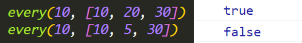
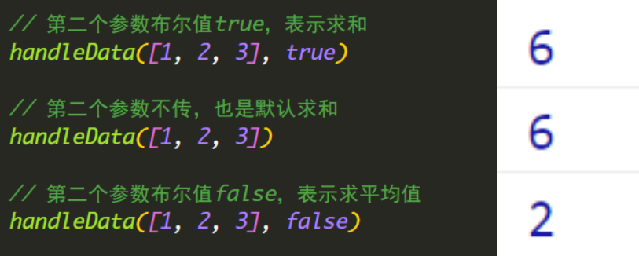
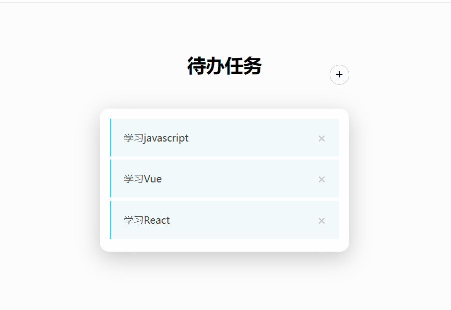
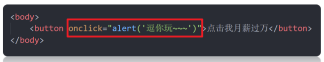
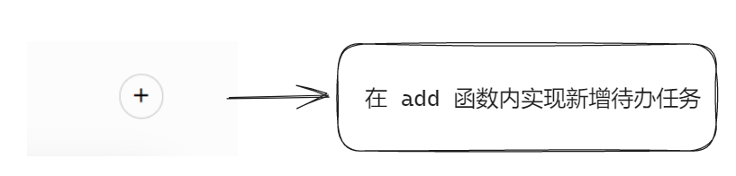
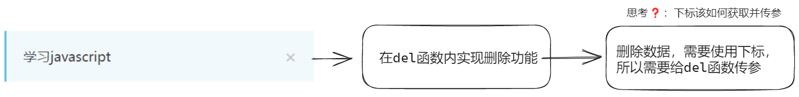
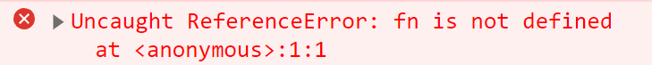
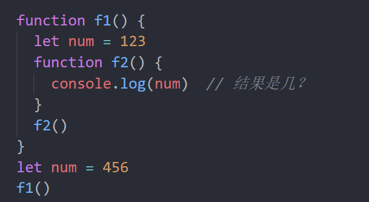

# 今日能力目标

能够封装函数实现复用代码

# 必要知识:

1. 能够利用**函数**来复用代码块
2. 能够使用**函数参数**来让函数逻辑能灵活
3. 能够使用**返回值**将函数内计算结果给返回出去


# 一、编程题

## 封装every函数-综合题

**难度等级：** ★★★

**作业目标： **封装一个 `every` 函数， 用于检测数组所有元素是否都满足条件

**考察能力：**

1. 能够封装函数以便复用功能
2. 能够给函数进行传参和设置返回值

### 作业需求

效果图需求如下：（调用函数，得到判断结果）



**需求如下：**

1. 检测数组里面的所有元素**是否都大于10**，如果满足则返回`true`， 如果不满足则返回 `false`

   已经提供了基础的函数声明和函数调用

### 相关素材

```html
<script>
  // 1. every 函数声明
  function every() {
	  // 补充代码
  }

// 2. every 函数的调用
console.log(every(10, [10, 20, 30]))
console.log(every(10, [10, 2, 30]))
</script>
```

### 思路分析

本题是一个典型的函数封装能力题，对于类似函数封装题型我们需要考虑的有：

- **作用：**明确该函数的作用
- **参数：**是否需要传参，以及参数有哪些

- **函数内部的业务逻辑**：如何实现函数的内部功能

- **返回值：**是否需要有返回值，返回值是什么


所以本题我们也可以按照这个思路来完成

1. **函数作用：**
  
   - 基于提供的数组来判断是否都满足指定条件
2. **参数：**
  
   - 声明形参 `ele` 和 `arr` 
3. **函数内部的业务逻辑**
  
   - 3.1 声明`flag`变量来存储`true`(假定表示数组的每一项都符合条件)
   
   - 3.2 遍历循环数组，如果找到了不符合条件的（不是 `> 10`），则修改 `flag` 里面的值为`false`
   
     说明假定是错误的，故而将结果设置为`false`
   
   - 3.3 同时`break`中断循环
   
      既然得知有不满足 `>10` 就可以中断循环，无需继续后续的循环了。
4. **返回值**：
  
   - 将变量`flag`结果 进行返回

### 参考答案

```js

```

### 总结反馈

- [ ] 我看效果图就可以分析出实现步骤并独立完成
- [ ] 我看效果图没有思路，需要看本题思路分析才能完成
- [ ] 我需要看参考答案才能梳理思路和完成代码
- [ ] 我没有思路，也看不懂答案，无法完成本题


## 封装求和或平均值函数-变形题

**难度等级：** ★★★★

**作业目标：**利用js封装求和或平均值函数

**考察能力：**

1. 能够封装函数以便复用功能
2. 能够给函数进行传参和设置返回值
3. 能够给参数设置默认值

### 作业需求

效果图需求如下：（调用函数，得到结果）



**需求如下：**

1. 函数可以传递2个参数，比如  `handleData(arr, true)`      `handleData 处理数据的意思`
   - 参数一： 接受实参传递过来的数组
   - 参数二:    布尔类型  
     - 如果是`true`或者不传递参数 是求和操作
     - 如果传递过来的参数是 `false` 则是求平均值
2. 已经提供了基础的函数声明和函数调用

### 相关素材

```html
<script>
    function handleData() {

    }

    // 第二个参数布尔值true，表示求和
    console.log(handleData([1, 2, 3]))  // 6

    // 第二个参数不传，也是默认求和
    console.log(handleData([1, 2, 3], true))  // 6

    // 第二个参数布尔值false，表示求平均值
    console.log(handleData([1, 2, 3], false))  // 2
</script>
```

### 思路分析

本题是一个典型的函数封装能力题，对于类似函数封装题型我们需要考虑的有：

- **作用：**明确该函数的作用
- **参数：**是否需要传参，以及参数有哪些

- **函数内部的业务逻辑：**如何实现函数的内部功能

- **返回值：**是否需要有返回值，返回值是什么

所以本题我们也可以按照这个思路来完成

1. **函数作用：**
   - 基于提供的数组来实现求和 或 求平均值
2. **参数：**
   - 声明2个形参`arr` 和  `flag`，来接收实参
   - 由于**第二个实参可省略**，所以可以给`flag`形参设置个**默认值 `true`**
3. **函数内部的业务逻辑：**
   - 3.1 声明`sum`变量用于存储求和的结果
   - 3.2 `for`循环遍历数组实现求和功能
4. **返回值**：
   - 如果`flag`值是`true`，返回求和结果，否则返回平均值结果

### 参考答案

```js

```

### 总结反馈

- [ ] 我看效果图就可以分析出实现步骤并独立完成
- [ ] 我看效果图没有思路，需要看本题思路分析才能完成
- [ ] 我需要看参考答案才能梳理思路和完成代码
- [ ] 我没有思路，也看不懂答案，无法完成本题


## 待办任务-二次开发题

**难度等级：** ★★★★★

**作业目标： **利用js实现**待办任务**的小程序 

**考察能力：**

1. 能够看懂已经提前准备好代码，并且能说出代码执行过程
2. 能够基于已有功能进行**新增任务**和**删除任务**
3. 能够封装函数以便复用渲染功能

### 作业需求

开发中，我们经常遇到在**已有**的业务基础上**新增**一些需求，所以各位同学先梳理已有提供好的业务，然后在根据需求分析新业务如何实现

**1. 已有业务：**

1. 正在开发一个待办任务功能，需要展示今日待办的任务有哪些，目前功能已经开发如下效果了：

   

   其中渲染数组中的待办任务已经完成了

   现有业务素材见附件


**2. 新增需求**

​	①：为了让用户可以新增待办任务，实现**点击 +**，出现弹框让用户输入任务内容，之后在列表中渲染出来

​	②：为了让用户可以删除已实现的任务，实现**点击 x**可以删除当前任务

**完整效果如下：**



### 相关素材

见附件

### 解释说明

> 在开始书写代码之前，有必要给小伙伴们解释下代码中的点击新增和点击删除是如何实现的。这里涉及到加号和删除按钮的结构代码

```html
<a href="javascript:;" onclick="add()" class="icon">+</a>
```

- 以上代码的`onclick="add()"`代码，表示当点击`a`链接的时候，会来执行`add`函数的调用，即可在`add`函数内完成新增待办任务功能（此种写法在 JS -Day01 就讲解过的哦）

  

- 在素材中已经提供好了 `add`函数的声明，小伙伴们只需要在`add`函数内完成添加功能即可

### 思路分析

本地核心要实现新增，删除如何实现，以及渲染数据的功能如何进行复用

1. **新增功能**：

   ​	

   - 1.1 首先需要出现弹框让用户输入：**待办任务**
   - 1.2 弹框内容添加到数组中作为第一项
   - 1.3 复用渲染业务，把数组里面的所有数据都重新渲染展示出来

2. **封装渲染函数**

   - 2.1 将准备的渲染代码使用函数进行封装，以便复用
   
     ​		由于在新增、删除待办任务 的时候，都需要重新渲染所有的数据，所以需要将渲染代码进行封装
   
   - 2.2 封装好之后，记得先调用一次，确保页面打开调用渲染函数，页面中有渲染出内容
3. **删除功能**：需要在准备的 `del` 函数内完成删除功能

   ​	

   - 思考：
     - 待办任务的数据都在数组中，点击删除功能，就是在删除数组中的数据
     - 删除数组中的数据，可以使用`splice`方法， 该方法需要接收 **开始删除位置的下标**
   - 3.1 当前`for`循环的下标`i`就是开始删除位置的下标，所以将下标`i`作为 `del` 函数的实参进行传递
   - 3.2 `del` 函数通过 `index` 形参进行接收到下标
   - 3.3 数组的`splice` 来删除数据
   - 3.4 之后调用渲染函数，渲染即可

### 参考答案

```js
let arr = ['学习javascript', '学习Vue', '学习React']

// 1. 新增功能
function add() {
  // 1.1 新增功能（出现弹框）
  let todo = prompt('请输入你的待办任务')
  // 1.2 新增功能（弹框内容添加到数组中作为第一项）
  arr.unshift(todo)
  // 1.3 复用渲染业务
  render()
}

// 2. 封装渲染函数
function render() {
  // 2.1 封装渲染函数（将准备的渲染代码使用函数进行封装，以便复用）
  let str = ''
  for (let i = 0; i < arr.length; i++) {
    str += `
      <li>
        <p>${arr[i]}</p>
			
		<!-- 3.1 删除功能（循环的下标i就是开始删除位置的下标，将下标i作为del函数的实参进行传递） -->
        <a class="close" href="javascript:;" onclick="del(${i})">×</a>
      </li>
    `
  }
  document.querySelector('.main ul').innerHTML = str
}

// 2.2 封装渲染函数（封装好之后，记得先调用一次）
render()


// 3.2 删除功能（ index形参进行接收到下标）
function del(index) {
  // 3.3 删除功能（数组的splice 来删除数据）
  arr.splice(index, 1)
    
  // 3.4 删除功能（调用渲染函数，渲染即可）
  render()
}
```

### 总结反馈

- [ ] 我看效果图就可以分析出实现步骤并独立完成
- [ ] 我看效果图没有思路，需要看本题思路分析才能完成
- [ ] 我需要看参考答案才能梳理思路和完成代码
- [ ] 我没有思路，也看不懂答案，无法完成本题


# 二、问答题

## 函数有何作用，如何声明和调用

**难度等级：**★★

**考察能力**

1. 理解JS函数的基本概念
2. 掌握函数如何声明、调用

### 问答要点

1. 什么是JS函数？
2. 如何声明和调用一个函数？

### 参考答案

```markdown

```


## 函数的参数有哪些，作用是什么，如何区分？

**难度等级：**★★

**考察能力**

1. 理解JS函数的基本概念。

### 问答要点

1. 函数的参数有哪些，各自作用
2. 函数的参数如何区分

### 参考答案

```js

```


## 函数如何返回结果，返回值有哪些注意事项？

**难度等级：**★★★

**考察能力**

1. 掌握函数的返回值基本使用

### 问答要点

1.  什么是函数的返回值？ 
2. 如何返回
3. 返回值注意事项

### 参考答案

```markdown

```


## JS中有哪些作用域

**难度等级：**★★★

**考察能力**

1. 理解JS中的作用域是什么
2. 理解全局作用域和局部作用域的区别

### 问答要点

1. 什么是JavaScript中的作用域？
2. 全局作用域和局部作用域有什么区别？

### 参考答案

```markdown

```


## 说出待办任务-新增功能的实现流程

**难度等级：**★★★★

**考察能力**

1. 能够说出案例中的新增功能的实现流程
2. 增加数组元素方法

### 问答要点

1. 能够说出案例中的新增功能的实现流程

### 参考答案

```markdown

```


## 说出待办任务-删除功能的实现流程

**难度等级：**★★★★

**考察能力**

1. 能够说出案例中的删除功能的实现流程
2. 删除数组元素方法

### 问答要点

1. 能够说出案例中的删除功能的实现流程

### 参考答案

```markdown

```


# 三. 自主学习题

## 预解析

又称：声明提升 或 变量提升

**难度等级：**★★★★

在代码中，经常会见到 如下写法：先调用函数，在声明函数，这样是可以的

```js
f()

function f() {}
```

但是如果换成另外写法，就会报错了,  这是为什么？

```js
fn()

let fn = function(){}
```



### 题目要求

1. 可以理解预解析的执行过程
2. 知道 `let` 或`const` 是没有声明提升的

### 参考教程

[阮一峰-javascript教程](https://wangdoc.com/javascript/types/function#%E5%87%BD%E6%95%B0%E5%90%8D%E7%9A%84%E6%8F%90%E5%8D%87)

或者

[MDN文档](https://developer.mozilla.org/zh-CN/docs/Glossary/Hoisting)

[阮一峰-let，const不存在变量提升](https://es6.ruanyifeng.com/#docs/let#%E4%B8%8D%E5%AD%98%E5%9C%A8%E5%8F%98%E9%87%8F%E6%8F%90%E5%8D%87)

### 相关素材

无


# 四、客观题

1. 在JavaScript中，下列有关于自定义函数的说法错误的是（) B

   A： 自定义函数的关键字是“function”

   B： 自定义函数必须带有参数

   C： 自定义函数被调用时接受的参数可以是常量、变量或其他表达式

   D： 自定义函数返回结果的关键字是“return”

   

2. 有以下代码运行的结果是？()A

   ~~~javascript
   function fn(num1,num2){
       return num1 + num2
   }
   alert(fn(10,20,30))
   ~~~

    A： 30

    B： 60

    C： undefined

    D： null

   下列关于函数的参数 描述正确的是，多选()ABC

   A： 形参表示形式上的参数 不是一个具体的值

   B： 函数的参数我们可以划分为形参和实参

   C： 实参就是函数调用时传入小括号内的真实数据

   D： 形参和实参的个数一定要匹配,否则一定会报错

   

4. 求以下运算的结果是？()C

   ~~~html
   <script>
     	console.log(true && 3 + 5)
   	console.log(0 && 3 + 5)
   	console.log(null || 3 + 5)
   	console.log(3 || undefined)  
   </script>
   ~~~

    A： true   0   8   3

    B： 8 0   null   3

    C： 8 0 8 3

    D：true  0   null   3

   

   ​				

5. 下列关于函数的描述中，错误的是( )C

   A： 函数可以返回一个值

   B： 函数可以没有参数

   C： 定义函数时需要返回类型

   D： 函数可以没有return关键字

   

6. 下列关于函数的描述中，错误的是( )C

   A： 函数封装了一段可以被重复执行的代码块

   B： 通过函数的封装 我们可以大量的复用封装好的功能

   C： 函数让我们的代码更加复杂化

   D： 函数能够多次调用

   

7. 关于JavaScript的作用域，下列描述错误的是（）D

   A： 根据作用域的不同，我们可以把变量分为全局变量和局部变量

   B： 函数的形参也可以看做是局部变量，局部变量只能在函数内部使用

   C： 全局变量在浏览器关闭时才会被销毁，局部变量在代码块运行结束后就会被销毁

   D： 在函数内部没有声明直接赋值的变量也属于局部变量

   

8. 下面关于函数的返回值，描述正确的是：()C

   A： 任何函数必须要有return返回值

   B： 函数中可以使用break来结束函数的执行

   C： 函数中return后面的语句不再执行

   D： 函数可以使用多个return返回多个值

   

9. 下面关于函数的返回值，描述错误的是：()A

    A： 任何函数必须要有return返回值

    B： 如果函数没有返回值，那么这个函数的调用结果是undefined

    C： 通过return可以给函数指定返回值

    D： return可以直接使用，表示函数的结束

   

10. 下列的函数声明中，正确的是：()D

     A： Function add(){}

     B： function class(){}

     C： function fn(1,2){}

     D： function fn(a,b){}

    

11. 下面关于立即执行函数说法错误是:()D

    A： 多个立即执行函数之间必须用分号间隔开

    B： 立即执行函数的作用是为了减少变量名冲突

    C： 立即执行函数可以添加函数名

    D： 立即执行函数使用非常少，推荐尽量不用

    

12. 下列关于函数表达式说法错误的是？（）D

    A： 将匿名函数赋值给一个变量，并且通过变量名称进行调用，称为函数表达式

    B： 函数表达式必须先定义，后使用

    C： 函数表达式的形参和实参使用跟具名函数一致

    D： 函数表达式就是普通函数的简写方式，并无不同

    

14. 求以下函数运算的结果() C

    ~~~javascript
    function fn(){
    	console.log(100)
    }
    console.log(fn())  
    ~~~

    A： 报错

    B： 100 100

    C： 100 undefined

    D： undefined undefined

    

15. 以下代码运行后 结果为()B

    ~~~javascript
    fn(1)
    let fn = function(a) {
      alert(a)
    }
    ~~~

     A： 1

     B： 程序报错

     C： alert(1)

     D： undefined

    

16. 请问以下代码是几？()A

     

     A： 123

     B： Uncaught ReferenceError: num is not defined

     C： undefined

     D： 456

    