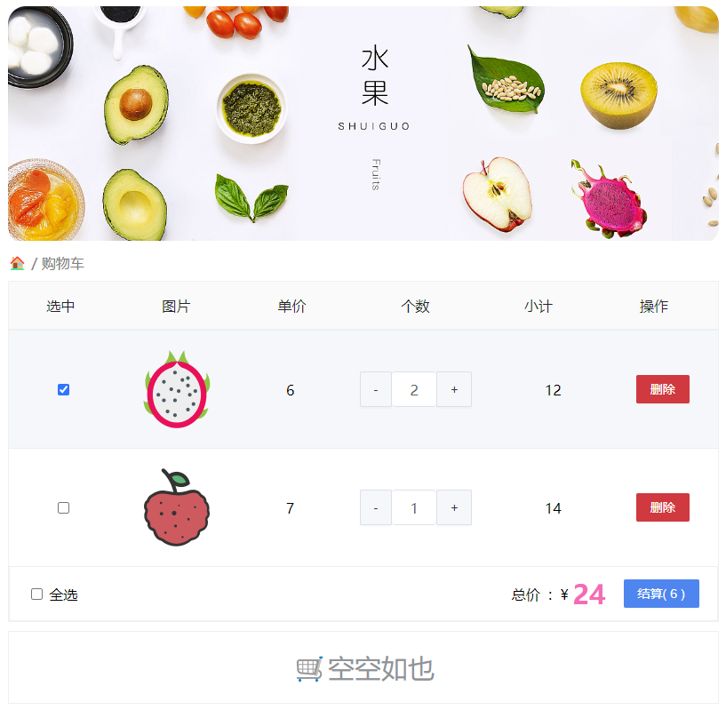
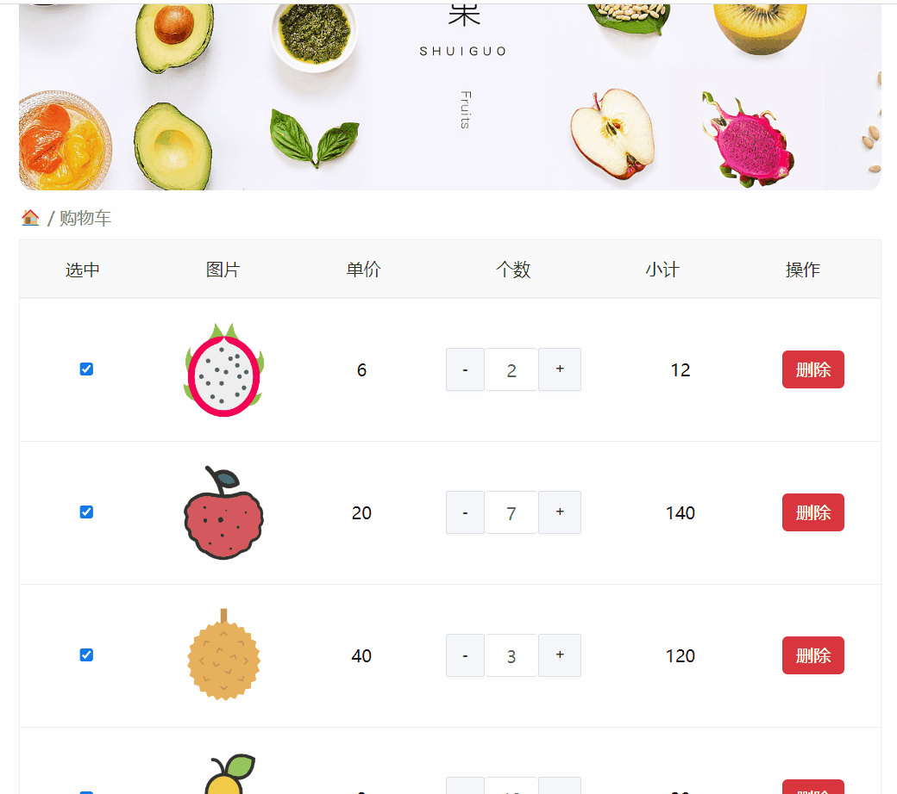
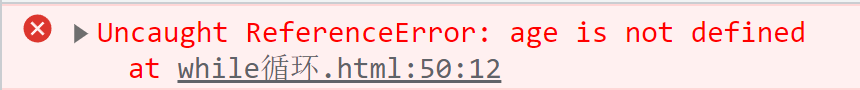
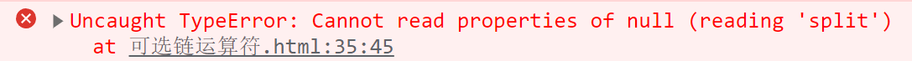

# 今日能力目标

能够对对象进行增删改查，并且可以利用循环将 对象数组 中的数据渲染到页面上

# 必要知识:

1. 能够创建**对象**来存储数据信息
2. 能够使用**点语法**来获取对象属性
3. 能够使用`for in`循环遍历**对象数据**


# 一、编程题

## 渲染英雄列表-综合题

**难度等级：** ★★

**作业目标：**利用 js 实现展示英雄头像案例

**考察能力：**

1. 能够使用`for`循环遍历对象数据
2. 能够从对象数组中取值

### 作业需求

效果图需求如下：


**需求如下：**

1. 页面打开呈现上图所示效果
2. 需要使用准备好的对象数组，渲染出英雄列表
3. 鼠标移入到图片上，需要展示英雄名字（对象数组中已准备该数据）

### 相关素材

见附件

### 思路分析

本题是一个典型的渲染数据题型，需要考虑**渲染什么数据**、需要**渲染出什么结构**、**渲染到哪展示**

1. **渲染什么数据**
   - 渲染提供好的 `datas` 对象数组
   - 1.1 循环遍历该数组    

2. **需要渲染的结构**
   
   - 渲染提供好的 `li`结构
   - 2.1 声明一个 **变量**来存储结构字符串，默认值 是**空字符串**
   - 2.2 在循环遍历中拼接`li`结构（设置好图片地址，图片的`title` 为 英雄名字）
   
3. **渲染到哪展示**

   - 3.1 渲染到 `ul` 列表中展示

   - 所以需要获取到`ul`，并通过`innerHTML `设置内容
### 参考答案

```js
// 2.1 变量存储结构字符串
let str = ''

// 1.1 循环遍历datas数组
for (let i = 0; i < datas.length; i++) {
    
    // 2.2 在循环遍历中拼接li结构（设置图片地址和title）
	str += `<li></li>`
}

// 3.1 渲染到 ul 列表中展示
document.querySelector('.list').innerHTML = str
```

### 总结反馈

- [ ] 我看效果图就可以分析出实现步骤并独立完成
- [ ] 我看效果图没有思路，需要看本题思路分析才能完成
- [ ] 我需要看参考答案才能梳理思路和完成代码
- [ ] 我没有思路，也看不懂答案，无法完成本题


## 渲染水果列表-综合题

**难度等级：** ★★★

**作业目标： **利用 js 展示水果列表案例

**考察能力：**

1. 能够循环遍历对象数组，并且能够从对象中取值
2. 能够从数据中取出所需数据进行求和

### 作业需求

效果图需求如下：



**需求如下：**

1. 根据数据渲染水果列表，结构里面包含 **复选框**，**水果图片**，**单价**，**数量**，还有**删除按钮**
2. 渲染的同时要计算`小计= 单价 * 数量`
3. 计算 **总价**，同时计算结算的**商品数量**

### 相关素材

见附件

### 思路分析

本题是一个典型的渲染数据题型，需要考虑**渲染什么数据**、需要**渲染出什么结构**、**渲染到哪展示**

1. **渲染什么数据：**
   - 拿 `fruit` 数组循环遍历
   - 1.1 循环遍历该数组
2. **渲染出什么结构：**
   - 渲染**类名为tr的div结构**，表示购物车中的每一行数据
   - 2.1 声明变量str来存储div结构
   - 2.2 在循环遍历中拼接 div结构
3. **渲染到哪展示：**
   - 3.1 在循环之后，渲染到**类名为tbody的div结构**中
   - 需要获取该元素，并设置其内容为 str拼接的结构
4. **补充**
   - 该案例不仅要渲染数据，还要根据数据中的 `num` 和 `price` 计算出**总价** 和 **总件数**
   - 4.1 需要**声明总价和总件数的变量来存储计算结果**
   - 4.2 在循环中，累计出总件数 和 总价
   - 4.3 循环之后，展示总件数 和 总价

### 参考答案

```js
// 2.1 声明str 变量（存储拼接的div结构）
let str = ''

// 4.1 计算总件数
let totalNum = 0
// 计算总价
let totalPrice = 0

// 1.1 循环fruit数组
for (let i = 0; i < fruit.length; i++) {
  const item = fruit[i];

  // 2.2 在循环遍历中拼接div结构
  str += `
    <div class="tr">
      <div class="td"><input type="checkbox" checked=""></div>
      <div class="td"></div>
      <div class="td">${item.price}</div>
      <div class="td">
        <div class="my-input-number">
          <button class="decrease"> - </button>
          <span class="my-input__inner">${item.num}</span>
          <button class="increase"> + </button>
        </div>
      </div>
      <div class="td">${item.price * item.num}</div>
      <div class="td"><button>删除</button></div>
    </div>
  `

  // 4.2 累计出总件数 和 总价
  totalNum += item.num
  // 计算总价
  totalPrice += item.num * item.price
}

// 3.1 渲染到类名tbody中
document.querySelector('.tbody').innerHTML = str

// 4.3 展示总价 + 总件数
document.querySelector('.price').innerHTML = totalPrice
document.querySelector('.pay').innerHTML = `结算( ${totalNum} )`
```

### 总结反馈

- [ ] 我看效果图就可以分析出实现步骤并独立完成
- [ ] 我看效果图没有思路，需要看本题思路分析才能完成
- [ ] 我需要看参考答案才能梳理思路和完成代码
- [ ] 我没有思路，也看不懂答案，无法完成本题


## 删除水果列表-二次开发题

**难度等级：** ★★★★

**作业目标： **能够对水果列表案例新开发计算总价以及删除商品功能

**考察能力：**

2. 能够基于自己已有的代码新增**删除**功能
2. 能够基于自己已有的代码进行**函数封装复用功能**

### 作业需求

开发中，我们经常遇到在**已有**的业务基础上**新增**一些需求，所以各位同学先梳理上面案例自己已经写好的功能代码，然后在根据需求分析新业务如何实现

**1. 已有业务：**

正在开发一个xx商城的购物车功能，需要展示用户购物车的数据列表，目前功能已经开发如下效果了：


购物车的数据都已经渲染展示到页面中

**2. 新增需求**

​	①：为了让用户删除无需购买的商品，**需要实现商品的删除功能**

​	②：删除对应商品之后，购物车的**总件数和总价都需要重新计算**得出最新结果

**完整效果图如下：**



### 相关素材

在**上题代码基础上**，新增代码完成删除功能

### 思路分析

本题是一个典型的二次开发题型。需要考虑到，**删除功能是如何实现的**，以及删除之后，如何看到最新的购物车列表

1. **删除功能**
   - 在提供的删除`a`链接结构中，已经提供了 点击会执行的`del函数`的调用
   - 1.1 所以需要提供`del`函数的声明，以及提供形参来接收实参下标
   - 1.2 让数组调用 `splice` 方法实现删除指定下标的数据
2. **删除之后，更新列表和总件数和总价数据**
   - 重新渲染购物车列表，重新计算总件数 和 总价
   - 2.1 这些功能在前面都已经实现过了，删除需要复用，故可以封装函数来实现复用
   - 2.2  **注意：**封装函数之后，一定要记得调用，才可以生效哦
### 参考答案

```js
// 1.1 del函数，实现删除功能
function del(index) {
  // 1.2 splice 方法删除数据
  fruit.splice(index, 1)
  render()
}

// 2.1 渲染展示购物车列表
function render() {
  // 存储拼接的结构
  let str = ''

  // 计算总件数
  let totalNum = 0

  // 计算总价
  let totalPrice = 0

  for (let i = 0; i < fruit.length; i++) {
    const item = fruit[i];

    // 拼接结构
    str += `
      <div class="tr">
        <div class="td"><input type="checkbox" checked=""></div>
        <div class="td"></div>
        <div class="td">${item.price}</div>
        <div class="td">
          <div class="my-input-number">
            <button class="decrease"> - </button>
            <span class="my-input__inner">${item.num}</span>
            <button class="increase"> + </button>
          </div>
        </div>
        <div class="td">${item.price * item.num}</div>
        <div class="td"><a href="javascript:;" onclick="del(${i})">删除</a></div>
      </div>
    `

    // 计算总件数
    totalNum += item.num
    // 计算总价
    totalPrice += item.num * item.price
  }

  document.querySelector('.tbody').innerHTML = str

  // 设置总价 + 总件数
  document.querySelector('.price').innerHTML = totalPrice
  document.querySelector('.pay').innerHTML = `结算( ${totalNum} )`
}

// 2.2 调用函数，实现页面一打开渲染购物车列表数据
render()
```

### 总结反馈

- [ ] 我看效果图就可以分析出实现步骤并独立完成
- [ ] 我看效果图没有思路，需要看本题思路分析才能完成
- [ ] 我需要看参考答案才能梳理思路和完成代码
- [ ] 我没有思路，也看不懂答案，无法完成本题


# 二、问答题

## JS中的对象是什么以及如何创建对象？

**难度等级：** ★★

**考察能力**

1.  理解JS中的对象是什么以及如何创建对象

### 问答要点

1.  什么是JS对象？ 
2.  如何创建JS对象？ 

### 参考答案

```markdown
js对象是一种数据类型，它可以存储多个键值对（属性和对应的值），对象用于表示事物的属性和行为。 

可以通过对象字面量来创建对象
    let person = {
        name: "Alice",
        age: 30,
        sayHello: function() {
            console.log("Hello!");
        }
    };
```


## 列举2~3个JS常用的内置对象

**难度等级：** ★★

**考察能力**

1. 知晓JS中常用的内置对象

### 问答要点

1. `console`对象
2. `document`对象
3. `Math`对象

### 参考答案

```markdown
console 对象提供了浏览器控制台调试的接口,我们常用的有 console.log() 方法用于在控制台输出打印结果

document 对象，我们常用的有 `document.querySelector()` 来获取元素

Math对象拥有一些数学常数属性和数学函数方法。 比如常用的 Math.random() 用于生成随机数
```


## 如何区分对象的属性和方法？如何访问属性和方法？

**难度等级：**★★★★

**考察能力**

1. 了解对象的属性和方法。
2. 能够使用点符号和方括号来访问对象的属性和方法。

### 问答要点

1. 对象的属性和方法有什么区别？
2. 如何访问对象的属性和方法？
3. 如何遍历对象

### 参考答案

```markdown
对象的属性和方法有什么区别？ 当对象的属性值为函数的时候，我们称该属性为方法

如何访问对象的属性和方法？ 可以使用点符号（.）或方括号（[]）来访问对象的属性和方法。例如：
	let person = {
        name: "Alice",
        age: 30,
        sayHello: function() {
            console.log("Hello!");
        }
    };
    console.log(person.age); // 使用点符号访问属性
    person.sayHello(); // 使用点符号访问方法
    
    一定要注意：[] 内的需要加引号，否则会当变量解析
    console.log(person['age'])
    console.log(person['sayHello'])

    person[age] // age没有加引号，age当变量解析，无该变量，会报错的
    
    
如何遍历对象 可以使用`for...in`语法
	for (const key in person) {
        console.log(key, person[key]);
    }
```




# 三. 自主学习题

## for...in 与 for...of 的区别

**难度等级：**★★★

学习了 `for...in` 语法， 那么之前让大家自学过`for...of` 语法，两者是不是非常的类似呢，那么`for...in` 和 `for...of` 循环之间的区别是什么？今天来探索下吧！

### 题目要求

分别使用 `for...in` 和 `for...of` 语法来遍历数组和对象，看看各种的结果如何，对比其中的区别

### 参考教程

看参考答案

### 相关素材

```js
let obj = {
    uname: 'lw',
    age: 39,
    desc: 'handsome'
}

let arr = [10, 20, 30]
```

### 参考答案

```js
// for...in 和 for...of 都可以循环数组
// 遍历数组
const arr = [10, 20, 30]
 
// for...in, 变量key是数组的下标
for (let key in arr){
    console.log(key) // 输出 0 1 2
}
 
// for...of, 变量key是数组的每一项的值。
for (let key of arr){
    console.log(key) // 输出 10 20 30
}


// for...in 可以遍历对象，for...of 不能遍历对象
// 遍历对象
let obj = {
    uname: 'lw',
    age: 39,
    desc: 'handsome'
}

// for...in
for (let key in obj) {
    console.log(key) // 输出 name,age,desc
    console.log(obj[key]) // 输出 lw,39,handsome
}

// for...of
for (let key of obj) {
    console.log(key) // 报错 Uncaught TypeError: object is not iterable
}
```

### 总结提炼

1. `for...in`适合遍历对象，`for...of`适合遍历数组。
2. `for...in`循环出的是`key`（键），`for...of`循环出的是`value`（值）。

## 可选链运算符（?.）

**难度等级：** ★★★★

在后面项目代码中，我们经常会使用到 可选链运算符 来简化代码，那么到底这运算符可以起到什么效果呢

```js
const profile = {
      id: "1692458770417848321",
      nickname: "哈哈",
      account: "用户13212345678",
      avatar: "http://yjy-xiaotuxian-dev.oss-cn-beijing.aliyuncs.com/avatar/2023-08-19/3b16b9f2-f0f7-4d4d-b86c-ca3c61445790.jpeg",
      gender: "男",
      birthday: "2019-05-16",
      fullLocation: "河北省 秦皇岛市 抚宁区",
      profession: "前端工程师"
}
```

以上是项目中的真实数据，我们需要从中拿到 `fullLocation` 完整地址，并且借助 `split` 方法切割得到省市区的数组

```js
// 实现需求
const addressArr = profile.fullLocation.split(' ') // ['河北省', '秦皇岛市', '抚宁区']
```

得到省市区的数组可以在地址选择器中同步到当前的地址，从而实现如下图效果（该效果无需小伙伴们实现，只是让大家get到为啥要split，是有必要的，这些功能在后面项目中大家都会涉及到哦）


### 题目要求

1. 以上代码获取到了省市区的数组，但是需要考虑到新注册的用户，还没有设置过 `fullLocation`的数据，那么`fullLocation`的值为`null`
2. 此时`profile.fullLocation.split(' ')` 就会报错
3. 需要处理此种情况下的报错问题, 这个时候就可以 使用 `?.` 可选链轻松搞定哦
4. 当然小伙伴们如果有其他解决方案也是可以的，记得和 `?.`对比下，自然会get到 `?.` 更香哦（项目中会经常使用 `?.` ）

### 参考教程

[MDN文档](https://developer.mozilla.org/zh-CN/docs/Web/JavaScript/Reference/Operators/Optional_chaining)

### 相关素材

见附件

### 参考答案

```js
const profile = {
  id: "1692458770417848321",
  nickname: "哈哈2",
  account: "用户13212345678",
  avatar: "http://yjy-xiaotuxian-dev.oss-cn-beijing.aliyuncs.com/avatar/2023-08-19/3b16b9f2-f0f7-4d4d-b86c-ca3c61445790.jpeg",
  gender: "男",
  birthday: "2019-05-16",
  fullLocation: null,
  profession: "asdas"
}

// 当profile.fullLocation的结果为 null 或 undefined 的时候，就不会执行后续的 split()
// 自然就不会报错啦
const addressArr = profile.fullLocation?.split(' ')
```

### 总结提炼

1.   当尝试访问可能不存在的对象属性时， 使用可选链运算符可以避免报错。


# 四、客观题

1. 关于对象说法错误的是？（）

   A： 对象是一种数据类型，类型是Object

   B： 对象是无序的数据的集合，数组是有序的数据集合

   C： 可以详细的描述描述某个事物

   D： 对象里面只能存放字符串类型或者数字型

   **答案：**D

   **解析：**  对象可以包含各种类型的数据，包括字符串、数字、布尔值、函数、其他对象等。 

2. 关于对象说法正确的是？多选 ()

   A： 声明对象的语法是：  let  obj = { age: 18 }

   B： 对象有属性和方法组成

   C： 属性一般是一般是名词性的，比如  年龄、性别等

   D： 方法一般是动词性的， 比如唱、跑、跳等，其本质是函数

   **答案：**ABCD

   **解析：** 以上选项都是正确说法

3. 关于for...in遍历对象，如下描述正确的是（）

   A： 只能遍历数组属性

   B： 只能遍历对象的属性

   C： 语句用于遍历数组或者对象的属性, 但是我们不推荐使用for in遍历数组

   D： 语句不能遍历数组

   **答案：**C

   **解析：** for...in 可以用来遍历对象，也可以用于遍历数组，但是不推荐使用for in遍历数组，故选项C正确

4. 关于对象遍历中，for(let k in obj) {} 下面语法说法错误的是？()

   A： k 可以遍历得到对象obj的属性名

   B： obj.k  也可以遍历得到对象obj的属性名

   C： obj[k] 可以得到对象obj的属性值

   D： for in 语法一般不用于遍历数组，主要用于遍历对象

   **答案：**B

   **解析：** 选项B中 obj.k 表示在获取obj对象的k这个属性值，不是遍历得到属性名，故选项B错误

5. 关于Math对象的random方法，下列描述正确的是（）

   A： 返回一个任意随机整数

    B： 返回一个任意的随机小数

    C： 返回一个0-1之间，并且包括0和1的随机小数【0,1】

    D： 返回一个0-1之间，并且包括0不包括1的随机小数【0,1）

   **答案：**D

   **解析：**  `Math.random()` 方法返回一个大于等于0且小于1的随机小数，它包括0但不包括1，因此结果在区间[0,1)内。 选项D正确

6. 基于如下代码，能正常访问到obj对象的my-name属性的方式是（）

   ~~~javascript
   let obj = {
     'my-name': 'zhangsan',
     age: 18
   }
   
   ~~~

   A： obj.my-name

    B： obj['my-name']

    C： obj('my-name')

    D： obj[key]

   **答案：**B

   **解析：** 由于属性名 `'my-name'` 包含了连字符 `-`，因此无法使用点符号（`.`）来访问。应该使用方括号（`[]`）来访问这样的属性，故选项B正确

7. 想要创建对象{name:'zs',age:18}，以下选项错误的是：()

   A： let obj = {};     obj.name='zs';   obj.age=18;

   B： let obj = new Object();     obj.name='zs';    obj.age=18;

   C： let obj =  {name:'zs',age:18}

   D： let obj.name = 'zs'    obj.age = 18

   **答案：**D

   **解析：** 选项D错误，将属性直接添加到变量 `obj` 上，而不是创建一个包含这些属性的对象。这将导致语法错误。 

8. js 数据类型说法错误的是? ()

   A:   js 数据类型分为基本数据类型和引用数据类型

   B： 简单类型又叫做基本数据类型或者值类型

   C： 复杂类型又叫做引用类型

   D： 简单数据类型存放到堆里面，引用数据类型存放到栈里面

   **答案：**D

   **解析：**  基本数据类型（简单类型）存放在栈内存中，而引用数据类型（复杂类型）的值存放在堆内存中，而变量本身存放的是指向堆内存中实际数据的引用。 故选项D错误

9. 请问输出结果是什么？（）

   

   A:   'pink'

   B： 'red'

   C： NaN

   D： undefined

   **答案：**A

   **解析：** 声明str2变量的时候，把str1的值（pink）赋值给了 str2，之后修改str2变量的时候，并不影响到str1变量的值，所以str1变量的结果还是pink，故选项A正确

10. 请问输出的结果是什么？()

      

      A:   'pink'

      B： 'red'

      C： NaN

      D： undefined

    **答案：**B

    **解析：** 声明obj2变量的时候，把obj1的值（对象内存地址）赋值给了 str2，就是说obj2 也指向obj1的对象

    ​				之后修改obj2的uname为red，其实就是在修改obj1指向的东西，所以obj1的uname访问结果就是修改过后的red，故选项B正确


