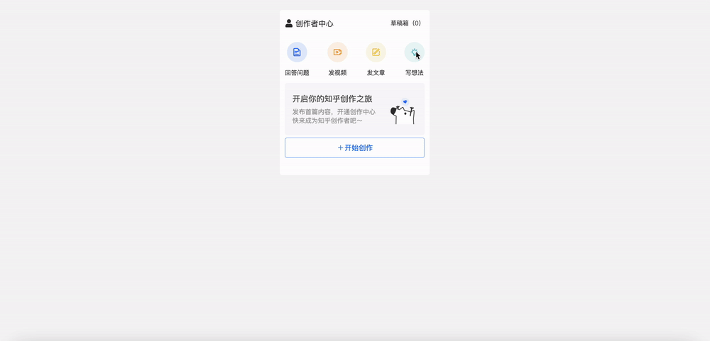

# 今日能力目标

能够通过点击事件，操作DOM元素的属性和样式

# 必要知识

1. 能够使用**`querySelector`**和**`querySelectorAll`**方法获取DOM元素
2. 能够使用**`innerText`**和**`innerHTML`**属性操作元素内容
3. 能够使用**`addEventListener`**给元素绑定事件，监听用户的点击行为
4. 能够通过js**操作元素的属性**，包括常见属性、样式属性、自定义属性

# 一、编程题

## 综合案例：按钮禁用效果

**难度等级：**   ★

**作业目标： ** 利用js实现常见的按钮禁用效果

**考察能力：**

1. 能够获取复选框的**`checked`**属性的值，拿到`checkbox`的勾选状态
2. 能够操作`button`按钮的**`disabled`**属性，来控制按钮的禁用状态

### 作业需求

效果图需求如下：


**需求如下：**

1. 勾选复选框，按钮可以点击，且背景变为红色
1. 不勾选复选框，按钮不可点击，且背景变为灰色


### 相关素材

见附件

### 思路分析

本题是一个典型的使用JS操作DOM属性的效果。这类效果的核心步骤是：获取元素；绑定事件；操作元素

1. **获取元素**
   * 通过`querySelector()`方法获取复选框和按钮元素，并将两个元素用变量存起来
2. **绑定事件**
   * 给复选框绑定`click`事件
3. **操作元素**
   * 在`click`事件中，将复选框的`checked`属性取反并赋值给按钮的`disabled`属性


### 参考答案

```js
    // 1. 获取dom元素
    const agree = document.querySelector('#agree')
    const registerBtn = document.querySelector('#registerBtn')

    // 2. 给复选框绑定click事件
    agree.addEventListener('click', function () {
      // 3. 在click事件中，将复选框的checked属性取反并赋值给按钮的disabled属性
      registerBtn.disabled = !this.checked
    })
```

### 总结反馈

- [ ] 我看效果图就可以分析出实现步骤并独立完成
- [ ] 我看效果图没有思路，需要看本题思路分析才能完成
- [ ] 我需要看参考答案才能梳理思路和完成代码
- [ ] 我没有思路，也看不懂答案，无法完成本题

## 综合案例：知乎写想法

**难度等级：**   ★

**作业目标： ** 完成知乎写想法效果

**考察能力：**

1. 能够使用**`classList`**操作元素类名，控制元素的显示和隐藏

### 作业需求

效果图需求如下：



**需求如下：**

1. 点击写想法，弹出模态框
2. 点击模态框中的✕，关闭模态框


### 相关素材

见附件

### 思路分析

本题是一个典型的使用JS切换元素显示效果的案例，实际开发中一般通过操作类名来完成元素的显示和隐藏。本题需要在点击事件中去操纵模态框和遮罩层的`hidden`类名。（备注：`hidden`类名用于控制模态框和遮罩层的显示和隐藏）

>  备注：`modal`类名表示模态框；`overlay`类名表示遮罩层；`show-modal`表示显示按钮；`close-modal`表示关闭按钮

1. **获取元素**
   * 通过**querySelector**方法获取元素，分别要获取到类名为`modal`、`overlay`、`show-modal`、`close-modal`的元素
   
2. **绑定事件**
   * 给类名为`show-modal`和`close-modal`的元素绑定`click`事件
3. **操作类名**
   * 3.1 显示模态框的时候类名为`modal`和`overlay`的元素需要**移除hidden**类名
   * 3.2 隐藏模态框的时候类名为`modal`和`overlay`的元素需要**添加hidden**类名


### 参考答案

```js
// 1. 获取元素
const modal = document.querySelector('.modal');
const overlay = document.querySelector('.overlay');
const btnOpenModal = document.querySelector('.show-modal');
const btnCloseModal = document.querySelector('.close-modal');

// 2. 绑定事件
btnOpenModal.addEventListener('click', function () {
  // 3.1 显示模态框的时候类名为modal和overlay的元素需要移除hidden类名
  modal.classList.remove('hidden');
  overlay.classList.remove('hidden');
})

// 2. 绑定事件
btnCloseModal.addEventListener('click', function () {
  // 3.2 隐藏模态框的时候类名为modal和overlay的元素需要添加hidden类名
  modal.classList.add('hidden');
  overlay.classList.add('hidden');
});
```

### 总结反馈

- [ ] 我看效果图就可以分析出实现步骤并独立完成
- [ ] 我看效果图没有思路，需要看本题思路分析才能完成
- [ ] 我需要看参考答案才能梳理思路和完成代码
- [ ] 我没有思路，也看不懂答案，无法完成本题


## 综合案例：百度换肤 

**难度等级：**   ★★

**作业目标： ** 完成百度换肤效果

**考察能力：**

1. 能够通过`style`属性修改body的背景图片

### 作业需求

效果图需求如下：


**需求如下：**

1. 点击页面顶部的五张小图片，将整个网页的背景切换成对应的图片


### 相关素材

见附件

### 思路分析

本题是一个典型的使用JS操纵DOM元素的效果。这类效果核心步骤是：**获取元素**，**绑定事件**，**操纵元素**

1. 获取元素
   * 获取所有的img图片
2. 绑定事件
   * 循环遍历所有图片，给每张图片绑定`click`事件
3. 操作元素
   * 3.1 获取到点击的那个图片的`src`属性值
   * 3.2 修改body的背景图片为上一步获取到的`src`


### 参考答案

```js
    // 1. 获取所有的img图片
    const imgs = document.querySelectorAll('img')

    // 2. 循环遍历所有图片，给每张图片绑定click事件
    for (let i = 0; i < imgs.length; i++) {
      imgs[i].addEventListener('click', function () {
        // 3.1 获取到点击的那个图片的src
        let src = this.src
        // 3.2 修改body的背景图片为上一步获取到的src
        document.body.style.backgroundImage = `url(${src})`
      })
    }
```

### 总结反馈

- [ ] 我看效果图就可以分析出实现步骤并独立完成
- [ ] 我看效果图没有思路，需要看本题思路分析才能完成
- [ ] 我需要看参考答案才能梳理思路和完成代码
- [ ] 我没有思路，也看不懂答案，无法完成本题

## 综合案例：计数器

**难度等级：**   ★★★★

**作业目标： ** 完成计数器案例

**考察能力：**

1. 能够通过**`dataset`**获取元素身上绑定的自定义属性
2. 能够通过**`style`**属性修改元素的样式

### 作业需求

效果图需求如下：


**需求如下：**

1. 点击➖按钮，页面数量减1，如果数量小于0，文字为红色
2. 点击➕按钮，页面数量加1，如果数量大于0，文字为绿色
3. 点击重置按钮，页面数量变为 0，颜色变回黑色


### 相关素材

见附件

### 思路分析

本题是一个典型的使用JS操纵数据并且和页面联动的效果。这类效果的核心步骤是：**保存元素和数量**，**修改数据**，**样式和数据联动**

1. 保存元素和数量
   * 定义变量保存操纵的元素和数量`num`
   
2. 修改数据
   * 2.1 循环按钮绑定`click`事件
   * 2.2 在按钮的事件中根据自定义属性`type`区分数量加、减和重置操作，并给`num`赋值

3. 样式和数据联动
   
   * 根据`num`大小的变化，动态修改展示值的元素的样式


### 参考答案

```js
// 1. 定义变量保存操纵的元素和数量num
// 展示值的元素
const valueEl = document.querySelector('.value');
// 获取所有的按钮
const btns = document.querySelectorAll('.btn');
// 数量
let num = 0;

btns.forEach((btn) => {
  // 2.1 给按钮循环绑定事件
  btn.addEventListener('click', () => {
    // 2.2 根据自定义属性type区分数量加减操作，并给num赋值
    const { type } = btn.dataset
    if (type === 'decrease') {
      num--;
    } else if (type === 'increase') {
      num++;
    } else {
      num = 0;
    }
    valueEl.innerHTML = num;

    // 3. 根据num大小的变化，动态修改展示值的元素的样式
    if (num > 0) {
      valueEl.style.color = 'green';
    } else if (num < 0) {
      valueEl.style.color = 'red';
    } else {
      valueEl.style.color = 'black';
    }
  });
})
```

### 总结反馈

- [ ] 我看效果图就可以分析出实现步骤并独立完成
- [ ] 我看效果图没有思路，需要看本题思路分析才能完成
- [ ] 我需要看参考答案才能梳理思路和完成代码
- [ ] 我没有思路，也看不懂答案，无法完成本题

## 综合案例：用户反馈 

**难度等级：**   ★ ★ ★ ★

**作业目标： ** 完成用户反馈

**考察能力：**

1. 能够通过**`classList`**操作类名，修改反馈选项样式
2. 能够通过**`innerText`**、**`innerHTML`**修改容器内容

### 作业需求

效果图需求如下：


**需求如下：**

1. 点击反馈项，反馈项高亮
3. 点击确定按钮则显示评价结果


### 相关素材

见附件

### 思路分析

本题是一个使用JS提交用户反馈的效果。该效果主要核心点有**反馈项高亮**和**确定反馈**两块内容

> 备注：高亮样式通过`active`类名控制

1. 反馈项高亮
   * 1.1 定义变量保存操纵的元素和用户选择的数据
   * 1.2 给所有评价选项绑定`click`事件
   * 1.3 操作高亮样式
   * 1.4 存储选中结果
2. 确定反馈
   * 2.1 给确定按钮绑定`click`事件
   * 2.2 判断选中结果如果为空，则弹出提示
   * 2.3 不为空则将结果渲染到页面

模版如下：

```html
<div class="bold">谢谢您的支持!</div>
<div class="bold">您的反馈为: 不满意</div>
<p>您反馈的建议，将成为我们日后改进工作的重要参考内容。</p>
```


### 参考答案

```js
// 1.1 定义变量保存操纵的元素和用户选择的数据
// 获取所有的评价
const ratingEls = document.querySelectorAll('.rating');
// 获取确定按钮
const btnEl = document.getElementById('btn');
// 获取展示内容的容器
const containerEl = document.getElementById('container');
// 存储用户选择的数据
let selectedRating = '';

ratingEls.forEach((ratingEl) => {
  // 1.2 给所有评价选项绑定click事件
  ratingEl.addEventListener('click', () => {
    // 1.3 操作高亮样式
    let activeEl = document.querySelector('.active')
    if (activeEl) {
      activeEl.classList.remove('active')
    }
    ratingEl.classList.add('active');
    // 1.4 存储选中结果
    selectedRating = ratingEl.innerText
  });
});

// 2.1 给确定按钮绑定click事件
btnEl.addEventListener('click', function () {
  // 2.2 判断选中结果如果为空，弹出提示
  if (selectedRating === '') return alert('请选择一个选项！')
  // 2.3 不为空则将结果渲染到页面
  containerEl.innerHTML = `
        <div class="bold">谢谢您的支持!</div>
        <div class="bold">您的反馈为: ${selectedRating}</div>
        <p>您反馈的建议，将成为我们日后改进工作的重要参考内容。</p>
        `;
});

```

### 总结反馈

- [ ] 我看效果图就可以分析出实现步骤并独立完成
- [ ] 我看效果图没有思路，需要看本题思路分析才能完成
- [ ] 我需要看参考答案才能梳理思路和完成代码
- [ ] 我没有思路，也看不懂答案，无法完成本题


# 二、问答题

## innerText和innerHTML的作用和区别

**难度等级：**   ★

**考察能力：**

1. `innerText`和`innerHTML`的作用
2. `innerText`和`innerHTML`的区别

### 问答要点

1. `innerText`和`innerHTML`作用是什么？
2. 哪种情况下只能用`innerHTML`？

### 参考答案

```markdown
`innerText`和`innerHTML`是JavaScript中常用的两个属性，用于获取或设置HTML元素的内容。

`innerText`属性用于获取或设置HTML元素的文本内容，它返回元素中包含的文本，**不包括HTML标签**。当使用`innerText`设置元素的内容时，任何HTML标记都会被当作普通文本进行处理。

`innerHTML`属性用于获取或设置HTML元素的HTML内容，它返回元素包含的HTML代码，**包括HTML标签**。当使用`innerHTML`设置元素的内容时，可以包含HTML标记，这些标记会被解析并显示为相应的样式和结构。
```


## 谈谈你对回调函数的理解

**难度等级：**   ★★★★★

**考察能力：**

1. 对于回调函数的理解

### 问答要点

1. 回调函数是什么？
1. 回调函数的应用场景？

### 参考答案

````markdown
回调函数是一种常见的编程概念，它是指将一个函数作为参数传递给另一个函数，并在**特定事件发生或特定条件满足时**被调用执行的**函数**。

在JavaScript中，回调函数通常用于处理异步操作，例如事件处理、处理文件读取、网络请求、定时器等。当异步操作完成时，系统会调用事先传递给它的回调函数，以便处理操作的结果或执行相应的操作。

```js
let loginBtn = document.querySelector('.login')

function login() {
  // 执行登录逻辑
}
// 此处的login函数是一个回调函数，它不会立即执行，而是会等到点击发生时，才会执行
loginBtn.addEventListener('click', login)
```
````


## 箭头函数的this和普通函数的this有什么区别

**难度等级：**   ★★★★

**考察能力：**

1. 对于函数中this对象的理解

### 问答要点

1. 箭头函数的this指向谁？
2. 普通函数的this指向谁？

### 参考答案

```markdown
在普通函数中，this的值是在函数被调用时确定的，它取决于函数的调用方式。如果函数作为对象的方法调用，this将绑定到该对象；如果函数作为普通函数调用，this将绑定到全局对象（在浏览器环境中是window对象）。

而在箭头函数中，this的值是在函数定义时确定的，它会继承自外部作用域的this值，而不是在函数被调用时动态确定。
```


## 自定义属性的使用方式

**难度等级：**   ★★

**考察能力：**

1. 自定义属性的使用场景
2. 自定义属性的定义规范
2. 自定义属性的获取方式

### 问答要点

1. 自定义属性有什么用？
1. 自定义属性如何设置？
1. 自定义属性如何通过js获取？

### 参考答案

```markdown
`data-*` 全局属性 是一类被称为自定义数据属性的属性，它赋予我们在所有 HTML 元素上嵌入自定义数据属性的能力，并可以通过脚本在 HTML 与 DOM 表现之间进行专有数据的交换。


以下是自定义属性的一些常见作用：

1. **存储数据**：自定义属性可以用于存储与元素相关的数据。这些数据可以是任何类型的，例如字符串、数字、对象等。通过自定义属性，开发人员可以在HTML元素中嵌入额外的信息，以便在后续的JavaScript代码中使用。
2. **JavaScript交互**：自定义属性可以用于在JavaScript中选择和操作特定的HTML元素。通过自定义属性，可以为元素提供唯一的标识符或其他属性，以便在JavaScript中查找和处理它们。
3. **样式控制**：自定义属性可以用于控制元素的样式。通过在元素上定义自定义属性，可以在CSS中使用这些属性来选择和应用样式。这对于根据特定的自定义属性值来自定义元素的外观非常有用。
4. **数据传递**：自定义属性可以用于在不同的HTML元素之间传递数据。通过在一个元素上设置自定义属性，然后在另一个元素上使用JavaScript来读取该属性，可以实现数据的传递和共享。

需要注意的是，自定义属性不会自动具有任何特殊的行为或功能。它们只是作为开发人员的工具，用于存储和传递额外的信息。在使用自定义属性时，需要自己编写相应的JavaScript代码来处理这些属性并实现相应的功能。

HTML中的自定义数据属性可以使用data-*的形式定义，其中*是自定义的属性名称。例如，我们有一个`<div>`元素定义了一个名为`data-id`的自定义数据属性：`<div data-id="1">Jack</div>`。

在JavaScript中，可以使用`dataset`属性来访问和修改HTML元素的自定义数据属性（data-*属性）。
```


## className和classList的适用场景

**难度等级：**   ★

**考察能力：**

1. 掌握`className`的使用
2. 掌握`classList`的使用

### 问答要点

1. `className`和`classList`的适用场景有哪些？

### 参考答案

```markdown
在HTML和JavaScript中，`className` 和 `classList` 都用于操作元素的类名。

`className` 是一个元素属性，用于获取或设置元素的类名。通过 `className`，你可以直接访问和修改元素的类名字符串。

`classList` 是一个元素属性，它提供了一组方法来操作元素的类名。通过 `classList`，你可以更方便地添加、删除和切换类名，以及检查元素是否具有某个特定的类名。

推荐使用 `classList`，因为它提供了更多的功能和便利性：

1. **更直观的语法**：`classList` 的方法名更直观，例如 `add`、`remove`、`toggle`，使代码更易读和理解。
2. **操作类名更安全**：使用 `classList` 方法操作类名时，不需要手动拼接和解析类名字符串，避免了一些潜在的错误和安全问题。
3. **支持多个类名**：`classList` 方法可以同时操作多个类名，而 `className` 只能操作整个类名字符串。
4. **支持检查类名是否存在**：`classList` 提供了 `contains` 方法，可以方便地检查元素是否具有某个类名。

尽管 `classList` 提供了更多的便利性，但在一些旧版本的浏览器中可能不完全支持。如果你需要兼容旧版本的浏览器，可以使用 `className`，但需要注意手动处理类名字符串的操作。如果你的目标浏览器支持 `classList`，那么推荐使用 `classList` 来操作元素的类名。
```


# 三、自主学习题

## innerText和textContent的异同

**难度等级：**★★★

除了innerText可以获取节点的文本内容，使用textContent也能够获取节点的文本内容，但是二者存在区别

### 题目要求

请对比以下js代码的打印结果：

```html
<!DOCTYPE html>
<html lang="en">
<head>
  <meta charset="UTF-8">
  <meta name="viewport" content="width=device-width, initial-scale=1.0">
  <title>Document</title>
</head>
<body>
  <style>
    div.hide {
      background-color: red;
      display: none;
    }
  </style>
  <script src="index.js"></script>

  <div class="hide">
    <div>看不见的div</div>

    <span>   看不到的span</span>
  </div>

  <script>
    console.log(document.body.innerText)
    console.log(document.body.textContent);
  </script>
</body>
</html>
```

### 参考教程

[textContent文档](https://developer.mozilla.org/zh-CN/docs/Web/API/Node/textContent)

### 相关素材

无

### 参考答案

```
// innerText打印 为空


// textContent打印如下：
  
    div.hide {
      background-color: red;
      display: none;
    }
  
  

  
    看不见的div

       看不到的span
  

  
    console.log(document.body.innerText)
    console.log(document.body.textContent);
```


### 总结提炼

`textContent`和`innerText`都能够获取节点的文本，但也有区别，主要区别如下：

- `textContent` 会获取*所有*元素的内容，包括script 和 style元素，空格，换行。
- `innerText` 受 CSS 样式的影响，只获取显示在页面的元素，不会返回隐藏元素的文本，例如`display: none`或`visibility: hidden`的元素将不会被包含在返回的文本中。


# 四、客观题

1. 下列选项中关于 document对象说法错误的是？

   A. 是 DOM 里提供的一个对象，是DOM顶级对象

   B. document是个对象，所以里面有很多属性和方法，比如 document.write()

   C. document 作为网页内容的入口

   D. document  实际开发中不太常用

   **答案**：D

   **解析**：无

2. 如果我想获取第一个类名为box的元素，该使用哪一个方法？

   A. document.querySelector('box')

   B. document.querySelectorAll('box')

   C. document.querySelector('.box')

   D. document.querySelectorAll('.box')

   **答案**：C

   **解析**：`querySelectorAll`方法是获取所有的指定选择器的元素

3. 如果我想获取所有类名为box的元素，该使用哪一个方法？

   A. document.querySelector('box')

   B. document.querySelectorAll('box')

   C. document.querySelector('.box')

   D. document.querySelectorAll('.box')

   **答案**：D

   **解析**：无

4. 假设页面有两个类名为box的元素，以下哪一个语法会报错？（多选）

   A. document.querySelector('box').style.backgroundColor = 'red'

   B. document.querySelector('.box').style.backgroundColor = 'red'

   C. document.querySelectorAll('.box').style.backgroundColor = 'red'

   D. document.querySelectorAll('.box')[0].style.backgroundColor = 'red'

   **答案**：AC

   **解析**：A选中box表示一个标签选择器，没有这个选择器；C选项`querySelectorAll`得到的是一个伪数组，不能直接修改`style`

5. 关于innerText与innerHTML的区别，下列说法错误的是？

   A.  innerText 只能获取元素文本，无法获取标签

   B.  innerHTML可以获取文本 + 标签

   C.  innerText 赋值时无法解析标签

   D.  innerText与innerHTML在设置的时候，作用一致。

   **答案**：D

   **解析**：无

6. 关于元素HTML常用属性操作，下列说法错误的是？

   A.  元素HTML属性指的是HTML标签本身的属性，比如 title ， alt等等

   B.  修改img标签的图片语法是:   元素.src = '图片路径'

   C.  修改a标签的链接语法是:   元素.href = '链接'

   D.  获取元素的类名语法是： 元素.class

   **答案**：D

   **解析**：获取元素的类名语法是： 元素.className

7. 关于操作元素css属性操作，下列说法错误的是？

   A.  我们可以通过style属性来修改常见样式

   B.  我们可以通过className修改类名时候，其实是追加类名，不影响以前类名

   C.  我们可以使用classList 来增加删除类名， 比如 元素.classList.add()等等

   D.  classList在添加类名时，不会影响原来的类名

   **答案**：B

   **解析**：className有多个类名时，如果修改类名，会覆盖原类名，而不是追加

8. 下列设置元素css样式语法，哪些是错误的？（多选）

   A.  元素.style.backgroundColor = 'red'

   B.  元素.style.backgroundColor = 'rgb(255,0,0)'

   C.  元素.style.background-color = 'red'

   D.  元素.style.width = 100

   E.   元素.style.src = './1.jpg'

   **答案**：CDE

   **解析**：C没有使用驼峰命名法；D应该是`'100px'`；E的`src`属性不属于`style`属性

9. 关于classList语法，下列说法正确的是？（多选）

   A.  classList的作用是操作元素的类名，包含新增、移除、切换类名等操作

   B.  新增类名：  元素.classList.add('类名')

   C.  移除类名：   元素.classList.remove('类名')

   D.  切换类名：  元素.classList.toggle('类名')

   **答案**：ABCD

   **解析**：无

10. 关于表单属性语法，下列说法错误的是？（多选）

    A.  通过元素.innerText 属性也可以用于设置文本框的值

    B.  想要得到文本框的值是通过  文本框元素.value 获取

    C.  设置按钮禁用状态的语法是：  元素.style.disabled= true

    D.  设置表单选中状态的语法是：  元素.checked = true

    **答案**：AC

    **解析**：文本框是单标签，无法设置`innerText`，要设置的话需要使用`value`属性；disabled属性直接通过`元素.disabled`访问

11. 关于自定义属性说法错误的是？

    A.  在html5中通过专门的 data- 实现自定义属性  

    B. 在标签上一律以data-开头， 比如 <标签 data-id='10'> 内容 </标签>

    C.  想要使用自定义属性的值可以通过  元素.dataset 得到 比如 元素.dataset.id 

    D.  其中dataset返回的是一个函数，可以调用函数得到里面的值
    
    **答案**：D
    
    **解析**：dataset返回的是一个对象而不是函数，通过对象可以访问自定义属性
