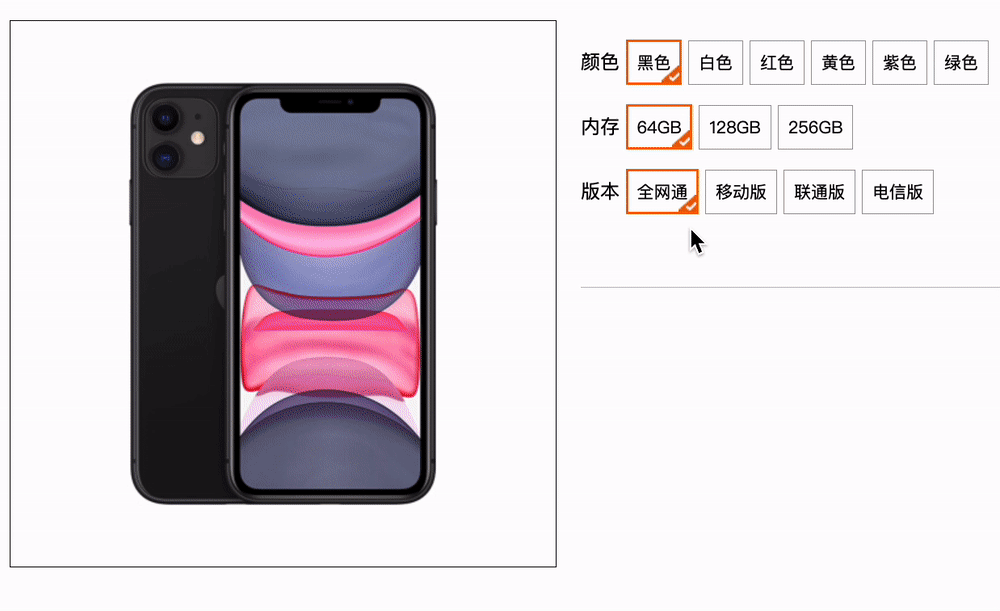
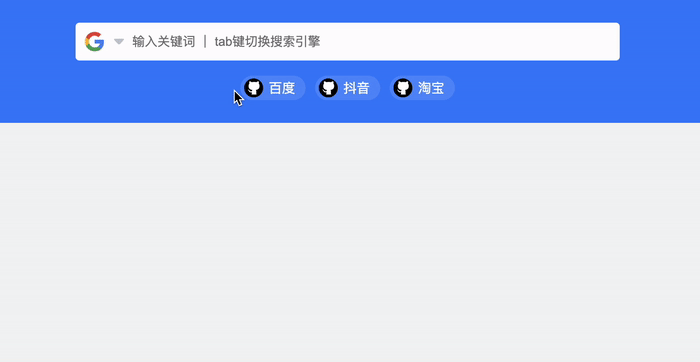

# 今日能力目标

掌握常用事件类型和事件对象， 事件流，能够通过事件委托，优化多个事件绑定

# 必要知识

1. 能够监听常见事件类型完成网页交互效果，比如**鼠标事件**、**焦点事件**、**文本事件**、**滚动事件**和**键盘事件**等
2. 能够使用**事件对象**获取所需信息
3. 能够借助于事件对象中的**`preventDefault`**阻止默认行为，**`stopPropagation`**阻止冒泡
4. 能够利用**事件委托**优化多个事件绑定
5. 能够利用**排他思想**完成常见网页交互效果

# 一、编程题

## 综合案例：京东选项卡

**难度等级：**   ★

**作业目标： ** 完成京东选项卡

**考察能力：**

1. 掌握排他思想的运用

### 作业需求

效果图需求如下：

1. 

**需求如下：**

1. 点击tab栏上面的选项样式发生改变
2. 点击tab栏下面的内容发生改变


### 相关素材

见附件

### 思路分析

这是一个通过JS实现tab栏切换的典型案例，该案例的核心内容有两块：**标签页样式高亮**和**标签页内容展示**

> 备注：tab栏选项的`active`类名控制高亮，高亮的tab栏索引和对应内容容器的索引相同，内容容器通过` selected`类名控制内容显示

1. 标签页样式高亮
   * 1.1 获取元素
   * 1.2 循环绑定事件
   * 1.3 使用排他思想，操作tab栏选项的`active`类名
2. 标签页内容展示
   * 使用排他思想，操作tab栏对应内容的`selected`类名


### 参考答案

```js
    // 1.1 获取元素
		// 获取tab栏选项
    const liList = document.querySelectorAll('.tab>li')
    // 获取tab栏对应内容的容器
    const mainList = document.querySelectorAll('.products>.main')

    // 1.2 循环绑定事件
    for (let i = 0; i < liList.length; i++) {
      liList[i].addEventListener('click', function () {

        // 1.3 使用排他思想，操作tab栏选项的active类名
        document.querySelector('.tab>.active').classList.remove('active')
        liList[i].classList.add('active')
        
        // 2. 使用排他思想，操作tab栏对应内容的selected类名
  			document.querySelector('.products>.selected ').classList.remove('selected')
        mainList[i].classList.add('selected')
      })
    }
```

### 总结反馈

- [ ] 我看效果图就可以分析出实现步骤并独立完成
- [ ] 我看效果图没有思路，需要看本题思路分析才能完成
- [ ] 我需要看参考答案才能梳理思路和完成代码
- [ ] 我没有思路，也看不懂答案，无法完成本题


## 综合案例：顺丰快递单号查询 

**难度等级：**   ★★

**作业目标： ** 完成顺丰快递单号查询案例

**考察能力：**

1. 能够使用表单元素的`input`事件
2. 能够使用表单元素的`blur`事件
3. 能够使用表单元素的`focus`事件

### 作业需求

效果图需求如下：


**需求如下：**

1. 输入框聚焦，如果没有值需要隐藏放大框
2. 输入框失焦，隐藏放大框
3. 输入框中输入，没有值就隐藏放大框，有值就显示放大框


### 相关素材

见附件

### 思路分析

这是一个典型的输入框交互效果，这类效果国绕着核心事件即可，本案例核心事件有三个：**处理聚焦**、**处理失焦**、**处理输入**

1. 处理聚焦
   * 如果输入框中没有值，就隐藏放大框
2. 处理失焦
   * 隐藏弹框
3. 处理输入
   *  如果输入时没有内容，就隐藏放大框
   * 如果输入时有内容，就显示放大框，并將输入内容赋值给放大框


### 参考答案

```js
        // 提示框
        const con = document.querySelector('.con');
				// 订单号
        const sf = document.querySelector('.sf');

        // 1. 处理聚焦
        sf.addEventListener('focus', function () {
            if (this.value !== '') {
                // 如果输入框中没有值，就要隐放大框
                con.style.display = 'block';
            }
        })

        // 2. 处理失焦
        sf.addEventListener('blur', function () {
            con.style.display = 'none';
        })

        // 3. 处理输入
        sf.addEventListener('input', function () {
            if (this.value == '') {
                // 3.1 如果输入时没有内容，就隐藏放大框
                con.style.display = 'none';
            } else {
                // 3.2 如果输入时有内容，就显示放大框，并將输入内容赋值给放大框
                con.style.display = 'block';
                con.innerText = this.value;
            }
        })

```

### 总结反馈

- [ ] 我看效果图就可以分析出实现步骤并独立完成
- [ ] 我看效果图没有思路，需要看本题思路分析才能完成
- [ ] 我需要看参考答案才能梳理思路和完成代码
- [ ] 我没有思路，也看不懂答案，无法完成本题


## 综合案例：淘宝购物选商品 

**难度等级：**    ★★

**作业目标： ** 完成淘宝购物选商品效果

**考察能力：**

1. 能够利用排他思想实现案例效果

### 作业需求

效果图需求如下：



**需求如下：**

1. 点击颜色按钮，按钮样式发生变化，同时左侧图片发生变化
2. 点击内存按钮，内存样式发生变化
3. 点击版本按钮，版本样式发生变化


### 相关素材

见附件

### 思路分析

本题是一个通过JS实现的购物网站常见的商品选择效果，本案例的核心内容是在点击事件中，利用**排他思想修改样式**

1. 准备图片数据
2. 获取所有颜色选择按钮，并循环绑定事件
   * 2.1 排他思想修改样式
   * 2.2 修改图片
3. 获取所有内存选择按钮，并循环绑定事件
   * 排他思想修改样式
4. 获取所有版本选择按钮，并循环绑定事件
   * 排他思想修改样式


### 参考答案

```js
    // 1. 准备图片数据
    const imgArr = [
      'images/black.jpg',
      'images/white.jpg',
      'images/red.jpg',
      'images/yellow.jpg',
      'images/purple.jpg',
      'images/green.jpg'
    ];

    // 2. 获取所有颜色选择按钮，并循环绑定事件
    const colorArr = document.querySelectorAll('.color span')
    for (let i = 0; i < colorArr.length; i++) {
      colorArr[i].onclick = function () {
        // 2.1 排他思想修改样式
        document.querySelector('.color .on').classList.remove('on')
        this.classList.add('on')
        // 2.2 修改图片
        document.querySelector('.wrap>img').src = imgArr[i]
      }
    }


    // 3. 获取所有内存选择按钮，并循环绑定事件
    const spanArr = document.querySelectorAll('.rom span')
    for (let i = 0; i < spanArr.length; i++) {
      spanArr[i].addEventListener('click', function () {
        // 3.1 排他思想修改样式
        document.querySelector('.rom .on').classList.remove('on')
        this.classList.add('on')
      })
    }


    // 4. 获取所有版本选择按钮，并循环绑定事件
    const banbenArr = document.querySelectorAll('.banben span')
    for (let i = 0; i < banbenArr.length; i++) {
      banbenArr[i].addEventListener('click', function () {
        // 4.1 排他思想修改样式
        document.querySelector('.banben .on').classList.remove('on')
        this.classList.add('on')
      })
    }
```

### 总结反馈

- [ ] 我看效果图就可以分析出实现步骤并独立完成
- [ ] 我看效果图没有思路，需要看本题思路分析才能完成
- [ ] 我需要看参考答案才能梳理思路和完成代码
- [ ] 我没有思路，也看不懂答案，无法完成本题


## 综合案例：小米密码框

**难度等级：**    ★★ ★

**作业目标： ** 完成小米密码框

**考察能力：**

1. 掌握输入框的`focus`和`blur`事件

### 作业需求

效果图需求如下：


**需求如下：**

1. 输入框聚焦，文字移动到输入框上面
2. 输入框失焦且输入框无内容，文字跑下来
3. 点击眼睛图标能够动态切换输入框的类型


### 相关素材

见附件

### 思路分析

本题是一个常见的密码输入框展示效果，本案例的核心内容有：**聚焦样式处理**，**失焦样式处理**，**点击图标处理**

> 备注：`active`类名可以用于控制文字和图标的样式

1. 获取元素

2. 聚焦样式处理
   * 给文字添加`active`类名
   
3. 失焦样式处理
   * 判断内容如果是空的，就移除`active`类名
   
4. 点击图标处理
   
   * 4.1 定义一个布尔值，来表示眼睛的状态
   * 4.2 改变眼睛状态
   
   * 4.3 改变输入框类型
   
   * 4.4 切换眼睛的类名


### 参考答案

```js
    // 1. 获取元素
    // 获取input元素
    const iptEl = document.querySelector('.mi-input')
    // 获取label元素
    const label = document.querySelector('label')
    // 获取图标
    const eyes = document.querySelector('.eyes')

    // 2. 聚焦样式处理
    iptEl.addEventListener('focus', function () {
      // 2.1 给文字添加active类名
      label.classList.add('active')
    })

    // 3. 失焦样式处理
    iptEl.addEventListener('blur', function () {
      // 3.1 判断内容如果是空的，就移除active类名
      if (this.value === '') {
        label.classList.remove('active')
      }
    })

    // 4. 点击图标处理
    // 4.1 定义一个布尔值，来表示眼睛的状态
    let isClose = true
    eyes.addEventListener('click', function () {
			// 4.2 改变眼睛状态
      isClose = !isClose
      //  4.3 改变输入框类型
      iptEl.type = isClose ? 'password' : 'text'
      // 4.4 切换眼睛的类名
      this.classList.toggle('active')
    })
```

### 总结反馈

- [ ] 我看效果图就可以分析出实现步骤并独立完成
- [ ] 我看效果图没有思路，需要看本题思路分析才能完成
- [ ] 我需要看参考答案才能梳理思路和完成代码
- [ ] 我没有思路，也看不懂答案，无法完成本题


## 二次开发题：掘金快捷导航

**难度等级：**   ★★★★★

**作业目标： ** 完成掘金谷歌插件快捷导航功能

**考察能力：**

1. 掌握事件委托处理多个点击事件
2. 掌握`keydown`事件的使用
3. 掌握使用`preventDefault()`阻止按tab键的默认行为
4. 掌握事件对象的使用，主要是`key`、`target`、`dataset`
5. 掌握自定义属性的使用
6. 掌握`classList`操作类名

### 作业需求

**1. 已有业务：**

正在开发掘金谷歌插件快捷导航功能，已经完成页面数据的展示，以及点击三角图标切换下拉导航列表的显示和隐藏，完成的效果如下：




**2. 新增需求：**

1. 点击某个导航选项，隐藏下拉导航列表，同时将当前展示的导航项切换成点击的导航项
2. 按tab键也能够切换当前的导航项，同时，如果下拉导航列表是显示状态，能看到选中的样式切换

完整效果如下：


### 相关素材

见附件

### 思路分析

本题是一个通过JS操作DOM元素的用户交互效果。该效果的核心步骤有：**点击导航项切换当前导航项**，**按tab键切换导航项**

> 备注：`active`类名控制小三角的旋转， `show`类名控制下拉导航列表的展示， `checked`类名控制导航项的选中


1. 点击导航项切换当前导航项
   * 1.1 利用事件委托绑定事件
   * 1.2 判断点击的目标元素是否包含`item`类名
   * 1.3 设置导航项的样式
   * 1.4 切换小三角和导航列表样式
   * 1.5 修改图片
2. 按tab键切换导航项
   * 2.1 定义变量记录当前展示导航的索引
   * 2.2 按键判断
   * 2.3 让input聚焦
   * 2.4 记录索引加1
   * 2.5 边界判断
   * 2.6 更新导航图片
   * 2.7 修改导航列表中选中项的类名


### 参考答案

```js
// 1. 点击导航项切换当前导航项
// 1.1 利用事件委托绑定事件
navListEl.addEventListener('click', function (e) {
  // 1.2 判断点击的目标元素是否包含item类名
  if (e.target.classList.contains('item')) {
    // 1.3 设置导航项的样式
    document.querySelector('.item.checked').classList.remove('checked')
    e.target.classList.add('checked')
    // 1.4 切换小三角和导航列表样式
    toggle()
    // 1.5 修改图片
    currNavEl.src = e.target.dataset.src
  }
})

// 2.1 定义变量 记录当前展示导航的索引
let curIndex = 0
// 2. 按tab键切换导航项
document.addEventListener('keydown', function (e) {
  // 2.2 按键判断
  if (e.key !== 'Tab') return
  e.preventDefault()
  // 2.3 让input聚焦
  ipt.focus()
  // 2.4 记录索引加1
  curIndex++
  // 2.5 边界判断
  if (curIndex === itemList.length) {
    curIndex = 0
  }
  // 2.6 更新导航项图片
  currNavEl.src = itemList[curIndex].dataset.src
  // 2.7 修改导航列表中选中项的类名
  document.querySelector('.item.checked').classList.remove('checked')
  itemList[curIndex].classList.add('checked')
})

```

### 总结反馈

- [ ] 我看效果图就可以分析出实现步骤并独立完成
- [ ] 我看效果图没有思路，需要看本题思路分析才能完成
- [ ] 我需要看参考答案才能梳理思路和完成代码
- [ ] 我没有思路，也看不懂答案，无法完成本题


# 二、问答题

## 事件对象的作用

**难度等级：**   ★★★★★

**考察能力：**

1. 掌握事件对象的作用

### 问答要点

1. 事件对象中有哪些常用的属性，有什么作用

### 参考答案

```markdown
1. **获取事件的类型**：事件对象中的`type`属性表示事件的类型，可以用于确定触发了哪种类型的事件。例如，`click`、`keydown`、`mouseover`等。
2. **获取事件的目标元素**：事件对象中的`target`属性表示触发事件的元素。通过访问`target`属性，可以获取到触发事件的具体HTML元素，从而对其进行操作。
3. **阻止事件的默认行为**：事件对象提供了`preventDefault()`方法，可以阻止事件的默认行为。例如，在点击链接时，可以使用`preventDefault()`方法阻止浏览器跳转到链接的URL。
4. **停止事件的传播**：事件对象提供了`stopPropagation()`方法，可以停止事件的传播。当事件发生在嵌套的元素上时，通过调用`stopPropagation()`方法，可以阻止事件继续传播到父元素或其他元素。
5. **获取事件的坐标信息**：对于鼠标事件（如`click`、`mousemove`等），事件对象提供了鼠标在页面上的坐标信息。可以通过访问事件对象的`clientX`和`clientY`属性获取鼠标的横向和纵向坐标。
6. **获取键盘事件的按键信息**：对于键盘事件（如`keydown`、`keyup`等），事件对象提供了按键相关的信息。可以通过访问事件对象的`key`或`keyCode`属性获取按下或释放的键的信息。
7. **传递自定义数据**：在触发事件时，可以通过事件对象的自定义属性，将额外的数据传递给事件处理程序。这样可以在事件处理程序中访问和使用这些数据。
```


## js中事件流有哪几个阶段，分别表示什么

**难度等级：**   ★★★

**考察能力：**

1. 掌握js事件流

### 问答要点

1. 捕获阶段是什么意思
2. 目标阶段是什么意思
3. 冒泡阶段是什么意思

### 参考答案

```markdown
JavaScript中的事件流可以分为三个阶段，它们是：

1. **捕获阶段（Capture phase）**：
   - 在捕获阶段，事件从文档根节点向下传播，沿着DOM树的路径，直到达到目标元素本身。
   - 在这个阶段，事件会依次触发经过的每个元素上绑定的捕获阶段的事件处理程序（如果有）。
   - 注意，大多数情况下，我们不会在捕获阶段绑定事件处理程序，因为默认情况下事件处理程序是在冒泡阶段执行的。
2. **目标阶段（Target phase）**：
   - 目标阶段是事件到达目标元素本身时触发的阶段。
   - 在这个阶段，事件会触发目标元素上绑定的事件处理程序。
3. **冒泡阶段（Bubbling phase）**：
   - 在冒泡阶段，事件从目标元素开始向上冒泡，沿着DOM树的路径，直到达到文档根节点。
   - 在这个阶段，事件会依次触发经过的每个元素上绑定的冒泡阶段的事件处理程序（如果有）。
   - 冒泡阶段是最常用的事件处理阶段，因为它允许我们在父元素上绑定事件处理程序，通过冒泡机制捕获子元素上触发的事件。
```

## 什么情况下需要阻止事件冒泡

**难度等级：**   ★

**考察能力：**

1. 掌握阻止事件冒泡的使用

### 问答要点

1. 什么情况下需要阻止事件冒泡
2. 如何阻止事件冒泡

### 参考答案

```markdown
有时候我们需要阻止事件冒泡的主要原因是避免事件在DOM树中继续向上冒泡，从而影响到其他元素的事件处理。比如：

**避免父元素的事件处理程序被触发**：如果一个元素包含了子元素，并且两者都绑定了相同类型的事件处理程序，当事件在子元素上触发后，它会继续在父元素上触发。如果我们希望只执行子元素的事件处理程序，可以通过阻止事件冒泡来避免父元素的事件处理程序被触发。

要阻止事件冒泡，可以使用`event.stopPropagation()`方法。在事件处理程序中调用该方法，可以停止事件在DOM树中继续向上冒泡。
```

## 事件委托的原理及作用

**难度等级：**   ★★★

**考察能力：**

1. 掌握事件委托的原理及作用

### 问答要点

1. 事件委托的原理是什么
2. 事件委托的好处有哪些

### 参考答案

```markdown
事件委托（Event delegation）是一种常用的事件处理技术，它利用事件冒泡的特性，将事件处理程序绑定到父元素上，而不是直接绑定到每个子元素上。当事件在子元素上触发时，事件会冒泡到父元素，然后由父元素上的事件处理程序来处理。

事件委托的原理如下：

1. 将事件处理程序绑定到父元素：选择一个父元素作为事件的处理者，并将事件处理程序绑定到该父元素上。通常选择的父元素是包含了多个子元素的容器元素，例如一个`<ul>`元素包含了多个`<li>`元素。
2. 事件冒泡：当事件在子元素上触发时，事件会按照冒泡阶段的顺序向上冒泡，逐级触发父元素的事件处理程序。
3. 判断事件来源：在父元素的事件处理程序中，可以通过事件对象（event object）的属性来判断事件的来源，例如`event.target`属性可以获取触发事件的具体元素。
4. 执行相应的操作：根据事件的来源，可以执行相应的操作。由于事件处理程序绑定在父元素上，所以无论子元素是已经存在的还是动态添加的，都可以通过事件委托来处理。

事件委托的好处是减少了事件处理程序的数量，提高了性能和内存利用率。当有大量的子元素需要绑定事件时，使用事件委托可以避免为每个子元素都绑定事件处理程序，而是只需绑定一个事件处理程序到父元素上。

此外，事件委托还具有动态绑定的特性，即使后续添加了新的子元素，它们也会自动继承父元素的事件处理程序，无需重新绑定。

总结起来，事件委托利用事件冒泡机制，将事件处理程序绑定到父元素上，通过判断事件来源来执行相应的操作，从而实现对子元素的事件处理。这是一种常用的优化和简化事件处理的技术。
```

## 浏览器有哪些常见的默认行为，如何阻止

**难度等级：**   ★

**考察能力：**

1. 知道常见默认行为
2. 知道如何阻止默认行为

### 问答要点

1. 浏览器有哪些常见的默认行为
2. 如何阻止浏览器的默认行为

### 参考答案

```markdown
浏览器中有一些常见的默认行为，例如点击链接时会跳转到链接的地址；提交表单时会刷新页面等，在网页上右键点击会弹出浏览器的默认右键菜单；按下 Tab 键会将焦点从当前元素移动到下一个可聚焦的元素，比如例如输入框、按钮、链接等。

阻止默认行为可通过事件对象中的preventDefault方法。
```

## 解绑事件需要注意什么

**难度等级：**   ★

**考察能力：**

1. 掌握解绑事件的方法

### 问答要点

1. 解绑事件的函数有什么需要注意的吗

### 参考答案

```markdown
需要注意：

1. **使用相同的函数引用**：要成功解绑事件，必须使用与绑定时相同的函数引用。这意味着你不能简单地创建一个新的匿名函数来解绑事件，因为它与绑定时的函数引用不同。你需要确保使用相同的函数引用来解绑事件。

2. **解绑事件的时机**：要确保在适当的时机解绑事件。如果你不再需要某个事件处理程序，最好在不需要它的时候立即解绑，以避免潜在的内存泄漏问题。例如，在删除一个元素之前，最好先解绑该元素上的所有事件处理程序。
```


# 三、客观题

1. 关于js中的事件，下列说法错误的是？

   A： DOM2事件中， 不能给元素注册同名事件，比如给同一个按钮同时注册2个点击事件

   B： 事件注册之后，回调函数里面的代码，不会立即触发

   C： 注册事件本质是把回调函数注册到元素身上

   D： 事件既可以通过用户交互来触发，也可以使用代码主动触发，比如 btn.click() 

   **答案**：A

   **解析**：DOM2事件可以同时注册多个事件

2. 下列关于事件类型解释错误的是？

   A.  鼠标事件类型：click   鼠标点击   mouseenter 鼠标经过   mouseleave  鼠标离开

   B.  表单获得光标事件类型：focus    获得焦点       blur  失去焦点

   C.  键盘事件类型： keydown 键盘弹起触发     keyup    键盘按下触发

   D.  用户输入表单事件类型： input    用户输入时，并且表单里面的值发生变化时候触发

   **答案**：C

   **解析**： keydown 键盘按下触发，keyup 键盘弹起触发，题目中写反了

3. 下列关于事件监听解释错误的是？

   A.  事件监听也称为事件注册或者事件绑定

   B.  事件监听三要素是：事件源、事件类型、事件处理函数

   C.  事件类型要求是字符串的，并且是小写字母

   D.  事件处理函数点击之后再去执行，而且只能执行一次

   **答案**：D

   **解析**：事件处理函数可以执行多次，不止一次。

4. 关于回调函数说法正确的是？（多选）

   A.  当一个函数当做参数来传递给另外一个函数的时候，这个函数就是回调函数

   B.  以前我们学过的 间隔函数（定时器）里面的函数，还有事件监听的匿名函数都是回调函数

   C.  使用匿名函数做为回调函数比较常见

   D.  回调函数简单理解，就是在特定事件发生或特定条件满足时被调用执行的函数

   **答案**： ABCD

   **解析**：无

5. 关于事件对象解释错误的是？

   A.  事件对象也是个对象，这个对象里有事件触发时的相关信息

   B.  例如：鼠标点击事件中，事件对象就存了鼠标点在哪个位置等信息

   C.  在事件绑定的回调函数的第一个参数就是事件对象，一般命名为 event、ev或者e

   D.  鼠标触发的事件包含事件对象，其余的比如键盘事件是没有事件对象的

   **答案**：D

   **解析**：所有事件都有事件对象

6. 可以得到用户按下了哪个键写法正确的是？

   A.  事件对象.e

   B.  事件对象.key

   C.  事件对象.keyboard

   D.  事件对象.keydown

   **答案**：B

   **解析**：事件对象中常见的属性有`target` `key` `keyCode` ` type` `preventDefault` `stopPropagation`

7. 用户按下回车键，下列判断条件写法正确的是？

   A.  e.key === Enter

   B.  e.keyboard  === 'enter'

   C.  e.key === 'Enter'

   D.  e.keyboard  = 'Enter'

   **答案**：C

   **解析**：事件对象中没有keyboard这个属性，key属性的值是一个字符串

8. 关于环境对象this，下列说法错误的是？

   A.  this是js中的一个环境对象，一般用于函数中

   B.  在事件处理函数中，this指向事件源dom对象，简单说指向函数调用者

   C.  只要是事件处理函数，就必须要使用this，否则无法实现功能

   D.  this相当于中文的我， 谁调用，我就是谁

   **答案**：C

   **解析**：事件处理函数中不是必须用this，借助于事件对象也可以获取到元素

9. 以下注册事件的说法，正确的是？

   A： 可以使用on+事件名称可以给一元素的同一个事件注册多个事件处理函数

   B： addEventListener方法可以给一个元素的同一个事件注册多个事件处理函数

   C： addEventListener第一个参数是事件名，注意需要加"on"

    D： addEventListener方法没有兼容性问题

   **答案**：B

   **解析**：on+事件名称不可以给一元素的同一个事件注册多个事件处理函数；addEventListener第一个参数是事件名，不要加“on”；addEventListener方法有兼容性问题，ie6-8不支持

10. 下面对于事件委托描述正确的是？（多选）


   A.  减少了注册次数，提高了程序性能

   B.  事件委托利用了事件冒泡

   C. 对于使用了事件委托的元素，其新增的子元素事件依然生效

   D. 事件委托利用了事件捕获

   **答案**：ABC

   **解析**：无
