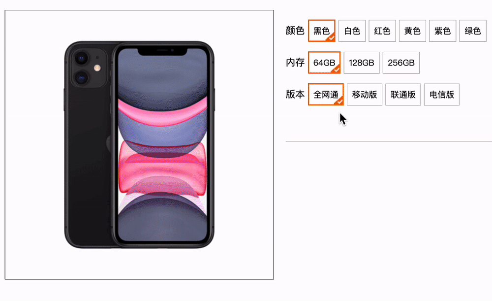
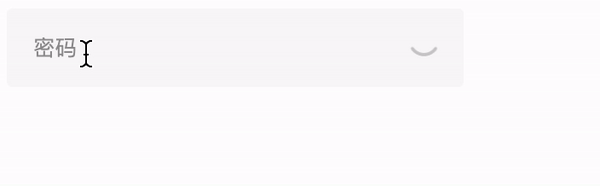
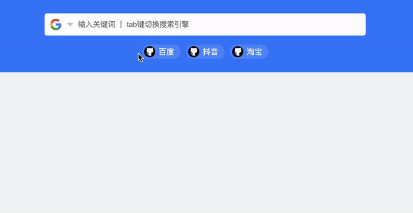
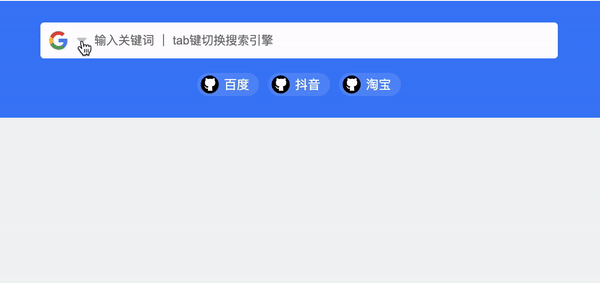

# 今日能力目标

掌握常用事件类型和事件对象， 事件流，能够通过事件委托，优化多个事件绑定

# 必要知识

1. 能够监听常见事件类型完成网页交互效果，比如**鼠标事件**、**焦点事件**、**文本事件**、**滚动事件**和**键盘事件**等
2. 能够使用**事件对象**获取所需信息
3. 能够借助于事件对象中的**`preventDefault`**阻止默认行为，**`stopPropagation`**阻止冒泡
4. 能够利用**事件委托**优化多个事件绑定
5. 能够利用**排他思想**完成常见网页交互效果

# 一、编程题

## 综合案例：京东选项卡

**难度等级：**   ★

**作业目标： ** 完成京东选项卡

**考察能力：**

1. 掌握排他思想的运用

### 作业需求

效果图需求如下：

1. 

**需求如下：**

1. 点击tab栏上面的选项样式发生改变
2. 点击tab栏下面的内容发生改变


### 相关素材

见附件

### 思路分析

这是一个通过JS实现tab栏切换的典型案例，该案例的核心内容有两块：**标签页样式高亮**和**标签页内容展示**

> 备注：tab栏选项的`active`类名控制高亮，高亮的tab栏索引和对应内容容器的索引相同，内容容器通过` selected`类名控制内容显示

1. 标签页样式高亮
   * 1.1 获取元素
   * 1.2 循环绑定事件
   * 1.3 使用排他思想，操作tab栏选项的`active`类名
2. 标签页内容展示
   * 使用排他思想，操作tab栏对应内容的`selected`类名


### 参考答案

```js
    
```

### 总结反馈

- [ ] 我看效果图就可以分析出实现步骤并独立完成
- [ ] 我看效果图没有思路，需要看本题思路分析才能完成
- [ ] 我需要看参考答案才能梳理思路和完成代码
- [ ] 我没有思路，也看不懂答案，无法完成本题


## 综合案例：顺丰快递单号查询 

**难度等级：**   ★★

**作业目标： ** 完成顺丰快递单号查询案例

**考察能力：**

1. 能够使用表单元素的`input`事件
2. 能够使用表单元素的`blur`事件
3. 能够使用表单元素的`focus`事件

### 作业需求

效果图需求如下：


**需求如下：**

1. 输入框聚焦，如果没有值需要隐藏放大框
2. 输入框失焦，隐藏放大框
3. 输入框中输入，没有值就隐藏放大框，有值就显示放大框


### 相关素材

见附件

### 思路分析

这是一个典型的输入框交互效果，这类效果国绕着核心事件即可，本案例核心事件有三个：**处理聚焦**、**处理失焦**、**处理输入**

1. 处理聚焦
   * 如果输入框中没有值，就隐藏放大框
2. 处理失焦
   * 隐藏弹框
3. 处理输入
   *  如果输入时没有内容，就隐藏放大框
   * 如果输入时有内容，就显示放大框，并將输入内容赋值给放大框


### 参考答案

```js
   
```

### 总结反馈

- [ ] 我看效果图就可以分析出实现步骤并独立完成
- [ ] 我看效果图没有思路，需要看本题思路分析才能完成
- [ ] 我需要看参考答案才能梳理思路和完成代码
- [ ] 我没有思路，也看不懂答案，无法完成本题


## 综合案例：淘宝购物选商品 

**难度等级：**    ★★

**作业目标： ** 完成淘宝购物选商品效果

**考察能力：**

1. 能够利用排他思想实现案例效果

### 作业需求

效果图需求如下：



**需求如下：**

1. 点击颜色按钮，按钮样式发生变化，同时左侧图片发生变化
2. 点击内存按钮，内存样式发生变化
3. 点击版本按钮，版本样式发生变化


### 相关素材

见附件

### 思路分析

本题是一个通过JS实现的购物网站常见的商品选择效果，本案例的核心内容是在点击事件中，利用**排他思想修改样式**

1. 准备图片数据
2. 获取所有颜色选择按钮，并循环绑定事件
   * 2.1 排他思想修改样式
   * 2.2 修改图片
3. 获取所有内存选择按钮，并循环绑定事件
   * 排他思想修改样式
4. 获取所有版本选择按钮，并循环绑定事件
   * 排他思想修改样式


### 参考答案

```js

```

### 总结反馈

- [ ] 我看效果图就可以分析出实现步骤并独立完成
- [ ] 我看效果图没有思路，需要看本题思路分析才能完成
- [ ] 我需要看参考答案才能梳理思路和完成代码
- [ ] 我没有思路，也看不懂答案，无法完成本题


## 综合案例：小米密码框

**难度等级：**    ★★ ★

**作业目标： ** 完成小米密码框

**考察能力：**

1. 掌握输入框的`focus`和`blur`事件

### 作业需求

效果图需求如下：



**需求如下：**

1. 输入框聚焦，文字移动到输入框上面
2. 输入框失焦且输入框无内容，文字跑下来
3. 点击眼睛图标能够动态切换输入框的类型


### 相关素材

见附件

### 思路分析

本题是一个常见的密码输入框展示效果，本案例的核心内容有：**聚焦样式处理**，**失焦样式处理**，**点击图标处理**

> 备注：`active`类名可以用于控制文字和图标的样式

1. 获取元素

2. 聚焦样式处理
   * 给文字添加`active`类名
   
3. 失焦样式处理
   * 判断内容如果是空的，就移除`active`类名
   
4. 点击图标处理
  
   * 4.1 定义一个布尔值，来表示眼睛的状态
   * 4.2 改变眼睛状态
   
   * 4.3 改变输入框类型
   
   * 4.4 切换眼睛的类名


### 参考答案

```js

```

### 总结反馈

- [ ] 我看效果图就可以分析出实现步骤并独立完成
- [ ] 我看效果图没有思路，需要看本题思路分析才能完成
- [ ] 我需要看参考答案才能梳理思路和完成代码
- [ ] 我没有思路，也看不懂答案，无法完成本题


## 二次开发题：掘金快捷导航

**难度等级：**   ★★★★★

**作业目标： ** 完成掘金谷歌插件快捷导航功能

**考察能力：**

1. 掌握事件委托处理多个点击事件
2. 掌握`keydown`事件的使用
3. 掌握使用`preventDefault()`阻止按tab键的默认行为
4. 掌握事件对象的使用，主要是`key`、`target`、`dataset`
5. 掌握自定义属性的使用
6. 掌握`classList`操作类名

### 作业需求

**1. 已有业务：**

正在开发掘金谷歌插件快捷导航功能，已经完成页面数据的展示，以及点击三角图标切换下拉导航列表的显示和隐藏，完成的效果如下：




**2. 新增需求：**

1. 点击某个导航选项，隐藏下拉导航列表，同时将当前展示的导航项切换成点击的导航项
2. 按tab键也能够切换当前的导航项，同时，如果下拉导航列表是显示状态，能看到选中的样式切换

完整效果如下：




### 相关素材

见附件

### 思路分析

本题是一个通过JS操作DOM元素的用户交互效果。该效果的核心步骤有：**点击导航项切换当前导航项**，**按tab键切换导航项**

> 备注：`active`类名控制小三角的旋转， `show`类名控制下拉导航列表的展示， `checked`类名控制导航项的选中


1. 点击导航项切换当前导航项
   * 1.1 利用事件委托绑定事件
   * 1.2 判断点击的目标元素是否包含`item`类名
   * 1.3 设置导航项的样式
   * 1.4 切换小三角和导航列表样式
   * 1.5 修改图片
2. 按tab键切换导航项
   * 2.1 定义变量记录当前展示导航的索引
   * 2.2 按键判断
   * 2.3 让input聚焦
   * 2.4 记录索引加1
   * 2.5 边界判断
   * 2.6 更新导航图片
   * 2.7 修改导航列表中选中项的类名


### 参考答案

```js

```

### 总结反馈

- [ ] 我看效果图就可以分析出实现步骤并独立完成
- [ ] 我看效果图没有思路，需要看本题思路分析才能完成
- [ ] 我需要看参考答案才能梳理思路和完成代码
- [ ] 我没有思路，也看不懂答案，无法完成本题


# 二、问答题

## 事件对象的作用

**难度等级：**   ★★★★★

**考察能力：**

1. 掌握事件对象的作用

### 问答要点

1. 事件对象中有哪些常用的属性，有什么作用

### 参考答案

```markdown

```


## js中事件流有哪几个阶段，分别表示什么

**难度等级：**   ★★★

**考察能力：**

1. 掌握js事件流

### 问答要点

1. 捕获阶段是什么意思
2. 目标阶段是什么意思
3. 冒泡阶段是什么意思

### 参考答案

```markdown

```

## 什么情况下需要阻止事件冒泡

**难度等级：**   ★

**考察能力：**

1. 掌握阻止事件冒泡的使用

### 问答要点

1. 什么情况下需要阻止事件冒泡
2. 如何阻止事件冒泡

### 参考答案

```markdown

```

## 事件委托的原理及作用

**难度等级：**   ★★★

**考察能力：**

1. 掌握事件委托的原理及作用

### 问答要点

1. 事件委托的原理是什么
2. 事件委托的好处有哪些

### 参考答案

```markdown

```

## 浏览器有哪些常见的默认行为，如何阻止

**难度等级：**   ★

**考察能力：**

1. 知道常见默认行为
2. 知道如何阻止默认行为

### 问答要点

1. 浏览器有哪些常见的默认行为
2. 如何阻止浏览器的默认行为

### 参考答案

```markdown

```

## 解绑事件需要注意什么

**难度等级：**   ★

**考察能力：**

1. 掌握解绑事件的方法

### 问答要点

1. 解绑事件的函数有什么需要注意的吗

### 参考答案

```markdown

```


# 三、客观题

1. 关于js中的事件，下列说法错误的是？

   A： DOM2事件中， 不能给元素注册同名事件，比如给同一个按钮同时注册2个点击事件

   B： 事件注册之后，回调函数里面的代码，不会立即触发

   C： 注册事件本质是把回调函数注册到元素身上

   D： 事件既可以通过用户交互来触发，也可以使用代码主动触发，比如 btn.click() 

   

2. 下列关于事件类型解释错误的是？

   A.  鼠标事件类型：click   鼠标点击   mouseenter 鼠标经过   mouseleave  鼠标离开

   B.  表单获得光标事件类型：focus    获得焦点       blur  失去焦点

   C.  键盘事件类型： keydown 键盘弹起触发     keyup    键盘按下触发

   D.  用户输入表单事件类型： input    用户输入时，并且表单里面的值发生变化时候触发

   

   

3. 下列关于事件监听解释错误的是？

   A.  事件监听也称为事件注册或者事件绑定

   B.  事件监听三要素是：事件源、事件类型、事件处理函数

   C.  事件类型要求是字符串的，并且是小写字母

   D.  事件处理函数点击之后再去执行，而且只能执行一次

   

   

4. 关于回调函数说法正确的是？（多选）

   A.  当一个函数当做参数来传递给另外一个函数的时候，这个函数就是回调函数

   B.  以前我们学过的 间隔函数（定时器）里面的函数，还有事件监听的匿名函数都是回调函数

   C.  使用匿名函数做为回调函数比较常见

   D.  回调函数简单理解，就是在特定事件发生或特定条件满足时被调用执行的函数

   

   

5. 关于事件对象解释错误的是？

   A.  事件对象也是个对象，这个对象里有事件触发时的相关信息

   B.  例如：鼠标点击事件中，事件对象就存了鼠标点在哪个位置等信息

   C.  在事件绑定的回调函数的第一个参数就是事件对象，一般命名为 event、ev或者e

   D.  鼠标触发的事件包含事件对象，其余的比如键盘事件是没有事件对象的

   

6. 可以得到用户按下了哪个键写法正确的是？

   A.  事件对象.e

   B.  事件对象.key

   C.  事件对象.keyboard

   D.  事件对象.keydown

   

7. 用户按下回车键，下列判断条件写法正确的是？

   A.  e.key === Enter

   B.  e.keyboard  === 'enter'

   C.  e.key === 'Enter'

   D.  e.keyboard  = 'Enter'

   

8. 关于环境对象this，下列说法错误的是？

   A.  this是js中的一个环境对象，一般用于函数中

   B.  在事件处理函数中，this指向事件源dom对象，简单说指向函数调用者

   C.  只要是事件处理函数，就必须要使用this，否则无法实现功能

   D.  this相当于中文的我， 谁调用，我就是谁

   

9. 以下注册事件的说法，正确的是？

   A： 可以使用on+事件名称可以给一元素的同一个事件注册多个事件处理函数

   B： addEventListener方法可以给一个元素的同一个事件注册多个事件处理函数

   C： addEventListener第一个参数是事件名，注意需要加"on"

    D： addEventListener方法没有兼容性问题

   

10. 下面对于事件委托描述正确的是？（多选）


   A.  减少了注册次数，提高了程序性能

   B.  事件委托利用了事件冒泡

   C. 对于使用了事件委托的元素，其新增的子元素事件依然生效

   D. 事件委托利用了事件捕获

  
