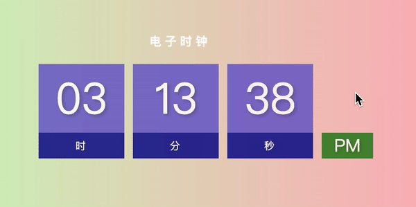
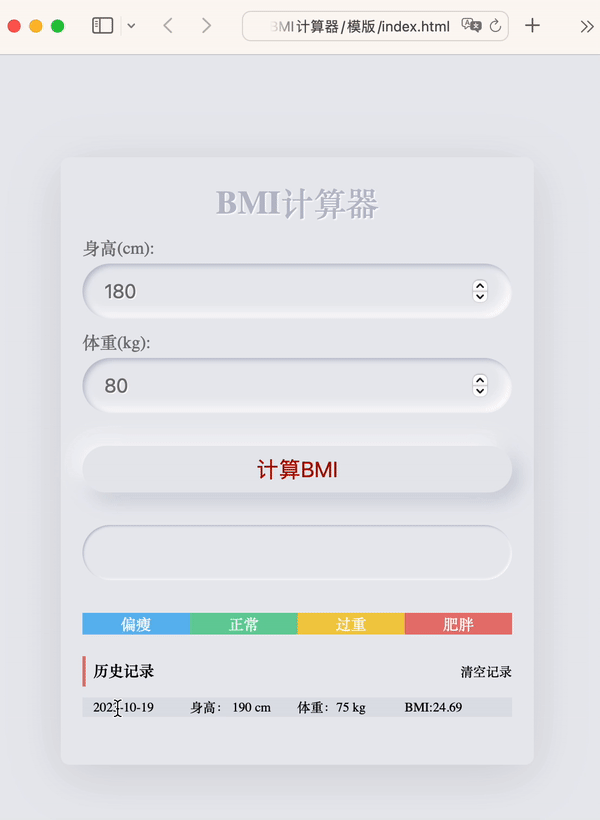

# 今日能力目标

能够利用JS操作浏览器的窗口，具备利用本地存储实现综合案例的能力

# 必要知识

1. 学会使用定时器**`setTimeout`**、延时器**`setInterval`**来重复和延时执行代码
2. 学会使用**`location`**对象来实现页面跳转
3. 学会使用 **`navigator`** 对象来获取浏览器信息
4. 学会使用**`history`**对象来控制浏览器历史记录
5. 学会使用**`localStorage`**实现持久性存储数据

# 一、编程题

## 综合案例：电子时钟

**难度等级：**   ★★

**作业目标： ** 完成网页版电子时钟案例

**考察能力：**

1. 掌握定时器`setInterval`的使用

### 作业需求

效果图需求如下：



**需求如下：**

1. 页面打开时展示当前时间，并且持续更新。根据上午或下午分别显示AM或PM。


### 相关素材

见附件

### 思路分析

本题是一个典型的电子时钟效果。本案例的核心思路是：**先渲染当前时间**，**定时器中更新页面时间**，**判断上午还是下午**

1. 先渲染当前时间
   * 1.1 获取当前时分秒
   
   * 1.2 设置具体时分秒，小于10的需要补0
   
   * > 注⚠️：补0操作需要多次执行,可以提取为函数,比如叫做addZero
2. 定时器中更新页面时间
3. 判断上午还是下午
   * 3.1 定义变量，保存时间状态
   * 3.2 设置时间状态


### 参考答案

```js
// 获取元素
// 小时
const hourEl = document.getElementById('hour');
// 分钟
const minuteEl = document.getElementById('minutes');
// 秒钟
const secondEl = document.getElementById('seconds');
// 时间状态
const ampmEl = document.getElementById('ampm');


updateClock()

// 2. 定时器中更新页面时间
setInterval(() => {
  updateClock();
}, 1000)


function updateClock() {
  // 1.1 获取当前时分秒
  let h = new Date().getHours();
  let m = new Date().getMinutes();
  let s = new Date().getSeconds();
  // 3.1 定义变量，保存时间状态
  let amOrPm = 'AM';
  // 3.2 设置时间状态
  if (h > 12) {
    h = h - 12;
    amOrPm = 'PM';
  }
  ampmEl.innerText = amOrPm;

  // 1.2 设置具体时分秒，小于10的需要补0
  h = addZero(h);
  m = addZero(m);
  s = addZero(s);
  hourEl.innerText = h;
  minuteEl.innerText = m;
  secondEl.innerText = s;
}

function addZero(time) {
  return time < 10 ? '0' + time : time;
}
```

### 总结反馈

- [ ] 我看效果图就可以分析出实现步骤并独立完成
- [ ] 我看效果图没有思路，需要看本题思路分析才能完成
- [ ] 我需要看参考答案才能梳理思路和完成代码
- [ ] 我没有思路，也看不懂答案，无法完成本题


## 二次开发题：番茄时钟

**难度等级：**   ★★★★

**作业目标： ** 完成网页版番茄时钟

**考察能力：**

1. 掌握定时器`setInterval`的使用

### 作业需求

**1. 已有业务**：

打开页面，页面时间的初始化已完成，并且已封装好部分可用函数：比如：设置页面时间的`setPageTime`函数，根据计时状态更新按钮样式的`updateElStatus`函数，时间补0函数`addZero`。效果图如下：


**2. 新增需求**：

1. 点击开始按钮开始倒计时，时间倒计时开始，按钮状态改变
2. 点击暂停按钮暂停倒计时，时间倒计时暂停，按钮状态改变
3. 点击重置按钮重置所有数据

> 备注：番茄时钟一般是25分钟，这里为了演示，时间设置得比较短

完整效果如下：


### 相关素材

见附件

### 思路分析

本题是一个典型的网页版番茄时钟案例。本案例的核心步骤：**开始计时**，**结束计时**，**重置计时**

1. 开始计时
   * 1.1 如果已开始，直接返回（已完成）
   * 1.2 状态设置为开始（已完成）
   * 1.3 更新按钮状态（已完成）
   * 1.4 开启定时器，每隔1秒执行一次
     * 1.4.1 倒计时剩余时间减少1秒
     * 1.4.2 更新页面上的时间显示
     * 1.4.3 如果时间到了，清除计时器并弹出提示，重置倒计时时间、开始状态、设置页面时间、更新按钮状态
2. 结束计时
   * 2.1 检查计时器是否已经结束，如果已经结束，直接返回
   * 2.2 状态重置为`false` 清除定时器 更新按钮状态
3. 重置计时
   * 3.1 清除定时器
   * 3.2 重置剩余时长 游戏状态重置为 `false` 清除定时器 更新按钮状态

> 备注⚠️：完成模版代码中TODO注释的代码逻辑


### 参考答案

```js

function startTimer() {
  // 1.1 如果已开始直接返回
  if (isStart) return;
  // 1.2 状态设置为开始
  isStart = true;
  // 1.3 更新按钮状态
  updateElStatus();
  // 1.4 开启定时器，每隔1秒执行一次
  interval = setInterval(() => {
    // 1.4.1 倒计时剩余时间减少1秒
    timeLeft--;
    // 1.4.2 更新页面上的时间显示
    setPageTime();
    // 1.4.3 如果时间到了，清除计时器并弹出提示，重置倒计时时间、开始状态、设置页面时间、更新按钮状态
    if (timeLeft === 0) {
      clearInterval(interval);
      alert('时间到了!');
      timeLeft = defaultDuration;
      isStart = false;
      setPageTime();
      updateElStatus();
    }
  }, 1000);
}

function stopTimer() {
  // 2.1 如果状态结束，直接返回
  if (isStart === false) return
  // 2.2 状态重置为false 清除定时器 更新按钮状态
  isStart = false
  clearInterval(interval);
  updateElStatus()
}

function resetTimer() {
  // 3.1 清除定时器
  clearInterval(interval);
  // 3.2 重置剩余时长 游戏状态重置为false 清除定时器 更新按钮状态
  timeLeft = defaultDuration;
  isStart = false
  setPageTime();
  updateElStatus()
}
```

### 总结反馈

- [ ] 我看效果图就可以分析出实现步骤并独立完成
- [ ] 我看效果图没有思路，需要看本题思路分析才能完成
- [ ] 我需要看参考答案才能梳理思路和完成代码
- [ ] 我没有思路，也看不懂答案，无法完成本题
## 二次开发题：BMI计算器

**难度等级：**   ★★★★

**作业目标： ** 完成BMI计算器

**考察能力：**

1. 掌握本地存储`localStorage`的使用

### 作业需求

**1. 已有业务**：

输入数据后，点击计算按钮，能够完成BMI数值计算。但是页面打开时并没有历史记录，也没有状态的变化。效果图如下：



**2. 新增需求**：

1. 刷新页面，渲染历史记录
2. 计算BMI之后，显示状态同步更新
3. 计算BMI之后，同步产生一条历史记录
4. 点击清空记录，清除历史记录

完整效果如下：


### 相关素材

见附件

### 思路分析

本题是一个网页版的BMI计算器案例。本案例的核心步骤是：**渲染BMI历史记录**，**计算BMI的结果**，**清空历史记录**

1. 渲染BMI历史记录
   * 1.1 获取本地存储的BMI数据
   * 1.2 如果有历史记录，则根据数据生成字符串（已完成）
   * 1.3 如果没有历史记录，显示提示信息（已完成）
   * 1.4 将生成字符串渲染到页面（已完成）
   
3. 计算BMI的结果
   * 2.1 获取输入的身高和体重数值（已完成）
   
   * 2.2 计算BMI值并保留两位小数（已完成）
   
   * 2.3 根据BMI值设置对应的分类
     
     > 备注：类名：`under-weight` 表示偏瘦；类名：`normal` 表示正常；类名：`over-weight` 表示过重；类名：`obesity` 表示肥胖。给以上类名的元素添加`active`类名即可出现小三角
     
   * 2.4 创建当前BMI数据对象，存储当前BMI数据
   
   * 2.5 渲染更新后的BMI历史记录（已完成）
   
4. 清空历史记录
   * 3.1 移除`localStorage`中的BMI数据
   * 3.2 渲染更新后的BMI历史记录（已完成）

>备注⚠️：完成模版代码中TODO注释的代码逻辑


### 参考答案

```js
// 分类	BMI 范围
// 偏瘦	<= 18.4
// 正常	18.5 ~ 23.9
// 过重	24.0 ~ 27.9
// 肥胖	>= 28.0

// 获取页面所需元素
const btnEl = document.getElementById('btn'); // 计算按钮
const bmiInputEl = document.getElementById('bmi-result'); // BMI结果输入框
const historyEl = document.querySelector('.history ul') // 历史记录容器
const clearBtn = document.querySelector('.clear') // 清空记录按钮

// 1. 渲染BMI历史记录
renderBMIHistory();
// 2. 计算BMI的结果
btnEl.addEventListener('click', calculateBMI);
// 3. 清空历史记录
clearBtn.addEventListener('click', clearBMIHistory);

function renderBMIHistory() {
  // 1.1 获取存储的BMI数据
  let bmiData = getBMI();

  let str = '';
  if (bmiData.length > 0) {
    // 1.2 如果有历史记录，则根据数据生成字符串
    bmiData.forEach(item => {
      str += `<li>
          <span>${formatTime(item.time)}</span>
          <span>身高： ${item.height * 100} cm</span>
          <span>体重：${item.weight} kg</span>
          <span>BMI:${item.bmi}</span>
      </li>`;
    });
  } else {
    // 1.3 如果没有历史记录，显示提示信息
    str = "<li style='text-align: center; padding-left: 10px;'>暂无历史记录!</li>";
  }
  // 1.4 将生成字符串渲染到页面
  historyEl.innerHTML = str;
}

function formatTime(timeStamp) {
  let time = new Date(timeStamp);
  let year = time.getFullYear();
  let month = time.getMonth() + 1;
  let date = time.getDate();
  return `${year}-${month}-${date}`;
}

function storeBMI(bmiObj) {
  // 获取已存储的BMI数据
  let bmi = getBMI();
  // 将新的BMI数据项添加到数组中
  bmi.push(bmiObj);
  // 将更新后的BMI数据存储到localStorage中
  localStorage.setItem('bmi', JSON.stringify(bmi));
}

function getBMI() {
  // 从localStorage中获取存储的BMI数据，如果没有则返回空数组
  return JSON.parse(localStorage.getItem('bmi') || '[]');
}

function setActive(selector) {
  // 移除之前选中的分类
  document.querySelector('.active')?.classList.remove('active');
  // 添加新选中的分类
  document.querySelector(selector).classList.add('active');
}

function clearBMIHistory() {
  // 3.1 移除localStorage中的BMI数据
  localStorage.removeItem('bmi');
  // 3.2 渲染更新后的BMI历史记录
  renderBMIHistory();
}

function calculateBMI() {
  // 2.1 获取输入的身高和体重数值
  const heightValue = document.getElementById('height').value / 100;
  const weightValue = document.getElementById('weight').value;

  // 2.2 计算BMI值并保留两位小数
  const bmiValue = (weightValue / (heightValue * heightValue)).toFixed(2);
  // 将计算得到的BMI值显示在输入框中
  bmiInputEl.value = bmiValue;

  // 2.3 根据BMI值设置对应的分类
  if (bmiValue < 18.4) {
    setActive('.under-weight');
  } else if (bmiValue >= 18.4 && bmiValue <= 23.9) {
    setActive('.normal');
  } else if (bmiValue > 23.9 && bmiValue <= 27.9) {
    setActive('.over-weight');
  } else if (bmiValue > 27.9) {
    setActive('.obesity');
  }

  // 2.4 创建当前BMI数据对象，存储当前BMI数据
  let currentBmi = {
    time: +new Date(),
    height: heightValue,
    weight: weightValue,
    bmi: bmiValue,
  };
  storeBMI(currentBmi);

  // 2.5 渲染更新后的BMI历史记录
  renderBMIHistory();
}

```

### 总结反馈

- [ ] 我看效果图就可以分析出实现步骤并独立完成
- [ ] 我看效果图没有思路，需要看本题思路分析才能完成
- [ ] 我需要看参考答案才能梳理思路和完成代码
- [ ] 我没有思路，也看不懂答案，无法完成本题

# 二、问答题

## localStorage和sessionStorage的异同点

**难度等级：**   ★★★★

**考察能力：**

1. 掌握localStorage和sessionStorage的使用

### 问答要点

1. localStorage和sessionStorage的相同点
1. localStorage和sessionStorage的不同点

### 参考答案

```markdown
相同点：
1. key和value都必须是字符串
2. 存储大小限制为5M+，具体取决于浏览器

不同点：
1. **数据的持久性不同**：`localStorage` 中存储的数据是持久的，即使用户关闭了浏览器，数据仍然存在。而 `sessionStorage` 中存储的数据只在当前会话中有效，当用户关闭浏览器后，数据会被清除。
2. **作用域不同**：`localStorage` 中存储的数据在同源（域名，协议，端口相同）下的所有页面间共享。也就是说，如果在一个页面中使用 `localStorage` 存储了数据，其他同源下的页面也可以访问和修改这些数据。而 `sessionStorage` 中存储的数据只在**同一个**窗口或标签页中共享，不同窗口或标签页之间的数据是隔离的。
3. **数据的生命周期不同**：`localStorage` 中存储的数据没有过期时间，除非被显式地移除，否则会一直保留在客户端。而 `sessionStorage` 中存储的数据在当前会话结束时会被自动清除，当用户关闭浏览器标签或窗口时，会话结束。
```

## navigator对象，说几个常见的属性及用法

**难度等级：**   ★★★

**考察能力：**

1. 对navigator对象的了解程度

### 问答要点

1. 除了navigator的userAgent，你还知道其他的属性吗？

### 参考答案

```markdown
`navigator.userAgent`属性返回浏览器的 User Agent 字符串，表示用户设备信息，包含了浏览器的厂商、版本、操作系统等信息。

`navigator.onLine`属性返回一个布尔值，表示用户当前在线还是离线（浏览器断线）

`navigator.geolocation`属性返回一个 Geolocation 对象，包含用户地理位置的信息。注意，该 API 只有在 HTTPS 协议下可用。

`navigator.clipboard`来访问系统剪切板，以读取系统剪切板的内容。
```


# 三、客观题


1. 关于定时器，下列说法错误的是？

   A. 延时函数 setTimeout() 只会执行一次

   B. 间歇函数 setInterval() 会重复执行，必须要手动清除

   C. 无论是哪一种定时器，只要开启就会立即执行

   D. clearInterval()  清除定时器必须要传参，参数是定时器的id

   **答案**：C

   **解析**：setInterval和setTimeout都不会立即执行，而是等时机到了才会执行

1. 关于间隔函数说法错误的是？

   A.  间隔函数返回的值是定时器id，可以通过定时器id清除定时器

   B. 语法: setInterval(函数, 间隔时间)，其中间隔时间的单位是 ms 毫秒

   C.  间隔函数可以根据时间自动重复执行某些代码

   D.  停止间隔函数的语法:  clearInterval(函数, 间隔时间)

   **答案**：D

   **解析**：`clearInterval`函数只需要传递一个参数 定时器ID 即可，不需要传递两个参数

2. 关于window对象描述，错误的是？

   A. window对象的成员，使用时可以省略window

   B. window.document === document ,结果是true

   C. window.a = 10 , 这行代码相当于添加了一个全局变量a

   D. window  里面 load 事件，会在DOM树加载完成后执行

   **答案**：D

   **解析**：load事件在整个页面及所有依赖资源如样式表和图片都已完成加载时触发。DOMContentLoaded事件才是页面 DOM 加载完成触发，无需等待依赖资源的加载。

3. 关于BOM对象，下列说法错误的是？

   A. location.href = ‘url’ 可以实现页面跳转功能

   B. location.search  获取地址中携带的参数，符号 ？后面部分

   C. location.hash 属性获取地址中的哈希值，符号 # 后面部分

   D. history.go(1) 和 history.back() 功能一致

   **答案**：D

   **解析**：history.go(-1) 和 history.back() 功能一致

4. 关于localStorage与sessionStorage，下列说法错误的是？

   A. 可以存储任意类型的数据

   B. 他们的作用相同，但是存储方式不同，因此应用场景也不同

   C.  `localStorage` 的数据可以长期保留,关闭浏览器也不会消失

   D. sessionStorage是临时存储，页面被关闭时，存储在 `sessionStorage` 的数据会被清除 

   **答案**：A

   **解析**：只能存字符串

5. `localStorage.setItem('answer', '42');const storedAnswer = localStorage.getItem('token');console.log(token);`以上代码输出的结果是什么？

   A. null

   B. undefined

   C. 42

   D. 错误信息

   **答案**：A

   **解析**：设置的是answer，获取的是token，而上面代码并没有存储token，所以为null

8. localStorage  存储的时候使用那个方法可以存储为JSON字符串？

   A. JSON.stringify(复杂数据类型)

   B. JSON.parse(复杂数据类型)

   C. '复杂数据类型'

   D. 数组.join('')

   **答案**：A

   **解析**：无

8. 以下哪个功能不能通过navigator对象实现？

   A. 判断是否使用的移动端浏览器

   B. 浏览器中的点击复制功能

   C. 检测是否断网

   D. 跳转页面

   **答案**：D

   **解析**：跳转页面通过location对象实现

   
