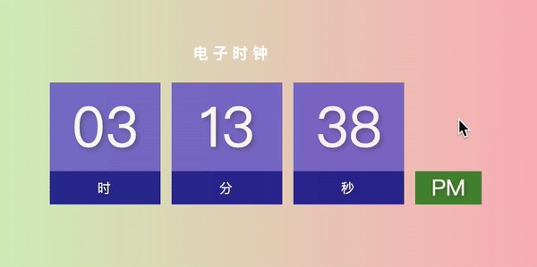
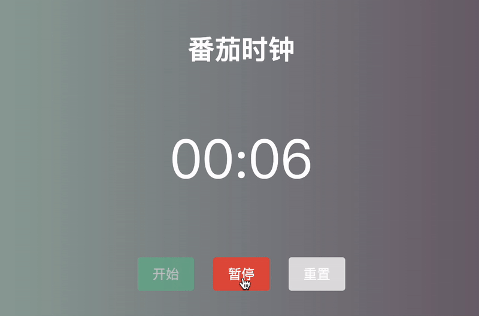
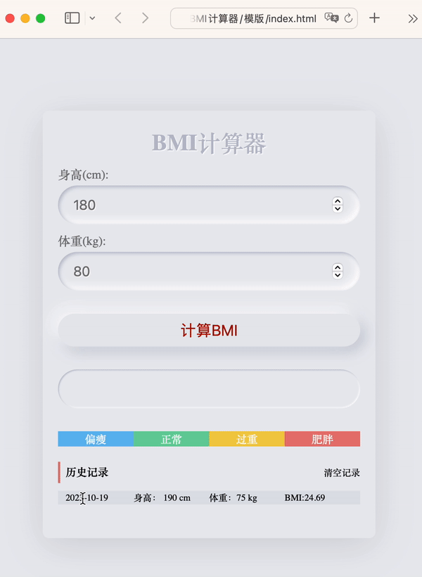
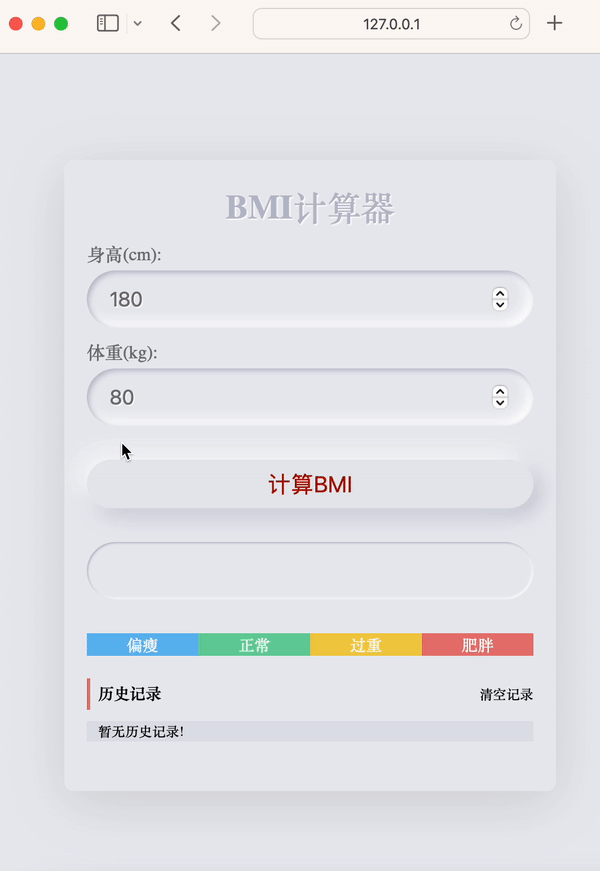

# 今日能力目标

能够利用JS操作浏览器的窗口，具备利用本地存储实现综合案例的能力

# 必要知识

1. 学会使用定时器**`setTimeout`**、延时器**`setInterval`**来重复和延时执行代码
2. 学会使用**`location`**对象来实现页面跳转
3. 学会使用 **`navigator`** 对象来获取浏览器信息
4. 学会使用**`history`**对象来控制浏览器历史记录
5. 学会使用**`localStorage`**实现持久性存储数据

# 一、编程题

## 综合案例：电子时钟

**难度等级：**   ★★

**作业目标： ** 完成网页版电子时钟案例

**考察能力：**

1. 掌握定时器`setInterval`的使用

### 作业需求

效果图需求如下：



**需求如下：**

1. 页面打开时展示当前时间，并且持续更新。根据上午或下午分别显示AM或PM。


### 相关素材

见附件

### 思路分析

本题是一个典型的电子时钟效果。本案例的核心思路是：**先渲染当前时间**，**定时器中更新页面时间**，**判断上午还是下午**

1. 先渲染当前时间
   * 1.1 获取当前时分秒
   
   * 1.2 设置具体时分秒，小于10的需要补0
   
   * > 注⚠️：补0操作需要多次执行,可以提取为函数,比如叫做addZero
2. 定时器中更新页面时间
3. 判断上午还是下午
   * 3.1 定义变量，保存时间状态
   * 3.2 设置时间状态


### 参考答案

```js

```

### 总结反馈

- [ ] 我看效果图就可以分析出实现步骤并独立完成
- [ ] 我看效果图没有思路，需要看本题思路分析才能完成
- [ ] 我需要看参考答案才能梳理思路和完成代码
- [ ] 我没有思路，也看不懂答案，无法完成本题


## 二次开发题：番茄时钟

**难度等级：**   ★★★★

**作业目标： ** 完成网页版番茄时钟

**考察能力：**

1. 掌握定时器`setInterval`的使用

### 作业需求

**1. 已有业务**：

打开页面，页面时间的初始化已完成，并且已封装好部分可用函数：比如：设置页面时间的`setPageTime`函数，根据计时状态更新按钮样式的`updateElStatus`函数，时间补0函数`addZero`。效果图如下：



**2. 新增需求**：

1. 点击开始按钮开始倒计时，时间倒计时开始，按钮状态改变
2. 点击暂停按钮暂停倒计时，时间倒计时暂停，按钮状态改变
3. 点击重置按钮重置所有数据

> 备注：番茄时钟一般是25分钟，这里为了演示，时间设置得比较短

完整效果如下：


### 相关素材

见附件

### 思路分析

本题是一个典型的网页版番茄时钟案例。本案例的核心步骤：**开始计时**，**结束计时**，**重置计时**

1. 开始计时
   * 1.1 如果已开始，直接返回（已完成）
   * 1.2 状态设置为开始（已完成）
   * 1.3 更新按钮状态（已完成）
   * 1.4 开启定时器，每隔1秒执行一次
     * 1.4.1 倒计时剩余时间减少1秒
     * 1.4.2 更新页面上的时间显示
     * 1.4.3 如果时间到了，清除计时器并弹出提示，重置倒计时时间、开始状态、设置页面时间、更新按钮状态
2. 结束计时
   * 2.1 检查计时器是否已经结束，如果已经结束，直接返回
   * 2.2 状态重置为`false` 清除定时器 更新按钮状态
3. 重置计时
   * 3.1 清除定时器
   * 3.2 重置剩余时长 游戏状态重置为 `false` 清除定时器 更新按钮状态

> 备注⚠️：完成模版代码中TODO注释的代码逻辑


### 参考答案

```js


```

### 总结反馈

- [ ] 我看效果图就可以分析出实现步骤并独立完成
- [ ] 我看效果图没有思路，需要看本题思路分析才能完成
- [ ] 我需要看参考答案才能梳理思路和完成代码
- [ ] 我没有思路，也看不懂答案，无法完成本题
## 二次开发题：BMI计算器

**难度等级：**   ★★★★

**作业目标： ** 完成BMI计算器

**考察能力：**

1. 掌握本地存储`localStorage`的使用

### 作业需求

**1. 已有业务**：

输入数据后，点击计算按钮，能够完成BMI数值计算。但是页面打开时并没有历史记录，也没有状态的变化。效果图如下：



**2. 新增需求**：

1. 刷新页面，渲染历史记录
2. 计算BMI之后，显示状态同步更新
3. 计算BMI之后，同步产生一条历史记录
4. 点击清空记录，清除历史记录

完整效果如下：




### 相关素材

见附件

### 思路分析

本题是一个网页版的BMI计算器案例。本案例的核心步骤是：**渲染BMI历史记录**，**计算BMI的结果**，**清空历史记录**

1. 渲染BMI历史记录
   * 1.1 获取本地存储的BMI数据
   * 1.2 如果有历史记录，则根据数据生成字符串（已完成）
   * 1.3 如果没有历史记录，显示提示信息（已完成）
   * 1.4 将生成字符串渲染到页面（已完成）
   
3. 计算BMI的结果
   * 2.1 获取输入的身高和体重数值（已完成）
   
   * 2.2 计算BMI值并保留两位小数（已完成）
   
   * 2.3 根据BMI值设置对应的分类
     
     > 备注：类名：`under-weight` 表示偏瘦；类名：`normal` 表示正常；类名：`over-weight` 表示过重；类名：`obesity` 表示肥胖。给以上类名的元素添加`active`类名即可出现小三角
     
   * 2.4 创建当前BMI数据对象，存储当前BMI数据
   
   * 2.5 渲染更新后的BMI历史记录（已完成）
   
4. 清空历史记录
   * 3.1 移除`localStorage`中的BMI数据
   * 3.2 渲染更新后的BMI历史记录（已完成）

>备注⚠️：完成模版代码中TODO注释的代码逻辑


### 参考答案

```js

```

### 总结反馈

- [ ] 我看效果图就可以分析出实现步骤并独立完成
- [ ] 我看效果图没有思路，需要看本题思路分析才能完成
- [ ] 我需要看参考答案才能梳理思路和完成代码
- [ ] 我没有思路，也看不懂答案，无法完成本题

# 二、问答题

## localStorage和sessionStorage的异同点

**难度等级：**   ★★★★

**考察能力：**

1. 掌握localStorage和sessionStorage的使用

### 问答要点

1. localStorage和sessionStorage的相同点
1. localStorage和sessionStorage的不同点

### 参考答案

```markdown

```

## navigator对象，说几个常见的属性及用法

**难度等级：**   ★★★

**考察能力：**

1. 对navigator对象的了解程度

### 问答要点

1. 除了navigator的userAgent，你还知道其他的属性吗？

### 参考答案

```markdown

```


# 三、客观题


1. 关于定时器，下列说法错误的是？

   A. 延时函数 setTimeout() 只会执行一次

   B. 间歇函数 setInterval() 会重复执行，必须要手动清除

   C. 无论是哪一种定时器，只要开启就会立即执行

   D. clearInterval()  清除定时器必须要传参，参数是定时器的id

   

1. 关于间隔函数说法错误的是？

   A.  间隔函数返回的值是定时器id，可以通过定时器id清除定时器

   B. 语法: setInterval(函数, 间隔时间)，其中间隔时间的单位是 ms 毫秒

   C.  间隔函数可以根据时间自动重复执行某些代码

   D.  停止间隔函数的语法:  clearInterval(函数, 间隔时间)

   

   

2. 关于window对象描述，错误的是？

   A. window对象的成员，使用时可以省略window

   B. window.document === document ,结果是true

   C. window.a = 10 , 这行代码相当于添加了一个全局变量a

   D. window  里面 load 事件，会在DOM树加载完成后执行

   

3. 关于BOM对象，下列说法错误的是？

   A. location.href = ‘url’ 可以实现页面跳转功能

   B. location.search  获取地址中携带的参数，符号 ？后面部分

   C. location.hash 属性获取地址中的哈希值，符号 # 后面部分

   D. history.go(1) 和 history.back() 功能一致

   

4. 关于localStorage与sessionStorage，下列说法错误的是？

   A. 可以存储任意类型的数据

   B. 他们的作用相同，但是存储方式不同，因此应用场景也不同

   C.  `localStorage` 的数据可以长期保留,关闭浏览器也不会消失

   D. sessionStorage是临时存储，页面被关闭时，存储在 `sessionStorage` 的数据会被清除 

   

5. `localStorage.setItem('answer', '42');const storedAnswer = localStorage.getItem('token');console.log(token);`以上代码输出的结果是什么？

   A. null

   B. undefined

   C. 42

   D. 错误信息

   

8. localStorage  存储的时候使用那个方法可以存储为JSON字符串？

   A. JSON.stringify(复杂数据类型)

   B. JSON.parse(复杂数据类型)

   C. '复杂数据类型'

   D. 数组.join('')

   

8. 以下哪个功能不能通过navigator对象实现？

   A. 判断是否使用的移动端浏览器

   B. 浏览器中的点击复制功能

   C. 检测是否断网

   D. 跳转页面

   

   
