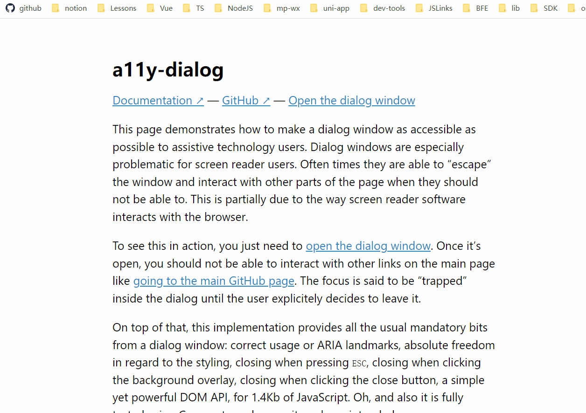

# a11y-dialog

## 介绍

> 是一个轻量级但灵活的脚本，用于创建可访问的对话框窗口。
>
> 官网链接：https://a11y-dialog.netlify.app/



## 使用

1. 页面中引入 插件的 js 文件

   ```html
   <script src="https://cdn.jsdelivr.net/npm/a11y-dialog@8/dist/a11y-dialog.min.js"></script>
   ```

   或者引入本地素材中的 js插件文件

2. 准备 HTML 结构

   ```html
   <!-- 1. 准备对话框容器 -->
   <div class="dialog-container" id="dialog" aria-hidden="true">
       <!-- 2. 底部蒙层 -->
       <div class="dialog-overlay" data-a11y-dialog-hide></div>
   
       <!-- 3. 对话框结构 -->
       <div class="dialog-content">
           <!-- 4. 关闭按钮 -->
           <button type="button" class="dialog-close" data-a11y-dialog-hide>
               &times;
           </button>
   
           <!-- 5. 标题 -->
           <h1>测试对话框</h1>
   
           <!-- 6. 内容 -->
           <p>好看的对话框</p>
       </div>
   </div>
   ```

   **说明**

   - **对话框容器**有 ` aria-hidden="true" ` 属性，可以确保对话框容器 **默认隐藏**
   - **底部蒙层**有  `data-a11y-dialog-hide`属性，可以确保点击蒙层关闭对话框
   - **关闭按钮**
     -  必须具有该`type="button"`属性
     -  必须具有该`data-a11y-dialog-hide`属性

3. 准备 CSS 样式
   样式可以按照实际需求来自定义

   ```css
   /** 使对话框容器和蒙层覆盖整个窗口 **/
   .dialog-container,
   .dialog-overlay {
     position: fixed;
     top: 0;
     right: 0;
     bottom: 0;
     left: 0;
   }

   /**
    提升层级 + 将对话框容器设置为弹性盒子，以便于将对话框居中。
   **/
   .dialog-container {
     z-index: 2;
     display: flex;
   }

   /** 确保对话框容器 隐藏不可见 **/
   .dialog-container[aria-hidden='true'] {
     display: none;
   }

   /** 蒙层带有透明效果 **/
   .dialog-overlay {
     background-color: rgb(43 46 56 / 0.9);
     animation: fade-in 200ms both;
}
   
   /**
      * 对话框在页面的垂直和水平位置居中。
      * 确保对话框位于覆盖层的顶部。
      * 确保对话框有一个不透明的白色背景。
      */
   .dialog-content {
     margin: auto;
     z-index: 2;
     position: relative;
     background-color: white;
     animation: fade-in 200ms 100ms both, slide-up 200ms 100ms both;
    padding: 1em;
     max-width: 90%;
     width: 600px;
     border-radius: 5px;
   }
   
   /* 淡入动画 */
   @keyframes fade-in {
     from {
       opacity: 0;
     }
   }
   
   /* 位移向上动画 */
   @keyframes slide-up {
     from {
       transform: translateY(10%);
     }
   }
   
   /* 对话框标题 */
   .dialog-content h1 {
     margin: 0;
     font-size: 1.25em;
   }
   
   /* 关闭按钮 */
   .dialog-close {
     position: absolute;
     top: 0.5em;
     right: 0.5em;
     border: 0;
     padding: 0.25em;
     background-color: transparent;
     font-size: 1.5em;
     width: 1.5em;
     height: 1.5em;
     text-align: center;
     cursor: pointer;
     transition: 0.15s;
     border-radius: 50%;
   }
   
   /* 关闭按钮的hover效果 */
   .dialog-close:hover {
     background-color: rgb(50 50 0 / 0.15);
   }
   
   /* 在用户的操作系统或浏览器设置中检测到减少动画偏好（"reduce"）时，禁用指定元素的动画效果。 */
   @media (prefers-reduced-motion: reduce) {
     .dialog-overlay,
     .dialog-content {
       animation: none;
     }
   }
   
   @media screen and (min-width: 700px) {
     .dialog-content {
       padding: 2em;
     }
   }
   
   @media screen and (min-width: 700px) {
     .dialog-close {
       top: 1em;
       right: 1em;
     }
   }
   ```
   
4. JS 交互

   1. 初始化对话框

      ```js
      // 获取对话框DOM容器
      const element = document.querySelector('#your-dialog-id')

      // 实例化对话框
      const dialog = new A11yDialog(element)
      ```

   2. 显示对话框

      ```js
      // 实例对话框调用 show 方法可以显示对话框
      dialog.show()
      ```

   3. 隐藏对话框

      ```js
      // 实例对话框调用 hide 方法可以隐藏对话框
      dialog.hide()
      ```

   4. 监视对话框的显示(最后一天的后台管理项目会使用到)

      ```js
      // 当对话框出现时做些什么
      dialog.on('show', function (event) {})
      ```

   5. 监视对话框的隐藏(最后一天的后台管理项目会使用到)

      ```js
      // 当对话框隐藏时做些什么
      dialog.on('hide', function (event) {})
      ```
