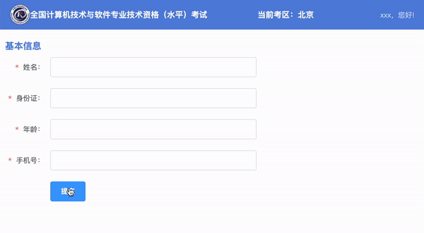

# 今日能力目标

能够使用正则表达式完成常见的表单验证功能，能够使用插件便捷实现功能

# 必要知识

1. 能够使用**正则表达式**完成对数据格式的校验
2. 能够使用**AlloyFinger**插件实现手势交互效果
3. 能够使用**a11y-dialog**插件实现模态框交互效果

# 一、编程题

## 综合案例：软考个人信息提交

**难度等级：**   ★★★★

**作业目标： ** 完成个人信息提交

**考察能力：**

1. 掌握正则表达式的使用

### 作业需求

效果图需求如下：



**需求如下：**

点击提交时，对表单进行数据格式校验：

1. 校验不通过，显示错误提示
2. 校验通过，跳转到成功页面


### 相关素材

见附件

### 思路分析

本题是一个典型的表单提交校验效果。本案例的核心步骤是：**提交前的数据校验**，**校验成功跳转页面**

1. 提交前的数据校验
   * 1.1 阻止button的默认行为
   * 1.2 清空所有错误信息
   * 1.3 校验数据
     * 1.3.1 校验用户名
     * 1.3.2 校验身份证
     * 1.3.3 校验年龄
     * 1.3.4 校验手机号
1. 校验成功跳转页面

### 参考答案

```js
// 获取元素
const submitBtn = document.querySelector('.submit') // 提交按钮
const usernameEl = document.querySelector('#username') // 用户名
const idcardEl = document.querySelector('#idcard') // 身份证
const ageEl = document.querySelector('#age') // 年龄
const mobileEl = document.querySelector('#mobile') // 手机号

// 1. 提交前的数据校验
submitBtn.addEventListener('click', function (e) {
  // 1.1 阻止button的默认行为
  e.preventDefault()
  // 1.2 清空所有错误信息
  clearAllError()

  // 1.3 校验数据
  let isAllValid = validateData()

  // 1.4 校验成功跳转页面
  if (isAllValid) {
    location.href = './success.html'
  }
})

function isUsernameValid() {
  let usernameReg = /^[\u4E00-\u9FA5]{2,4}$/
  return usernameReg.test(usernameEl.value.trim())
}

function isIdcardValid() {
  let idcardReg = /^[1-9]\d{5}(?:18|19|20)\d{2}(?:0[1-9]|10|11|12)(?:0[1-9]|[1-2]\d|30|31)\d{3}[\dXx]$/
  return idcardReg.test(idcardEl.value.trim())
}

function isAgeValid() {
  let ageReg = /^(?:[0-9]|[1-9][0-9]|1[0-9]{2})$/
  return ageReg.test(ageEl.value.trim())
}

function isMobileValid() {
  let mobileReg = /^(?:(?:\+|00)86)?1[3-9]\d{9}$/
  return mobileReg.test(mobileEl.value.trim())
}

function validateData() {
  // 1.3.1 校验用户名
  if (!isUsernameValid()) {
    showError('username', '用户名校验不通过，请输入1-4位的汉字')
  }

  // 1.3.2 校验身份证
  if (!isIdcardValid()) {
    showError('idcard', '请输入合法的身份证格式')
  }

  // 1.3.3 校验年龄
  if (!isAgeValid()) {
    showError('age', '请输入数字')
  }

  // 1.3.4 校验手机号
  if (!isMobileValid()) {
    showError('mobile', '请输入合法的手机号')
  }

  return isUsernameValid() && isIdcardValid() && isAgeValid() && isMobileValid()
}

function showError(id, msg) {
  let target = document.getElementById(id).nextElementSibling
  target.classList.remove('hide')
  target.innerText = msg
}

function clearAllError() { 
  let errors = document.querySelectorAll('.form-error')
  errors.forEach(item => {
    item.classList.add('hide')
  })
}
```

### 总结反馈

- [ ] 我看效果图就可以分析出实现步骤并独立完成
- [ ] 我看效果图没有思路，需要看本题思路分析才能完成
- [ ] 我需要看参考答案才能梳理思路和完成代码
- [ ] 我没有思路，也看不懂答案，无法完成本题

## 二次开发题：仿outlook邮箱

**难度等级：**   ★★★

**作业目标： ** 完成outlook邮箱的邮件状态设置

**考察能力：**

1. AlloyFinger插件的使用
2. 数据的处理

### 作业需求

**1. 已有业务**：

正在开发移动端的outlook邮箱，已经完成页面数据的展示，完成效果如下：


**2. 新增需求**：

1. 向右滑动，出现操作区块，点击可修改邮件的阅读状态

完整效果如下：


### 相关素材

见附件

### 思路分析

本题是一个移动端常见的滑动效果。本案例的核心是利用**AlloyFinger插件**，在滑动的时候改变数据状态。核心步骤有以下步骤：**初始化AlloyFinger插件**，**处理状态区块**

> 备注：li标签添加`active`类名可以实现右滑

1. 初始化AlloyFinger插件
   * 2.1 为每一个li标签创建AlloyFinger实例，并传递配置项
   * 2.2 在配置项中判断，如果是右滑，li标签添加`active`类名，如果是左滑，li标签移除`active`类名
3. 处理状态区块
   * 2.1 给所有邮件项绑定点击事件
   * 2.2 点击事件中根据邮件id找到对应邮件
   * 2.3 修改对应邮件的状态
   * 2.4 让状态区块缩回去**之后**再重新渲染页面

### 参考答案

备注：数据已提前准备

```js

// 渲染页面
render()

function render() {
  // 获取邮件渲染的容器元素
  let mailList = document.querySelector('.mail-list')
  // 拼接字符串并通过给li添加unread或者read类名来显示邮件的状态
  let str = mails.map(item => (`
    <li class=${item.readStatus}>
      <div class="group">
        <div class="status" data-id=${item.id}>
          标记${item.readStatus === 'unread' ? '已读' : '未读'}
        </div>
        <article>
          
          <div class="mail-info">
            <div>
              <span class="from">${item.from.username}</span>
              <time>${item.time}</time>
            </div>
            <p>${item.content}</p>
          </div>
        </article>
      </div>
    </li>
  `))
    .join('')
  // 将字符串赋值给容器元素的innerHTML属性完成渲染
  mailList.innerHTML = str

  // 1. 初始化AlloyFinger插件
  initSwipe()

  // 2. 处理状态区块
  handleStatus()
}

function initSwipe() {
  // 2.1 为每一个li标签创建AlloyFinger实例，并传递配置项
  let lis = document.querySelectorAll('.mail-list li')
  lis.forEach(item => {
    // 2.2 在配置项中判断，如果是右滑，li标签添加active类名，如果是左滑，li标签移除active类名
    new AlloyFinger(item, {
      swipe: (evt) => {
        if (evt.direction === 'Right') {
          item.classList.add('active')
        }
        if (evt.direction === 'Left') {
          item.classList.remove('active')
        }
      }
    })
  })
}

function handleStatus() {
  let statusEls = document.querySelectorAll('.status')
  // 2.1 给所有邮件项绑定点击事件
  statusEls.forEach(status => {
    status.addEventListener('click', function (e) {
      // 2.2 点击事件中根据邮件id找到对应邮件
      let id = +e.target.dataset.id
      let mail = mails.find(item => item.id === id)
      // 2.3 修改对应邮件的状态
      mail.readStatus = mail.readStatus === 'unread' ? 'read' : 'unread'
      // 2.4 让状态区块缩回去之后再重新渲染页面
      e.target.parentNode.parentNode.classList.remove('active')
      setTimeout(() => { render() }, 300)
    })
  })
}

```

### 总结反馈

- [ ] 我看效果图就可以分析出实现步骤并独立完成
- [ ] 我看效果图没有思路，需要看本题思路分析才能完成
- [ ] 我需要看参考答案才能梳理思路和完成代码
- [ ] 我没有思路，也看不懂答案，无法完成本题


# 二、自主学习题

## Sortable.js的使用

**难度等级：**   ★★

**作业目标： ** 完成淘宝移动端首页应用顺序拖拽自定义

**考察能力：**

1. 能够自学Sortable.js拖拽库，完成案例

### 作业需求

效果图需求如下：


**需求如下：**

1. 能够拖拽应用区块，进行排序
2. 排序之后刷新页面顺序依然存在

### 参考教程

[官方中文文档](http://www.sortablejs.com/)

[官方英文文档](https://github.com/SortableJS/Sortable)

[其他参考文档](https://www.itxst.com/sortablejs/neuinffi.html)


### 相关素材

见附件

### 思路分析

本题是一个常见的拖拽排序效果。本案例的核心是利用**Sortable.js**实现拖拽排序，核心步骤是**创建sortable实例，添加配置项**

1. 查看`Sortable.js`官方文档
2. 获取拖拽的容器元素
3. 创建sortable实例，添加配置项
   * 3.1 添加动画时间`animation`配置
   * 3.2 添加`store`配置处理用本地存储存储当前顺序


### 参考答案

```js
// 1. 查看sortable.js官方文档
// 2. 获取拖拽的容器元素
const dropItems = document.querySelector('.nav')

// 3. 创建sortable实例，添加配置
new Sortable(dropItems, {
  // 3.1 添加动画时间animation配置
  animation: 350,
  // 3.2 添加store配置处理用本地存储存储当前顺序
  store: {
    set: (sortable) => {
      const order = sortable.toArray()
      localStorage.setItem(sortable.options.group.name, order.join('|'))
    },
    get: (sortable) => {
      const order = localStorage.getItem(sortable.options.group.name)
      return order ? order.split('|') : []
    }
  }
});
```

### 总结反馈

- [ ] 我看效果图就可以分析出实现步骤并独立完成
- [ ] 我看效果图没有思路，需要看本题思路分析才能完成
- [ ] 我需要看参考答案才能梳理思路和完成代码
- [ ] 我没有思路，也看不懂答案，无法完成本题


## 正则表达式提供了哪些常用的方法

**难度等级：**   ★

**考察能力：**

1. 掌握正则提供的常用方法`test`和`exec`

### 问答要点

1. 如何查看正则表达式与指定的字符串是否匹配
1. 如何在字符串中执行搜索匹配，获取结果

### 参考答案

````markdown
1. 使用`test()` 方法用于测试一个字符串是否与正则表达式匹配，并返回布尔值。它返回 `true` 表示匹配成功，返回 `false` 表示匹配失败。

```js
const regex = /\d+/; // 匹配一个或多个数字
const str = 'Hello, 123 World!';
const result = regex.test(str);
console.log(result); // 输出: true
```


2. `exec()` 方法在一个指定字符串中执行一个搜索匹配。返回一个结果数组或 null

```
let regex = /foo(.*)/;
let str = 'foobar';
let result = regex.exec(str);

console.log(result[0]); // 输出 "foobar"，这是完全匹配的文本
console.log(result[1]); // 输出 "bar"，这是括号内捕获的结果
```

注意，如果正则表达式包含g标志，exec()方法的行为将不同。在这种情况下，每次调用exec()都会从上次匹配后的位置开始新的搜索。如果再次调用exec()并且没有找到匹配项，那么它将从字符串的开头开始新的搜索。例如：

```let regex = /foo/g;
let str = 'foofoo';

let result;
while ((result = regex.exec(str)) !== null) {
  console.log(`Found ${result[0]} at ${result.index}. Next starts at ${regex.lastIndex}`);
}
```

这将输出：
```
Found foo at 0. Next starts at 3
Found foo at 3. Next starts at 6
```


````


# 三、问答题


## 正则表达式的适用场景

**难度等级：**   ★★★

**考察能力：**

1. 了解正则表达式的适用场景

### 问答要点

1. 正则表达式的适用场景有哪些

### 参考答案

```markdown
1. 模式匹配：正则表达式可以用于检查一个字符串是否符合某种模式。你可以定义一个模式，然后使用正则表达式来匹配字符串中是否存在该模式。这对于验证用户输入、解析文本数据、提取特定信息等任务非常有用。
2. 字符串搜索和替换：正则表达式可以用于在字符串中搜索特定的模式，并进行替换或提取操作。你可以使用正则表达式来搜索字符串中的特定模式，并进行替换为其他内容，或者提取出匹配的部分。
3. 数据验证：正则表达式可以用于验证数据的格式和有效性。例如，你可以使用正则表达式来验证邮箱地址、电话号码、身份证号码等数据是否符合特定的格式要求。
4. 数据提取：正则表达式可以从字符串中提取出符合特定模式的部分。通过定义合适的正则表达式，你可以从文本中提取出需要的信息，如提取URL、提取日期等。
5. 格式化字符串：正则表达式可以用于格式化字符串。你可以使用正则表达式来将字符串按照特定的格式进行修改，如添加分隔符、格式化日期等。
6. 文本处理：正则表达式在文本处理任务中非常有用。你可以使用正则表达式来进行文本的分割、拼接、排序等操作，以满足特定的需求。
```

## 正则表达式中常见的元字符有哪些

**难度等级：**   ★★

**考察能力：**

1. 掌握正则表达式中经常使用的元字符

### 问答要点

1. 有哪些字符在正则表达式中是有特殊含义的

### 参考答案
```markdown
1. `.`：匹配任意字符，除了换行符。
2. `^`：匹配字符串的开头。
3. `$`：匹配字符串的结尾。
4. `*`：匹配前面的元素零次或多次。
5. `+`：匹配前面的元素一次或多次。
6. `?`：匹配前面的元素零次或一次。
6. `|`：用于分隔多个模式，匹配其中任意一个模式。
8. `[]`：用于定义字符类，匹配方括号内的任意一个字符。
9. `[^]`：用于定义否定字符类，匹配除了方括号内定义的字符之外的任意一个字符。
10. `()`：用于创建捕获组，可以对匹配的内容进行分组。
11. `\`：用于转义特殊字符，或表示特殊的字符类别，如`\d`表示匹配数字。
11. `\d`：匹配任意数字字符，相当于`[0-9]`。
13. `\D`：匹配任意非数字字符，相当于`[^0-9]`。
14. `\w`：匹配任意单词字符（字母、数字、下划线），相当于`[a-zA-Z0-9_]`。
15. `\W`：匹配任意非单词字符，相当于`[^a-zA-Z0-9_]`。
16. `\s`：匹配任意空白字符，包括空格、制表符、换行符等。
17. `\S`：匹配任意非空白字符。
```

## 字符串有哪些常见的方法可以结合正则使用

**难度等级：**   ★★

**考察能力：**

1. 掌握字符串的match、replace方法如何结合正则使用

### 问答要点

1. 字符串的哪个方法可以在字符串中查找正则匹配到的字符
1. 字符串的哪个方法可以在字符串中替换正则匹配到的字符

### 参考答案

```markdown
1. `match()` 方法在字符串中查找正则的匹配项

   const str = 'Hello, 123 World!';
   const regex = /\d+/g; // 匹配所有的数字
   
   const result = str.match(regex);
   console.log(result); // 输出: ["123"]


2. `replace()`方法在字符串中替换正则的匹配项

   const str = 'Hello, 123 World!';
   const regex = /\d+/; // 匹配一个或多个数字
   const replacement = '456'; // 替换为新的字符串
   
   const result = str.replace(regex, replacement);
   console.log(result); // 输出: "Hello, 456 World!"
```


# 四、客观题


1. 下面关于正则表达式说法正确的是？（多选）

   A.  正则表达式是是一种字符串匹配的模式（规则）

   B. 可以用于表单验证（匹配）

   C. 可以用于过滤敏感词（替换）

   D. 可以用于字符串中提取我们想要的部分（提取）

   **答案**：ABCD

   **解析**：无

2. 下面声明正则表达式正确的是？

   A.  const 变量名 = \表达式\

   B.  const 变量名 = /表达式/

   C.  const 变量名 =  表达式

   D.  const 变量名 =  '表达式'

   **答案**：B

   **解析**：无

3. 下面哪个方法可以用于检测正则表达式与指定的字符串是否匹配？

   A.  text()

   B.  has()

   C.  test()

   D.  excel()

   **答案**：C

   **解析**：无

4. 下列关于正则中特殊字符描述正确的是？（多选）

   A： ^和$符号为定界符，用于表示匹配以什么开头或以什么结尾

   B： []表示范围，用于匹配多个选项中的任意1个

   C： \d和\D是字符类，是一种简写字符

   D： *、?、+是量词符，用于表示字符出现的次数

   **答案**：ABCD

   **解析**：无

5. 下列选项能够将字符串str中的”java”、”Java”、”JAVA”替换为“前端”的是？（多选）

   A： 

    ~~~javascript
    const str = 'javascript和JAVA是两个不同的语言，Javascript诞生于1995年'
    const strend = str.replace(/java/i, '前端')
    console.log(strend)
    ~~~

   B： 

    ~~~javascript
    const str = 'javascript和JAVA是两个不同的语言，Javascript诞生于1995年'
    const strend = str.replace(/java/gi, '前端')
    console.log(strend)
    ~~~

   C： 

    ~~~javascript
    const str = 'javascript和JAVA是两个不同的语言，Javascript诞生于1995年'
    const strend = str.replace(/java|JAVA|Java/, '前端')
    console.log(strend)
    ~~~

   D： 

    ~~~javascript
    const str = 'javascript和JAVA是两个不同的语言，Javascript诞生于1995年'
    const strend = str.replace(/java|JAVA|Java/g, '前端')
    console.log(strend)
    ~~~

    **答案**：BD

    **解析**：A选项中只会替换第一个javascript中的java，后面的不会被替换；C选项的替换结果和A选项的替换结果一样

6. 关于正则表达式声明6位数字的邮编，以下代码正确的是？

    A：  const reg = /\d6/

    B： const reg = \d{6}\

    C： const reg = /\d{6}/

    D： const reg =  /d6/

    **答案**：C

    **解析**：无

