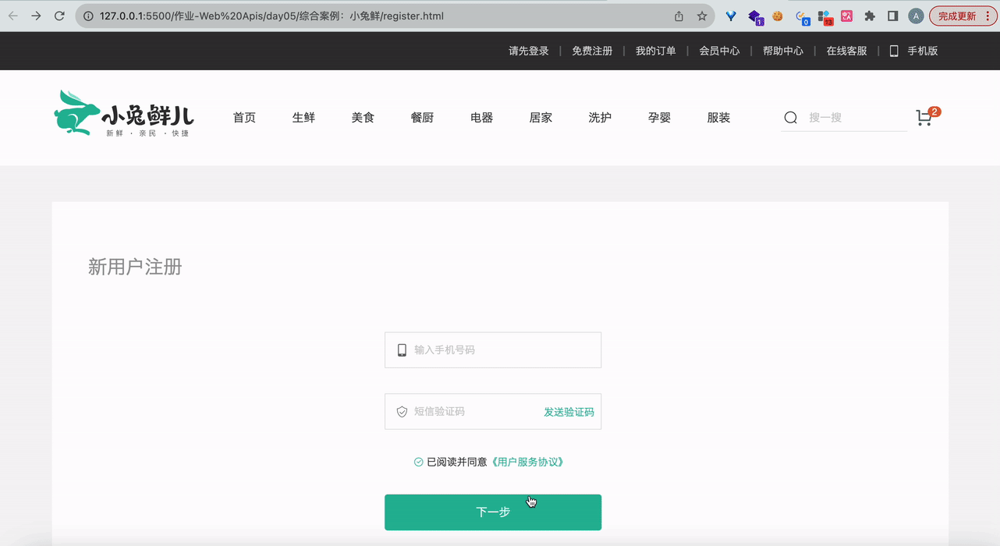
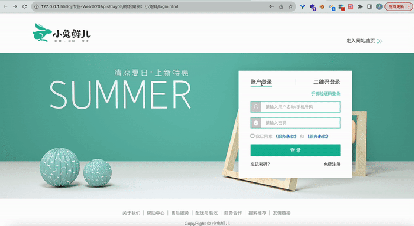

# 今日能力目标

掌握获取元素尺寸和位置，了解节点的增删改查操作

# 必要知识

1. 能够利用**offsetWidth**，**offsetHeight**，**offsetTop**，**offsetLeft**实现网页特效
2. 掌握节点的创建、新增、查找和删除方法，实现网页交互

# 一、编程题


## 小兔鲜注册

**难度等级：**   ★★★

**作业目标： ** 完成小兔鲜的注册功能

**考察能力：**

1. 掌握定时器的使用
2. 掌握正则的使用

### 作业需求

效果图需求如下：



**需求如下：**

1.  手机号发生改变的时候，需要校验手机号格式，不正确就显示错误提示
1.  点击获取验证码，开始倒计时获取验证码，且开始获取后不能重复点击
1.  验证码发生改变的时候，需要校验验证码格式，不正确就显示错误提示
1.  点击已阅读的checkbox，其样式发生改变
1.  点击下一步需要对手机号，验证码，checkbox进行校验，校验通过就跳转到登录页面


### 相关素材

见附件

### 思路分析

本题是一个常见的注册效果。本案例的核心步骤有：**校验手机号**，**获取验证码**，**校验验证码**，**checkbox点击处理**，**提交按钮处理**

> 备注：checkbox通过切换类名`icon-queren2`来修改样式

1. 校验手机号
   * 1.1 监听手机输入框`change`事件
     * 1.1.1 定义手机号正则
     * 1.1.2 如果手机号没有通过校验，显示错误提示
     * 1.1.3 如果通过就清除错误提示
2. 获取验证码
   * 2.1 定义所需变量
     * 2.1.1 定义倒计时剩余时长
     * 2.1.2 开关变量，表示是否可以继续点击
   * 2.2 给按钮绑定点击事件
     * 2.2.1 点击时判断，如果可以点击，则运行后续逻辑
     * 2.2.2 开启定时器，开始倒计时
       * 将剩余时间减1，并展示到页面
       * 判断倒计时剩余时间是否为0，如果为0，重置数据
     * 2.2.3 立即将`canClick`变成false让按钮不可点击
3. 校验验证码
   * 3.1 定义验证码正则
   * 3.2 监听验证码`change`事件
     * 3.2.1 如果验证码不满足正则，显示错误提示
     * 3.2.2 如果验证码满足正则，则清除错误提示
4. checkbox点击处理
   * 切换checkbox的类名
5. 提交按钮处理
   * 5.1 阻止默认提交行为
   * 5.2 校验手机号和验证码，如果任意一个没通过校验就直接return
   * 5.3 如果没有勾选checkbox，弹出提示
   * 5.4 如果校验通过，就跳转到登录页


### 参考答案

```js
    // 1. 校验手机号
    // 获取手机输入框
    const phone = document.querySelector('[name=phone]')
    // 1.1 监听手机输入框change事件
    phone.addEventListener('change', verifyPhone)
    function verifyPhone() {
      // 1.1.1 定义手机号正则
      const regPhone = /^1(3\d|4[5-9]|5[0-35-9]|6[567]|7[0-8]|8\d|9[0-35-9])\d{8}$/
      // 1.1.2 如果手机号没有通过校验，显示错误提示
      if (!regPhone.test(phone.value)) {
        phone.nextElementSibling.innerHTML = '请输入11位的数字'
        return false
      }
      // 1.1.3 如果通过就清除错误提示
      phone.nextElementSibling.innerHTML = ''
      return true
    }


    // 2. 获取验证码
    // 2.1 定义所需变量
    // 2.1.1 定义倒计时剩余时长
    let timeLeft = 5
    // 2.1.2 开关变量，表示是否可以继续点击
    let canClick = true
    // 2.2 给按钮绑定点击事件
    const codeBtn = document.querySelector('.code')
    codeBtn.addEventListener('click', function () {
      // 2.2.1 点击时判断，如果可以点击，则运行后续逻辑
      if (canClick) {
        codeBtn.innerHTML = `0${timeLeft}秒后重新获取`

        // 2.2.2 开启定时器，开始倒计时
        let timerId = setInterval(function () {
          // 2.2.2.1 将剩余时间减1，并展示到页面
          timeLeft--
          codeBtn.innerHTML = `0${timeLeft}秒后重新获取`

          // 2.2.2.2 判断倒计时剩余时间是否为0，如果为0，重置数据
          if (timeLeft === 0) {
            codeBtn.innerHTML = `重新获取`
            clearInterval(timerId)
            canClick = true
          }
        }, 1000)

        // 2.2.3 立即将canClick变成false让按钮不可点击
        canClick = false
      }
    })


    // 3. 校验验证码
    // 3.1 定义验证码正则
    const regCode = /^\d{6}$/
    const code = document.querySelector('[name=code]')
    // 3.2 监听验证码change事件
    code.addEventListener('change', verifyCode)
    function verifyCode() {
      // 3.2.1 如果验证码不满足正则，显示错误提示
      if (!regCode.test(code.value)) {
        code.nextElementSibling.innerHTML = '请输入6位的数字'
        return false
      }
      // 3.2.2 如果验证码满足正则，则清除错误提示
      code.nextElementSibling.innerHTML = ''
      return true
    }


    // 4. checkbox点击处理
    const queren = document.querySelector('.icon-queren')
    queren.addEventListener('click', function () {
      // 4.1 切换checkbox的类名
      this.classList.toggle('icon-queren2')
    })


    // 5. 提交按钮处理
    const xtx = document.querySelector('.xtx-form')
    xtx.addEventListener('submit', function (e) {
      // 5.1 阻止默认提交行为
      e.preventDefault()
      // 5.2 校验手机号和验证码，如果任意一个没通过校验就直接return
      let isPhoneValid = verifyPhone()
      let isCodeValid = verifyCode()
      if (!isPhoneValid || !isCodeValid) return

      // 5.3 如果没有勾选checkbox，弹出提示
      if (!queren.classList.contains('icon-queren2')) {
        e.preventDefault()
        return alert('请您勾选同意协议')
      }

      // 5.4 如果校验通过，就跳转到登录页
      if (isPhoneValid && isCodeValid) {
        location.href = './login.html'
      }
    })
```

### 总结反馈

- [ ] 我看效果图就可以分析出实现步骤并独立完成
- [ ] 我看效果图没有思路，需要看本题思路分析才能完成
- [ ] 我需要看参考答案才能梳理思路和完成代码
- [ ] 我没有思路，也看不懂答案，无法完成本题


## 小兔鲜登录

**难度等级：**   ★

**作业目标： ** 完成小兔鲜登录

**考察能力：**

1. 拍他思想的运用

### 作业需求

效果图需求如下：



**需求如下：**

1. 点击tab栏进行登录方式的切换
2. 点击登录，先对内容进行校验
3. 校验通过跳转到首页


### 相关素材

见附件

### 思路分析

本题是一个常见的登录效果。本案例的核心是通过正则实现数据的校验，利用`localStorage`存储用户名

1. tab栏切换
   * 1.1 事件委托形式注册点击
   * 1.2 判断如果点击的是tab栏
     * 1.2.1. 利用排他思想调整tab栏的样式
     * 1.2.2 利用排他思想操作tab栏对应内容的样式
2. 点击登录跳转页面
   * 2.1 监听表单的`submit`事件
   * 2.2 阻止表单提交事件的默认行为
   * 2.3 如果checkbox没有被选中，弹出提示
   * 2.4 存储用户名（首页用） 跳转页面


### 参考答案

```js
    // 1. tab栏切换
    const tab_nav = document.querySelector('.tab-nav')
    const panes = document.querySelectorAll('.tab-pane')
    // 1.1 事件委托形式注册点击
    tab_nav.addEventListener('click', function (e) {
      // 1.2 判断如果点击的是tab栏
      if (e.target.classList.contains('tab-item')) {
        // 1.2.1 利用排他思想调整tab栏的样式
        tab_nav.querySelector('.active').classList.remove('active')
        e.target.classList.add('active')

        // 1.2.2 利用排他思想操作tab栏对应内容样式
        for (let i = 0; i < panes.length; i++) {
          panes[i].style.display = 'none'
        }
        panes[e.target.dataset.id].style.display = 'block'
      }
    })

    // 2. 点击登录跳转页面
    const form = document.querySelector('form')
    const remember = document.querySelector('.remember')
    const username = document.querySelector('[name=username]')
    // 2.1 监听表单的submit事件
    form.addEventListener('submit', function (e) {
      // 2.2 阻止表单提交事件的默认行为
      e.preventDefault()

      // 2.3 如果checkbox没有被选中，弹出提示
      if (!remember.checked) {
        return alert('请您勾选同意协议')
      }
      // 2.4 存储用户名（首页用） 跳转页面
      localStorage.setItem('xtx-uname', username.value)
      location.href = './index.html'
    })
```

### 总结反馈

- [ ] 我看效果图就可以分析出实现步骤并独立完成
- [ ] 我看效果图没有思路，需要看本题思路分析才能完成
- [ ] 我需要看参考答案才能梳理思路和完成代码
- [ ] 我没有思路，也看不懂答案，无法完成本题


# 二、客观题

1. 以下说法错误的是？

   A. DOM树：DOM 将 HTML文档以树状结构直观的表现出来，我们称之为 DOM 树 或者 节点树

   B. 节点（Node）是DOM树(节点树)中的单个点

   C. 文档本身、元素、文本以及注释都属于是节点

   D. 我们重点要学习文本节点，因为我们经常对文本进行操作

   **答案**：D

   **解析**：应重点学习元素节点，实际开发中大部分时候是对元素进行操作

2. 以下关于查询节点语法，错误的是？

   A. 元素.parentNode 是获取父元素（最近一级父元素，亲爸爸）

   B. 元素.previousElementSibling 是获取上一个元素

   C. 元素.childNode 是获取所有子元素

   D. 元素.nextElementSibling 是获取下一个元素

   **答案**：C

   **解析**：元素.childNodes才是获取所有子元素

3. 以下关于新增节点，错误的是？（多选）

   A. document.createElement() 创建的是空标签

   B. 元素.append(子元素)   会将子元素添加到最后面

   C. 元素.prepend(子元素) 会将子元素添加到最前面

   D. document.createElement('div') 会将元素添加到DOM树并渲染

   **答案**：AD

   **解析**：document.createElement() 如果没有传递参数会报错；使用 document.createElement()创建的元素并不会自动添加到DOM树并渲染 

4. 以下关于节点操作，错误的是？

   A. 元素.remove()  作用是删除当前元素

   B. 元素.innerHTML = ''  可以实现清空该元素的所有内容

   C. 父元素.remove(子元素)  也可以删除父元素中的子元素

   D. document.createElement()  是创建一个新的节点

   **答案**：C

   **解析**：remove方法只能删除自身
