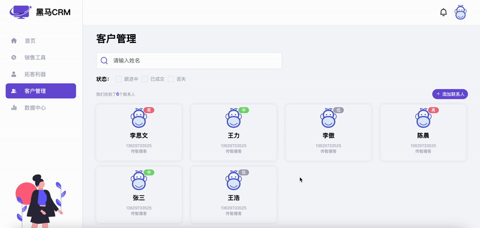
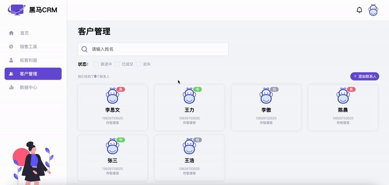

# 今日能力目标

完成后台管理系统完整功能

# 必要知识

综合前面所学知识点

# 一、编程题

## 黑马CRM - 数据渲染&删除

**难度等级：**   ★★

**作业目标： ** 完成黑马CRM

**考察能力：**

1. 能够完成后台管理系统中常见的`CURD`功能

### 作业需求

效果图需求如下：



**需求如下：**

1. 将准备好的数据渲染到指定的页面结构中
2. 点击删除按钮能够实现数据的删除功能


### 相关素材

见附件

### 思路分析

本题是一个典型的后台管理系统数据渲染和删除操作。本案例的核心是将数组拼接成字符串，在事件委托中，根据索引删除数组项。核心步骤：**数据渲染**，**删除联系人**

1. 数据渲染
   * 1.1 获取元素
   * 1.2 定义购买意向和颜色的映射关系
   * 1.3 渲染页面
     * 1.3.1 根据数组拼接字符串
     * 1.3.2 将拼接的字符串渲染到指定位置
     * 1.3.3 设置联系人数量
2. 删除联系人
   * 2.1 利用事件委托给删除按钮绑定点击事件
   * 2.2 判断点击的是否是删除按钮
   * 2.3 根据id删除指定的联系人
   * 2.4 重新渲染页面并弹出提示信息


### 参考答案

```js
// 1.1 获取元素
const contractsContainer = document.querySelector('.contracts-container') // 联系人容器
const statusCheckboxes = document.querySelectorAll('[name=status]') // 所有的checkboxk
const contractsNumEl = document.querySelector('.contracts-num') // 联系人数量
const searchInputEl = document.querySelector('.search-input') // 搜索框
// 1.2 定义购买意向和颜色的映射关系
const colorMap = {
  '低': '#A7AAB9',
  '中': '#7BDA79',
  '高': '#ED7286'
}

render(users)
// 1.3 渲染页面
function render(userList) {
  // 1.3.1 根据数组拼接字符串
  let str = userList
    .map(user => (`
      <div class="contracts-item">
        <div class="close iconfont icon-guanbi" data-id=${user.id}></div>
        <div class="avatar">
          
          <span style="background-color: ${colorMap[user.intention]};">${user.intention}</span>
        </div>
        <p class="username">${user.username}</p>
        <p class="mobile">${user.mobile}</p>
        <p class="company">${user.company}</p>
      </div>
    `))
    .join('')
  // 1.3.2 将拼接的字符串渲染到指定位置
  contractsContainer.innerHTML = str
  // 1.3.3 设置联系人数量
  setContractsNum(userList.length)
}
function setContractsNum(num) {
  contractsNumEl.innerHTML = num
}


// 2. 删除联系人
bindDel()
function bindDel() {
  // 2.1 利用事件委托给删除按钮绑定点击事件
  contractsContainer.addEventListener('click', function (e) {
    // 2.2 判断点击的是否是删除按钮
    if (e.target.classList.contains('close')) {
      // 2.3 根据id删除指定的联系人
      let id = e.target.dataset.id
      let index = users.findIndex(user => user.id === id)
      users.splice(index, 1)
      // 2.4 重新渲染页面并弹出提示信息
      render(users)
      showMessage({ message: '删除客户成功' })
    }
  })
}
```

### 总结反馈

- [ ] 我看效果图就可以分析出实现步骤并独立完成
- [ ] 我看效果图没有思路，需要看本题思路分析才能完成
- [ ] 我需要看参考答案才能梳理思路和完成代码
- [ ] 我没有思路，也看不懂答案，无法完成本题


## 黑马CRM -  数据搜索&筛选

**难度等级：**   ★★★

**作业目标： ** 完成黑马CRM

**考察能力：**

1. 能够完成后台管理系统中常见的`CURD`功能

### 作业需求

效果图需求如下：



**需求如下：**

1. 输入框中输入内容，按回车键搜索相应结果并展示
2. 勾选相应状态的checkbox，筛选出对应的数据并展示


### 相关素材

见附件

### 思路分析

本题是一个典型的后台管理系统数据查找操作。本案例的核心是操作数组。核心步骤：**搜索数据**，**筛选数据**

3. 搜索数据
   * 3.1 给搜索框绑定`keyup`事件
   * 3.2 获取输入的内容
   * 3.3 如果按下的是回车键，根据输入的内容搜索数据
   * 3.4 清除所有`checkbox`的选中状态
   * 3.5 根据输入的内容搜索数据并渲染
4. 筛选数据
   * 4.1 定义数组，保存筛选条件
   * 4.2 给所有`checkbox`循环绑定`change`事件


### 参考答案

```js
// 3. 搜索数据
// 3.1 给搜索框绑定keyup事件
searchInputEl.addEventListener('keyup', function (e) {
  // 3.2 获取输入的内容
  let name = e.target.value.trim()
  // 3.3 如果按下的是回车键，根据输入的内容搜索数据
  if (e.key === 'Enter') {
    // 3.4 清除所有checkbox的选中状态
    clearChecked()
    // 3.5 根据输入的内容搜索数据并渲染
    let filteredUsers = users.filter(user => user.username.includes(name))
    render(filteredUsers)
  }
})

function clearChecked() {
  statusCheckboxes.forEach(checkbox => {
    checkbox.checked = false
  })
}


// 4. 筛选数据
// 4.1 定义数组，保存筛选条件
let allFilters = []
// 4.2 给所有checkbox循环绑定change事件
statusCheckboxes.forEach(checkbox => {
  checkbox.addEventListener('change', function (e) {
    // 4.3 如果是选中状态，将该过滤条件的值追加到筛选条件数组中
    if (e.target.checked) {
      allFilters.push(e.target.value)
    } else {
      // 4.4 如果不是选中状态，根据筛选条件的值删除筛选条件数组中的元素
      delFilterByCode(e.target.value)
    }
    // 4.5 根据过滤条件动态渲染数据到页面
    dynamicRender()
  })
})

function delFilterByCode(code) {
  let index = allFilters.findIndex(item => item === code)
  allFilters.splice(index, 1)
}

function dynamicRender() {
  if (allFilters.length === 0) return render(users)
  render(getFilteredUsers())
}

// 根据条件筛选符合条件的联系人
function getFilteredUsers() {
  return users.filter(user => allFilters.includes(user.status.toString()));
}
```

### 总结反馈

- [ ] 我看效果图就可以分析出实现步骤并独立完成
- [ ] 我看效果图没有思路，需要看本题思路分析才能完成
- [ ] 我需要看参考答案才能梳理思路和完成代码
- [ ] 我没有思路，也看不懂答案，无法完成本题
## 黑马CRM - 数据添加

**难度等级：**   ★★★★

**作业目标： ** 完成黑马CRM

**考察能力：**

1. 能够完成后台管理系统中常见的`CURD`功能

### 作业需求

效果图需求如下：


**需求如下：**

1. 点击添加联系人，弹出添加的表单弹框
2. 点击提交校验表单
3. 如果校验通过则向客户列表中添加数据并重新渲染页面，最后弹出成功提示


### 相关素材

见附件

### 思路分析

本题是一个典型的后台管理系统数据添加操作。本案例的核心是利用正则实现数据校验。

6. 添加联系人
   * 6.1 获取元素
   * 6.2 创建模态框实例
   * 6.3 点击添加联系人，显示模态框
   * 6.4 给提交按钮绑定点击事件
     * 6.4.1 校验数据
     * 6.4.2 校验通过将数据添加到数组中
     * 6.4.3 重新渲染
     * 6.4.4 重置表单
     * 6.4.5 隐藏模态框
     * 6.4.6 弹出提示信息


### 参考答案

```js

// 6. 添加联系人
// 6.1 获取元素
const addEl = document.querySelector('.add') // 添加按钮
const element = document.getElementById('add-dialog') // 添加对话框
const usernameEl = document.querySelector('#username') // 用户名
const avatarEl = document.querySelector('#avatar') // 头像
const emailEl = document.querySelector('#email') // 邮箱
const mobileEl = document.querySelector('#mobile') // 手机号
const intentionEl = document.querySelector('#intention') // 意向
const companyEl = document.querySelector('#company') // 公司
const form = document.querySelector('form') // 添加联系人的表单
const submit = document.querySelector('.submit') // 提交按钮
// 6.2 创建模态框实例
const dialog = new A11yDialog(element)

// 6.3 点击添加联系人，显示模态框
addEl.addEventListener('click', function () {
  dialog.show()
})

// 6.4 给提交按钮绑定点击事件
submit.addEventListener('click', function (e) {
  e.preventDefault()

  // 6.4.1 校验数据
  let isAllValid = validateData()
  if (isAllValid) {
    // 6.4.2 校验通过将数据添加到数组中
    users.push({
      id: Date.now().toString(),
      username: usernameEl.value.trim(),
      avatar: avatarEl.value.trim() || './imgs/default-avatar.png',
      email: emailEl.value.trim(),
      mobile: mobileEl.value.trim(),
      status: 1,
      intention: intentionEl.value.trim(),
      company: companyEl.value.trim(),
    })
    // 6.4.3 重新渲染
    render(users)
    // 6.4.4 重置表单
    form.reset()
    // 6.4.5 隐藏模态框
    dialog.hide()
    // 6.4.6 弹出提示信息
    showMessage({ message: '添加客户成功' })
  }
})

// 6.4.5.1 监听模态框隐藏事件，清除所有错误信息
dialog.on('hide', function (event) {
  clearAllError()
})

function isUsernameValid() {
  let usernameReg = /^[\u4E00-\u9FA5]{2,4}$/
  return usernameReg.test(usernameEl.value.trim())
}
function isMobileValid(mobile) {
  let mobileReg = /^(?:(?:\+|00)86)?1[3-9]\d{9}$/
  return mobileReg.test(mobileEl.value.trim())
}

function validateData() {
  // 6.5.1 校验用户名
  if (!isUsernameValid()) {
    showError('username', '用户名校验不通过，请输入1-4位的汉字')
  }
  // 6.5.2 校验手机号
  if (!isMobileValid()) {
    showError('mobile', '请输入合法的手机号')
  }
  return isUsernameValid() && isMobileValid()
}

function showError(id, msg) {
  let formEl = document.getElementById(id)
  let target = formEl.nextElementSibling
  target.classList.remove('hide')
  target.innerText = msg
}

function clearAllError() {
  let errors = document.querySelectorAll('.form-error')
  errors.forEach(item => {
    item.classList.add('hide')
  })
}
```

### 总结反馈

- [ ] 我看效果图就可以分析出实现步骤并独立完成
- [ ] 我看效果图没有思路，需要看本题思路分析才能完成
- [ ] 我需要看参考答案才能梳理思路和完成代码
- [ ] 我没有思路，也看不懂答案，无法完成本题


   
