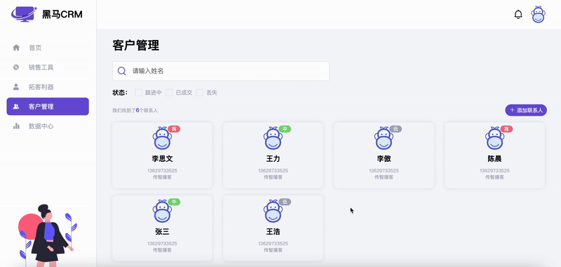
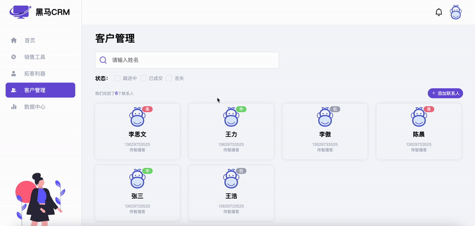

# 今日能力目标

完成后台管理系统完整功能

# 必要知识

综合前面所学知识点

# 一、编程题

## 黑马CRM - 数据渲染&删除

**难度等级：**   ★★

**作业目标： ** 完成黑马CRM

**考察能力：**

1. 能够完成后台管理系统中常见的`CURD`功能

### 作业需求

效果图需求如下：



**需求如下：**

1. 将准备好的数据渲染到指定的页面结构中
2. 点击删除按钮能够实现数据的删除功能


### 相关素材

见附件

### 思路分析

本题是一个典型的后台管理系统数据渲染和删除操作。本案例的核心是将数组拼接成字符串，在事件委托中，根据索引删除数组项。核心步骤：**数据渲染**，**删除联系人**

1. 数据渲染
   * 1.1 获取元素
   * 1.2 定义购买意向和颜色的映射关系
   * 1.3 渲染页面
     * 1.3.1 根据数组拼接字符串
     * 1.3.2 将拼接的字符串渲染到指定位置
     * 1.3.3 设置联系人数量
2. 删除联系人
   * 2.1 利用事件委托给删除按钮绑定点击事件
   * 2.2 判断点击的是否是删除按钮
   * 2.3 根据id删除指定的联系人
   * 2.4 重新渲染页面并弹出提示信息


### 参考答案

```js

```

### 总结反馈

- [ ] 我看效果图就可以分析出实现步骤并独立完成
- [ ] 我看效果图没有思路，需要看本题思路分析才能完成
- [ ] 我需要看参考答案才能梳理思路和完成代码
- [ ] 我没有思路，也看不懂答案，无法完成本题


## 黑马CRM -  数据搜索&筛选

**难度等级：**   ★★★

**作业目标： ** 完成黑马CRM

**考察能力：**

1. 能够完成后台管理系统中常见的`CURD`功能

### 作业需求

效果图需求如下：



**需求如下：**

1. 输入框中输入内容，按回车键搜索相应结果并展示
2. 勾选相应状态的checkbox，筛选出对应的数据并展示


### 相关素材

见附件

### 思路分析

本题是一个典型的后台管理系统数据查找操作。本案例的核心是操作数组。核心步骤：**搜索数据**，**筛选数据**

3. 搜索数据
   * 3.1 给搜索框绑定`keyup`事件
   * 3.2 获取输入的内容
   * 3.3 如果按下的是回车键，根据输入的内容搜索数据
   * 3.4 清除所有`checkbox`的选中状态
   * 3.5 根据输入的内容搜索数据并渲染
4. 筛选数据
   * 4.1 定义数组，保存筛选条件
   * 4.2 给所有`checkbox`循环绑定`change`事件


### 参考答案

```js

```

### 总结反馈

- [ ] 我看效果图就可以分析出实现步骤并独立完成
- [ ] 我看效果图没有思路，需要看本题思路分析才能完成
- [ ] 我需要看参考答案才能梳理思路和完成代码
- [ ] 我没有思路，也看不懂答案，无法完成本题
## 黑马CRM - 数据添加

**难度等级：**   ★★★★

**作业目标： ** 完成黑马CRM

**考察能力：**

1. 能够完成后台管理系统中常见的`CURD`功能

### 作业需求

效果图需求如下：


**需求如下：**

1. 点击添加联系人，弹出添加的表单弹框
2. 点击提交校验表单
3. 如果校验通过则向客户列表中添加数据并重新渲染页面，最后弹出成功提示


### 相关素材

见附件

### 思路分析

本题是一个典型的后台管理系统数据添加操作。本案例的核心是利用正则实现数据校验。

6. 添加联系人
   * 6.1 获取元素
   * 6.2 创建模态框实例
   * 6.3 点击添加联系人，显示模态框
   * 6.4 给提交按钮绑定点击事件
     * 6.4.1 校验数据
     * 6.4.2 校验通过将数据添加到数组中
     * 6.4.3 重新渲染
     * 6.4.4 重置表单
     * 6.4.5 隐藏模态框
     * 6.4.6 弹出提示信息


### 参考答案

```js

```

### 总结反馈

- [ ] 我看效果图就可以分析出实现步骤并独立完成
- [ ] 我看效果图没有思路，需要看本题思路分析才能完成
- [ ] 我需要看参考答案才能梳理思路和完成代码
- [ ] 我没有思路，也看不懂答案，无法完成本题


   
