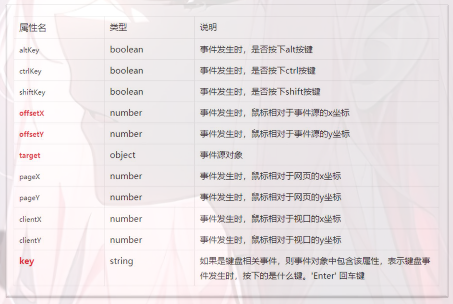
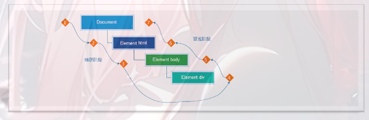

# 事件类型

### 鼠标事件类型

```
鼠标点击
对象.addEventListener('click',function(){})
鼠标移入
对象.addEventListener('mouseenter',function(){})
鼠标移出
对象.addEventListener('mouseleave',function(){})
```

### 焦点事件类型

```
获得焦点
对象.addEventListener('focus',function(){})
失去焦点
对象.addEventListener('blur',function(){})
自动获取焦点
元素.focus
```

### 键盘事件类型

```
键盘按下
对象.addEventListener('keydown',function(){})
键盘抬起
对象.addEventListener('keyup',function(){})
```

### 文本事件类型

```
input输入
对象.addEventListener('input',function(){})
```

### 滚动事件类型

```
scroll页面滚动
//给window添加scroll监听事件
window.addEventListener('scroll',function(){})
页面谁滚动
html元素滚动
document.documentElement 返回HTML元素
滚动多少距离
scrollLeft和scrollTop （属性）
获取被卷去的左侧和头部
获取元素内容往左、往上滚出去看不到的距离
这两个值是可读写的
```

# 事件对象

```
语法: 注册事件中,回调函数的第一个参数就是事件对象
一般命名为event ev e
元素.addEventListener('click',function(e){})
```



# 事件流

### 事件流与两个阶段说明

```
事件流指的是事件完整执行过程中的流动路径
当触发事件时，会经历两个阶段，分别是捕获阶段、冒泡阶段
```



### 事件捕获

```
事件捕获概念：
当一个元素的事件被触发时，会从DOM的根元素开始依次调用同名事件 (从外到里)
```

```
代码 DOM.addEventListener(事件类型,事件处理函数,是否使用捕获机制)
```

```
说明：
addEventListener第三个参数传入 true 代表是捕获阶段触发（很少使用）
若传入false代表冒泡阶段触发，默认就是 false
```

### 事件冒泡

```
事件冒泡概念: 
当一个元素的事件被触发时，同样的事件将会在该元素的所有祖先元素中依次被触发。这一过程被称为事件冒泡(从内到外)
简单理解：当一个元素触发事件后，会依次向上调用所有父级元素的 同名事件
事件冒泡是默认存在的，或者第三个参数传入 false 都是冒泡
实际工作都是使用事件冒泡为主
```

### 阻止冒泡

```
问题：因为默认就有冒泡阶段的存在，所以容易导致事件影响到父级元素
需求：若想把事件就限制在当前元素内，就需要阻止事件冒泡
前提：阻止事件冒泡需要拿到事件对象
语法：事件对象.stopPropagation()
注意：此方法可以阻断事件流动传播，不光在冒泡阶段有效，捕获阶段也有效
```

**鼠标经过/离开事件：**

```
mouseover 和 mouseout 会有冒泡
mouseenter 和 mouseleave 没有冒泡 (常用)
```

**阻止默认行为**

```
阻止元素发生默认的行为
例如：1.当点击提交按钮时阻止对表单的提交 2.阻止链接的跳转等等
语法：事件对象.preventDefault()
```

### 事件委托

```
事件委托(Event Delegation)：是JavaScript中注册事件的常用技巧，也称为事件委派、事件代理
简单理解：原本需要注册在子元素的事件委托给父元素，让父元素担当事件监听的职务
为什么要用事件委托呢？
如果同时给多个元素注册事件，还需要利用循环多次注册事件
优点: 减少注册次数,可以提高程序性能  动态生成的元素也能触发事件
原理: 事件委托其实是利用冒泡事件的特点  给父元素注册事件,当我们触发子元素的时候,会冒泡到父元素身上,从而触发父元素的事件
```

# 排他思想

```
①：排除其他人
②：保留我自己
```

