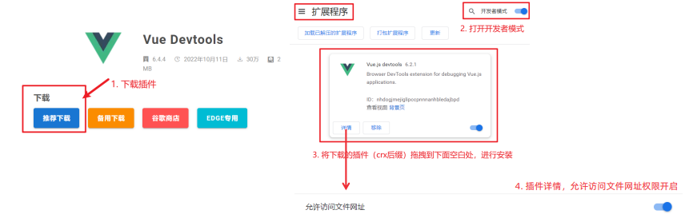
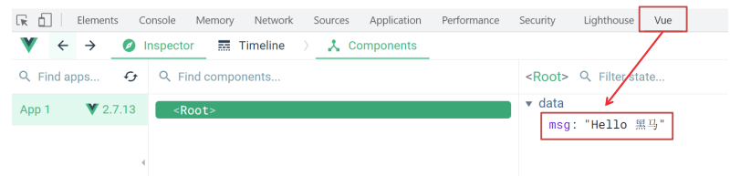

# Vue 快速上手

### Vue 概念 

```
概念：Vue 是一个用于 构建用户界面 的 渐进式 框架
优点：大大提升开发效率 (70%↑)
缺点：需要理解记忆规则 → 官网
```

```
1. 构建用户界面：基于 数据 动态 渲染 页面
2. 渐进式：循序渐进的学习
3. 框架：一套完整的项目解决方案，提升开发效率↑ (理解记忆规则)
规则 → 官网
```

### 创建实例 

```
核心步骤 4步：
1. 准备容器
2. 引包 (官网) - 开发版本 / 生产版本
3. 创建 Vue 实例 new Vue()
4. 指定配置项 → 渲染数据
① el 指定挂载点
② data 提供数据
```

### 插值表达式 

```
插值表达式是一种 Vue 的模板语法
作用: 利用表达式进行插值，渲染到页面中
表达式：是可以被求值的代码，JS引擎会将其计算出一个结果
语法：{{ 表达式 }}\
注意点：
 使用的数据必须存在 （data）
 支持的是表达式，而非语句，比如：if for ...
 不能在标签属性中使用 {{ }} 插值
```

### 响应式特性 

```
响应式：数据变化，视图自动更新
如何访问 or 修改？data中的数据, 最终会被添加到实例上
访问数据： "实例.属性名"
修改数据： "实例.属性名" = "值"
聚焦于数据 → 数据驱动视图
使用 Vue 开发，关注业务的核心逻辑，根据业务修改数据即可
```

### 开发者工具





# Vue 指令

### v-html

```
v-html:
作用：设置元素的 innerHTML
语法：v-html = "表达式 "
v-html = "表达式 " → 动态设置元素 innerHTML
```

### v-show

```
作用： 控制元素显示隐藏
语法： v-show = "表达式" 表达式值 true 显示， false 隐藏
原理： 切换 display:none 控制显示隐藏
场景： 频繁切换显示隐藏的场景
```

### v-if

```
作用： 控制元素显示隐藏（条件渲染）
语法： v-if = "表达式" 表达式值 true 显示， false 隐藏
原理： 基于条件判断，是否 创建 或 移除 元素节点
场景： 要么显示，要么隐藏，不频繁切换的场景
```

### v-else

```
作用： 辅助 v-if 进行判断渲染
语法： v-else v-else-if = "表达式"
注意： 需要紧挨着 v-if 一起使用
```

### v-on

```
作用： 注册事件
语法：
v-on:事件名 = "内联语句"
v-on:事件名 = "methods中的函数名"
简写：@事件名
注意：methods函数内的 this 指向 Vue 实例
```

```
传参
@click="fn(参数1,参数2)"
```

### v-bind

```
作用： 动态的设置html的标签属性
语法： v-bind:属性名="表达式"
注意： 简写形式 :属性名="表达式"
```

### v-for

```
作用： 基于数据循环， 多次渲染整个元素
遍历数组语法：
v-for = "(item, index) in 数组"
item 每一项， index 下标
省略 index: v-for = "item in 数组"
数组、对象、数字...
```

**v-for 中的 key**

```
语法：key属性 = "唯一标识"
作用：给列表项添加的唯一标识。便于Vue进行列表项的正确排序复用。
```

### v-model

```
作用: 给 表单元素 使用, 双向数据绑定
数据变化 → 视图自动更新
视图变化 → 数据自动更新
语法: v-model = '变量'
可以快速 获取 或 设置 表单元素内容
```

